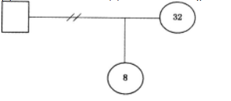

# 第十七章　家庭社会工作服务

## 第 1 题 [单选题]

**题目：** 1.  搬迁到城市生活后，父亲从事体力劳动，母亲操持家务，小林在学校因口音和生活习惯常被同学嘲笑，家庭氛围压抑。社会工作者小余的下列做法中体现了处境化原则的是（    ）。

**选项：**
```
A.要求小林尽快改掉口音，融入同学
B.深入走访小林家庭的山区老家，了解其生活背景，同时观察城市学校的社交环境，协助小林家庭制定适应策略
C.建议小林转学回山区学校
D.给小林报城市方言培训班
```

> **正确答案：** B

**解析：**
处境化原则的应用

---

## 第 2 题 [单选题]

**题目：** 2.  外人的面指责儿子小辉，不是说他学习不用功，辜负了妈妈的期望，就是抱怨他不听话，总是与妈妈对着干。赵女士的抱怨没有让小辉有任何改变，反而让小辉对妈妈产生了抵触情绪。社会工作者依据帮助家庭成员增能的原则，尝试缓和母子间的紧张关系。社会工作者对赵女士的下列提问中，符合帮助家庭成员增能原则的是（ ）。

**选项：**
```
A.“您认为孩子为什么会这样?”
B.“孩子哪些表现让您不满意?”
C.“您能谈一下孩子让您感到满意的地方吗?”
D.“您认为自己对待孩子的方式与孩子的表现有什么关系?”
```

> **正确答案：** C

**解析：**
选项A询问赵女士对儿子行为的看法，这可能继续将焦点放在问题上，而不是寻找解决方案。

选项B同样关注于赵女士不满意的地方，这可能会加剧负面情绪，而不是促进积极的改变。
选项C要求赵女士谈论孩子让她满意的地方，这有助于她发现儿子的优点，增强积极的互动，符合增能原则。
选项D询问赵女士对待孩子的方式与孩子表现的关系，这可能引导她反思自己的行为，但不如选项C直接促进积极的沟通和增能。
因此，最符合帮助家庭成员增能原则的是选项C。

---

## 第 3 题 [单选题]

**题目：** 3.  保家庭，其父亲因失业变得自卑，其母亲身体不好，小陆学习成绩优异但不敢申请奖学金。社会工作者运用增能原则的做法是（    ）。

**选项：**
```
A.直接为小陆家申请更高额度的低保
B.鼓励小陆的父亲参加就业技能培训，协助小陆的母亲学习养生知识管理身体，同时引导小陆梳理学习成绩优势，尝试申请奖学金
C.安排社区志愿者定期给小陆家送生活物资
D.建议小陆放弃学业，早日工作挣钱补贴家用
```

> **正确答案：** B

**解析：**
家庭社会工作服务中的增能原则

---

## 第 4 题 [单选题]

**题目：** 4.  子小强的一些行为习惯很不好，自己玩过的玩具不整理，说话很没礼貌，他们向社会工作者小孙求助。小孙根据家庭行为学习原理为小强设计了行为改变的方案，下列做法中正确的是（ ）。

**选项：**
```
A.指导小强改变不良的行为习惯
B.指导小张夫妇学习新的亲子沟通方式
C.指导小张夫妇形成家庭角色分工，并制订家庭规划
D.指导小强学习新行为，并鼓励父母及时给予奖励
```

> **正确答案：** D

**解析：**
题目背景是小张夫妇发现儿子小强有一些不良的行为习惯，如不整理玩具、说话没礼貌，他们寻求社会工作者小孙的帮助。小孙根据家庭行为学习原理为小强设计了行为改变的方案。我们需要选择正确的做法。

家庭行为学习原理通常强调通过正向强化来改变孩子的行为。这意味着当孩子表现出期望的行为时，父母应及时给予奖励或表扬，以鼓励这种行为的重复出现。因此，选项D“指导小强学习新行为，并鼓励父母及时给予奖励”直接符合这一原理，是正确答案。
选项A“指导小强改变不良的行为习惯”虽然直接针对问题，但没有提到如何实施改变，缺乏具体的方法。
选项B“指导小张夫妇学习新的亲子沟通方式”虽然有助于改善家庭沟通，但与直接针对小强行为改变的焦点不太相关。
选项C“指导小张夫妇形成家庭角色分工，并制订家庭规划”更多关注家庭结构和规划，而不是直接针对小强的行为改变。
因此，根据家庭行为学习原理，正确答案是D。

---

## 第 5 题 [单选题]

**题目：** 5.  ，因无力购置新房，结婚后小两口与小林的父母住在一起，目前小林的家庭类型属于（    ）。

**选项：**
```
A.主干家庭
B.单亲家庭
C.联合家庭
D.核心家庭
```

> **正确答案：** A

**解析：**
家庭类型的判断

---

## 第 6 题 [单选题]

**题目：** 6.  的服务过程中，针对小孙家“夫妻沟通不畅，孩子学习成绩下降”的情况，社会工作者在第一阶段会谈的核心工作是（    ）。

**选项：**
```
A.与小孙家成员进行寻解面谈，建立初步工作关系
B.回顾会谈内容，商定后续方法
C.赞美小孙家的积极改变，布置家庭作业
D.为小孙家制定详细的治疗方案
```

> **正确答案：** A

**解析：**
寻解家庭治疗第一阶段会谈的核心工作

---

## 第 7 题 [单选题]

**题目：** 7.  结婚多年，经常一言不合就大打出手，为此陈女士对丈夫心灰意懒，将全部的爱给了儿子。儿子与母亲关系很好，对父亲却越来越有敌意。为改善家庭关系，李先生向社会工作者老杨求助。老杨计划以改善夫妻关系为切入点，为李先生家庭提供服务。下列做法中，适宜的是（ ）。

**选项：**
```
A.帮助李先生和陈女士提升心理健康意识
B.帮助李先生和陈女士学习家庭照顾技巧
C.帮助李先生和陈女士改变相互沟通的方式
D.帮助儿子重新认识自己和父母之间的关系
```

> **正确答案：** C

**解析：**
A帮助李先生和陈女士提升心理健康意识：虽然提升心理健康意识对个人有好处，但题目强调的是改善夫妻关系，这个选项过于宽泛，没有直接针对夫妻沟通和关系改善。

B帮助李先生和陈女士学习家庭照顾技巧：家庭照顾技巧可能包括家务分工、孩子教育等方面，但夫妻之间的沟通问题仍然是核心问题，这个选项可能不够直接。
C帮助李先生和陈女士改变相互沟通的方式：夫妻之间的沟通方式是导致冲突的重要原因，改变沟通方式可以直接改善夫妻关系，从而间接改善整个家庭关系，这与社会工作者的切入点相符。
D帮助儿子重新认识自己和父母之间的关系：虽然儿子的心理状态需要关注，但题目明确指出以改善夫妻关系为切入点，这个选项偏离了主要焦点。
因此，最适宜的做法是C，即帮助李先生和陈女士改变相互沟通的方式，以改善夫妻关系，进而改善整个家庭关系。

---

## 第 8 题 [单选题]

**题目：** 8.  年轻家长改善亲子关系，社会工作者小王决定开展亲子小组。督导者发现小王拟招募的组员均为年轻妈妈，为提高小王的社会性别意识，督导者应该提醒小王（    ）。

**选项：**
```
A.指导组员学习亲子沟通的技巧
B.选编适合年轻妈妈的养育知识
C.重视父亲在亲子关系中的责任
D.关注祖辈在亲子关系中的作用
```

> **正确答案：** C

**解析：**
社会性别意识在亲子小组社会工作服务中的应用

---

## 第 9 题 [单选题]

**题目：** 9.  着12岁的女儿来到某城市打工。一开始，李女士和女儿居住在城乡接合部的平房里。随着工作逐渐稳定，李女士和女儿的居住环境有了很大改善。但是，令李女士感到困惑的是，青春期的女儿总是和她对着干，随地扔东西的坏习惯也改不掉，母女俩为此多次争吵；女儿还吵着不想上学要回老家，最近学习成绩明显下滑。为此，李女士求助社会工作者小王。根据家庭处境化原则，小王适宜的做法是（    ）。

**选项：**
```
A.了解李女士对女儿的期望和要求
B.分析李女士女儿学习成绩下滑的原因
C.探寻李女士来到城市打工的原因
D.观察李女士与女儿日常如何沟通
```

> **正确答案：** D

**解析：**
家庭处境化原则

---

## 第 10 题 [单选题]

**题目：** 10.  ，经常一言不合就对妻子陈女士大打出手，为此陈女士对丈夫心灰意冷，将全部的爱给了儿子。儿子与母亲关系很好，对父亲却越来越有敌意。为改善家庭关系，李先生向社会工作者老杨求助。老杨计划以改善夫妻关系为切入点为李先生家庭提供服务。下列做法中适宜的是（    ）。

**选项：**
```
A.帮助李先生和陈女士提升心理健康意识
B.帮助儿子重新认识自己和父母之间的关系
C.帮助李先生和陈女士改变沟通的方式
D.帮助李先生和陈女士学习家庭照顾技巧
```

> **正确答案：** C

**解析：**
以改善夫妻关系为切入点的家庭社会工作服务

---

## 第 11 题 [单选题]

**题目：** 11.  区“家庭专业社会工作服务”项目正在进行招标，以下竞标的项目中能够促进家庭能力提升的是（    ）。

**选项：**
```
A.潍坊社区家庭健康讲座活动
B.“亲子一日游”活动
C.三林镇“外来媳”团体沙龙活动
D.“维稳妈妈”情绪控制辅导
```

> **正确答案：** B

**解析：**
A主要提供健康知识教育，侧重于信息传递和健康意识提升。虽然健康是家庭生活的重要方面，但讲座形式通常为单向传授，缺乏家庭互动和实践，对家庭整体能力的提升（如沟通、决策）作用有限，因此不符合核心要求。
B通过亲子共同参与户外体验，直接促进亲子之间的互动、沟通和情感交流。这种活动能增强家庭凝聚力，改善家庭关系，从而有效提升家庭能力（如合作、问题解决），符合促进家庭能力提升的目标。
C针对特定群体（外来媳妇），提供支持、分享和社交机会，有助于个体适应和网络建设。但活动焦点在于个体赋能而非整个家庭系统，对家庭整体能力的提升间接且较弱，因此不完全符合要求。
D专注于母亲的情绪管理技能，旨在改善个人情绪调节能力。虽然情绪稳定有助于家庭环境，但这是个体层面的干预，未涉及家庭互动或整体功能提升，因此不符合促进家庭能力提升的核心定义。
综上，最能促进家庭能力提升的项目是 B“亲子一日游”活动，因为它直接通过家庭共同体验来增强家庭关系和功能。

---

## 第 12 题 [单选题]

**题目：** 12.  繁忙，无法兼顾家中年迈患病的母亲和年幼的孩子，经常出现照顾疏忽，家庭矛盾因此频发。社会工作者为其链接日间照料中心、提供临时托管服务，缓解照顾压力。该服务属于（    ）。

**选项：**
```
A.家庭救助服务
B.家庭生活服务
C.家庭赋能服务
D.资源整合服务
```

> **正确答案：** B

**解析：**
家庭社会工作服务的类型

---

## 第 13 题 [单选题]

**题目：** 13.  了外遇之后，王女士便不断与丈夫争吵，每次争吵后，王女士都在女儿面前抱怨。不久前，王女士发现女儿开始厌学、逃课，学习成绩下滑。王女士非常担心女儿，于是向社会工作者求助。根据家庭系统理论，社会工作者应该帮助王女士（ ）。

**选项：**
```
A.改善与丈夫的关系
B.加强与女儿的沟通
C.调节其丈夫与女儿的关系
D.明确与女儿的界限
```

> **正确答案：** B

**解析：**
根据家庭系统理论，社工应优先处理直接导致女儿问题的母子互动环节（选项B），而非间接的夫妻关系（选项A）。
家庭系统理论的干预逻辑：①子系统互动：家庭问题往往由多个子系统（如夫妻子系统、亲子子系统）的相互作用引发。②当前问题焦点：女儿厌学、逃课的直接诱因是王女士在女儿面前抱怨丈夫（母女互动失衡），而非夫妻关系本身。社工需优先处理直接影响女儿行为的母子沟通问题。
选项B（加强与女儿的沟通）正确：①直接干预：通过改善母女沟通，帮助王女士意识到自身情绪对女儿的影响，减少将夫妻矛盾转移到女儿身上，从而缓解女儿的心理压力。②系统平衡：修复母女关系可增强家庭支持系统，为后续改善夫妻关系（选项A）奠定基础。
选项A（改善夫妻关系）错误：①间接性：夫妻关系修复需较长时间，且女儿的问题已迫在眉睫。若仅关注夫妻关系，可能延误对女儿行为的干预。②风险性：若夫妻矛盾短期内无法解决，持续忽视母女沟通可能加剧女儿的心理问题。

---

## 第 14 题 [单选题]

**题目：** 14.  断决策，母亲和小赵有时不敢表达反对意见，家庭矛盾频发，社会工作者小张运用系统家庭治疗的循环提问技巧介入，正确的做法是（    ）。

**选项：**
```
A.单独询问父亲：“您觉得家人为什么不敢反对您”
B.当着全家人的面，让每位家庭成员轮流表达对“父亲决策时家人反应”的看法
C.建议父亲改变独断的沟通方式
D.为小赵家庭制定新的家庭规则
```

> **正确答案：** B

**解析：**
系统家庭治疗的循环提问技巧

---

## 第 15 题 [单选题]

**题目：** 15.  习成绩下滑后，他的妈妈说“我天天为你操心，你却一点也不努力，真让我失望”。妈妈指责小浩时，爸爸要么帮妈妈批评小浩，要么躲进书房回避。社会工作者小陈拟为该家庭开展萨提亚家庭治疗。下列小陈的做法中，最符合萨提亚家庭治疗核心思路的是（    ）。

**选项：**
```
A.单独教导小浩“妈妈批评你是为你好，要学会听话”
B.引导妈妈用“我看到你最近写作业到很晚，担心你的学习状态，希望我们能聊聊你遇到的困难”来代替指责
C.要求爸爸必须在妈妈批评小浩时出面调解，不能回避
D.帮全家制定每周学习监督计划，重点提升小浩的学习成绩
```

> **正确答案：** B

**解析：**
本题考查萨提亚家庭治疗的核心思路。萨提亚家庭治疗的核心是促进表里一致的沟通，帮助家庭成员用观察和感受替代指责，改善互动模式。选项A属于单向说教，未改善家庭互动模式，不符合萨提亚家庭治疗思路，排除；选项B帮助妈妈用观察和感受替代指责，符合萨提亚表里一致的沟通要求，正确；选项C属于强制要求，未帮助爸爸理解互动模式，不符合萨提亚治疗思路，排除；选项D仅聚焦学习成绩提升，未解决家庭沟通和互动问题，不符合萨提亚家庭治疗思路，排除。综上，故选B。

---

## 第 16 题 [单选题]

**题目：** 16.  的（）阶段，其任务和要求是适应新的、不以子女为中心的角色的要求。

**选项：**
```
A.老年人家庭
B.青少年家庭
C.中年夫妇家庭
D.子女独立家庭
```

> **正确答案：** C

**解析：**
根据家庭生命周期理论的一般理解和不同教材的具体表述，阶段划分和任务描述可能存在差异。根据最新教材：
中年夫妇家庭阶段的任务是“适应新的、不以子女为中心的角色的要求”。
子女独立家庭阶段的任务是“为子女独立生活做准备和接纳和促进子女自立的要求”。
因此，符合题目描述的阶段应为中年夫妇家庭，故正确答案为 C。

---

## 第 17 题 [单选题]

**题目：** 17.  独自抚养14岁的女儿，面对青春期女儿的叛逆表现，她认为孩子不听话、无法沟通，感到无能为力，于是向社会工作者小谭求助。在了解情况后，小谭拟针对王女士开展亲职教育辅导服务。下列服务目标中，恰当的是（    ）。

**选项：**
```
A.协助女儿耐心倾听王女士的想法
B.协助女儿更好地扮演家庭成员的角色
C.协助王女士纠正女儿的不当行为
D.协助王女士了解青春期的特征
```

> **正确答案：** D

**解析：**
亲职教育辅导服务的目标

---

## 第 18 题 [单选题]

**题目：** 18.14  无人抚养儿童，与奶奶相依为命。最近，大壮因厌学情绪严重与奶奶冲突不断，无论奶奶怎么劝说，大壮都不想去上学了，于是奶奶向社会工作者小宁寻求帮助。小宁遵循家庭处境化原则为大壮和奶奶提供服务，下列做法中正确的是（ ）。

**选项：**
```
A.约定奶奶和大壮都在家的时间去探访
B.去学校向老师和同学了解大壮的情况
C.邀请大壮参加社区的青少年成长小组
D.请奶奶下次与大壮一同来与小宁交谈
```

> **正确答案：** A

**解析：**
A约定奶奶和大壮都在家的时间去探访。这个选项符合家庭处境化原则，因为社会工作者直接到家庭中去了解情况，可以更真实地观察家庭成员之间的互动，以及家庭环境对大壮厌学情绪的影响。

B去学校向老师和同学了解大壮的情况。这个选项虽然可以获取大壮在学校的表现，但可能忽略了家庭环境对大壮的影响，而且可能让大壮感到被监视，不利于建立信任关系。
C邀请大壮参加社区的青少年成长小组。这个选项虽然有助于大壮的社会融入和成长，但可能需要大壮主动参与，而大壮目前有厌学情绪，可能不愿意参加这样的活动。
D请奶奶下次与大壮一同来与小宁交谈。这个选项虽然可以让社会工作者直接与家庭成员交流，但可能无法深入了解家庭的真实情况，特别是家庭成员之间的互动和家庭环境。
综上所述，选项A最符合家庭处境化原则，能够直接在家庭环境中了解情况，有助于解决问题。

---

## 第 19 题 [单选题]

**题目：** 19.  在开展家庭社会工作服务时，服务对象王女士反映亲子关系紧张，认为青春期的儿子叛逆、不愿沟通。为了准确评估王女士家庭的真实需求，小周的下列做法中属于践行处境化原则的是（    ）。

**选项：**
```
A.邀请王女士和儿子在辅导室进行一对一的面谈，深入分析亲子矛盾的根源
B.到王女士家中观察母子二人的日常互动模式，包括家务分工、休闲交流等场景
C.为王女士推荐亲子沟通类的书籍和线上课程，让家庭自行学习改善关系的方法
D.联系社区的青少年活动中心，为王女士的儿子安排周末的兴趣活动
```

> **正确答案：** B

**解析：**
家庭处境化原则是家庭社会工作的核心原则之一，该原则假设家庭是家庭成员日常生活的场景，要求社会工作者将家庭成员放在家庭的日常生活环境中，观察和了解家庭成员之间以及家庭成员与周围环境之间的互动状况，避免脱离实际生活场景的抽象评估。
对各选项分析如下：
选项A错误：在辅导室进行面谈属于脱离家庭日常场景的访谈，无法观察到真实的互动模式，不符合处境化原则。
选项B正确：到王女士家中观察日常互动，能够在真实的生活场景中了解亲子关系的实际状态，充分体现了处境化原则的要求。
选项C错误：推荐书籍和课程属于服务介入措施，不属于需求评估阶段的处境化实践。
选项D错误：安排兴趣活动属于服务介入措施，与需求评估的处境化原则无关。

---

## 第 20 题 [单选题]

**题目：** 20.  时突然晕倒，被小区保安及时发现并送医。医生嘱赵伯伯以后出门一定要有人陪伴，但赵伯伯不听医生和家人劝阻，仍然独自到处走动，导致家庭关系紧张。赵伯伯的家人向社会工作者小李求助。会谈时，小李的下列提问中，符合家庭处境化原则的是（ ）。

**选项：**
```
A.“赵伯伯为什么喜欢外出?”
B.“赵伯伯喜欢什么时候外出?”
C.“你们希望赵伯伯什么时候外出?”
D.“你们什么时候有空陪赵伯伯外出?”
```

> **正确答案：** D

**解析：**
其中家庭处境化原则认为家庭是家庭成员自然生活的场景，因此社会工作者在观察评估家庭成员的需要时要把家庭成员放在家庭的生活场景中观察，了解家庭成员之间以及家庭成员与周围环境之间的互动交流状况，关注家庭成员的日常生活，准确把握家庭成员的真实需要，提供符合实际家庭处境的解决方案。选项A和B关注的是赵伯伯个人的喜好或需求，喜欢外出的原因和时间。选项C的提问虽然涉及家庭成员对赵伯伯行为的期望，但它更多是在询问家庭成员的主观意愿。选项D的提问将赵伯伯的行为(外出)与家庭成员的日常生活安排(空闲时间)联系起来，考虑到了家庭成员之间的互动和实际需求，符合家庭处境化原则的要求，故选D。

---

## 第 21 题 [单选题]

**题目：** 21.  哲非常想学画画，但父母觉得画画没有前途，未与小哲商量就为他报了编程学习辅导班。为此，小哲与父母发生矛盾，其父母向社会工作者小刘求助。根据家庭生命周期理论中各阶段的任务和要求，小刘应该采取的介入行动是引导小哲父母（ ）。

**选项：**
```
A.对学校保持更大的开放性
B.适应小哲的自主性发展要求
C.为小哲的独立生活做准备
D.学习把小哲当作成年人对待
```

> **正确答案：** B

**解析：**
家庭生命周期理论将家庭的发展分为不同的阶段，每个阶段都有其特定的任务和要求。对于正处于青少年期的孩子，如小哲（初一学生），家庭的主要任务是适应孩子的自主性发展要求。这个阶段的孩子开始寻求独立，希望有更多的自主权和决策能力。父母在这个阶段需要学会放手，尊重孩子的兴趣和选择，而不是单方面决定孩子的学习方向。

题目中的情况是小哲想学画画，但父母未与他商量就为他报了编程班，导致矛盾。这说明父母没有充分考虑小哲的自主性需求。因此，社会工作者小刘应该引导父母适应小哲的自主性发展要求，即选项 B。其他选项如 A、C、D 分别强调开放性、独立生活准备和当作成年人对待，但这些都不符合家庭生命周期理论中青少年期的主要任务，因此不正确。

---

## 第 22 题 [单选题]

**题目：** 22.  家庭，丈夫带着15岁的女儿、张女士带着10岁的儿子组成了这个新家。婚后因子女教育、家务分工等问题，夫妻矛盾不断，孩子之间也常发生冲突。社会工作者采用结构式家庭治疗模式开展服务，经过一段时间的介入，家庭互动模式有所改善，但近期因丈夫前妻频繁来家探望女儿，导致家庭矛盾再次激化。社会工作者的下列做法中，符合结构式家庭治疗模式核心逻辑且能有效解决当前矛盾的是（    ）。

**选项：**
```
A.与丈夫前妻沟通，建议减少探望频率
B.协助家庭重新明确边界，厘清家庭成员与前妻的互动规则
C.为孩子们提供个体辅导，缓解冲突情绪
D.调解夫妻矛盾，引导双方各退一步
```

> **正确答案：** B

**解析：**
结构式家庭治疗

---

## 第 23 题 [单选题]

**题目：** 23.  中频频出错，情绪很不好，回家就对10岁的儿子打骂，夫妻二人也经常为此事争吵不休。学校老师反映老李儿子最近经常逃课，学习成绩下降，和同学关系紧张。作为一名家庭社会工作者，你认为老李儿子学习成绩下降的主要原因是（ ）。

**选项：**
```
A.社区因素
B.同伴因素
C.家庭因素
D.学校因素
```

> **正确答案：** C

**解析：**
题目描述了老李在工作中频频出错，情绪不好，回家后对儿子进行打骂，夫妻之间也因此经常争吵。这些情况表明家庭环境存在紧张和冲突，这对孩子的心理和行为产生了负面影响。老李的儿子最近经常逃课，学习成绩下降，与同学关系紧张，这些都是孩子在面对家庭问题时可能出现的行为反应。

家庭社会工作者需要关注的是家庭内部的因素，因为家庭是孩子成长的重要环境，家庭成员之间的互动和关系直接影响孩子的行为和情绪。老李的负面情绪和对儿子的暴力行为可能让孩子感到不安和压力，导致他在学校的表现出现问题。此外，夫妻之间的争吵也可能给孩子带来额外的压力，影响他的学习和社交能力。
虽然学校和同伴因素也可能对孩子的学习成绩产生影响，但在题目中并没有直接提到学校环境的问题或者同伴关系的恶化，而是重点描述了家庭内部的矛盾和冲突。因此，家庭因素是导致老李儿子学习成绩下降的主要原因。
综上所述，正确答案是C.家庭因素。

---

## 第 24 题 [单选题]

**题目：** 24.  结婚后育有一子，马先生在外工作，陈女士全职照顾家庭。随着孩子学业难度增加，陈女士在辅导功课上越来越力不从心，加之孩子进入青春期后，陈女士缺乏与孩子沟通的技巧，母子俩经常吵架。陈女士为此向社会工作者孙姐求助。孙姐的下列做法中，体现性别视角家庭工作原则的是（    ）。

**选项：**
```
A.增进马先生与孩子的沟通互动
B.建议改由马先生负责教育孩子
C.鼓励陈女士外出减少亲子冲突
D.教授陈女士与孩子沟通的技巧
```

> **正确答案：** A

**解析：**
性别视角家庭工作原则

---

## 第 25 题 [单选题]

**题目：** 25.  家庭经济陷入困境，生活压力大，与妻子关系紧张，经常吵架。受此影响，上初中的女儿学习成绩下滑。社会工作者了解情况后，根据家庭成员增能原则开展服务。下列做法中最恰当的是（    ）。

**选项：**
```
A.改善老陈夫妻的关系，促进夫妻之间的情感沟通
B.为老陈提供就业岗位，改善其家庭的经济生活状况
C.增强老陈指导孩子学习的能力，缓解家庭教育压力
D.增强老陈夫妻沟通技能，为孩子提供良好的家庭环境
```

> **正确答案：** D

**解析：**
家庭成员增能原则的核心是通过提升家庭成员自身的能力，解决家庭问题，而非直接解决问题本身。
A：该选项是直接解决夫妻关系问题，属于问题解决导向，没有体现“增能”（即提升能力）的核心。
D：该选项的核心是“增强沟通技能”，即通过提升夫妻双方的沟通能力，让他们自己能够解决关系紧张的问题，同时改善家庭环境，符合增能原则“助人自助”的核心，提升服务对象自身的能力而非直接替他们解决问题。
因此D选项比A选项更符合增能原则的要求。

---

## 第 26 题 [单选题]

**题目：** 26.  接待了前来求助的小红母女俩，在面谈中，母亲告诉小郑，小红近来像变了一个人似的，上课不专心，做作业拖拉。为此，她也说过小红，但情况没有任何改观。根据家庭系统理论，小郑的下列判断中，正确的是（ ）。

**选项：**
```
A.这个家庭的问题是小红导致的
B.小红的问题是母亲导致的
C.小红的问题是整个家庭的问题
D.小红的问题与家庭无关
```

> **正确答案：** C

**解析：**
家庭系统理论认为，家庭是一个相互关联的系统，每个成员的行为都会影响整个系统。当家庭中的某个成员出现问题时，这通常反映了整个家庭系统的问题，而不仅仅是某一个成员的问题。因此，小红的问题可能与整个家庭的互动模式、沟通方式或家庭环境有关，而不仅仅是小红本人或母亲的问题。选项C正确地反映了这一观点，即小红的问题是整个家庭的问题。其他选项将问题归咎于某一个成员，这不符合家庭系统理论的整体视角。

---

## 第 27 题 [单选题]

**题目：** 27.  岁的儿子最近学习不专心，沉迷于网络游戏，成绩明显下降。为此，王女士与丈夫尝试了很多方法管教儿子，但收效甚微。儿子平时还算听话，与王女士夫妇也较亲近，就是沉迷网络游戏的问题让王女士颇为烦恼，遂向社会工作者小李求助。小李接案后，首先进行需求评估，以便找出问题产生的原因。在此工作步骤中，小李运用家庭结构图描述王女士家庭成员之间的关系，其中，表示王女士与其儿子关系的连接线应是（    ）。

**选项：**
```
A.实线
B.虚线
C.波折线
D.阻断线
```

> **正确答案：** A

**解析：**
本题核心考察家庭结构图的符号含义。家庭结构图中不同线条对应的关系为：
实线：代表稳定、亲密的正常关系，是家庭成员间的常规联结状态。
虚线：代表关系疏远、冷淡，互动较少。
波折线：代表关系存在冲突、紧张，经常发生矛盾。
阻断线：代表关系断裂，如断绝往来、离婚且无互动等。
题干明确说明“儿子平时还算听话，与王女士夫妇也较亲近”，说明亲子关系整体是稳定亲密的，沉迷网络游戏只是具体的行为问题，并未影响亲子关系的根本状态，因此应当用实线表示。

---

## 第 28 题 [单选题]

**题目：** 28.  中，具有预防功能的是（ ）。

**选项：**
```
A.家庭治疗
B.婚姻调解
C.生活困难家庭救助
D.家庭生活教育
```

> **正确答案：** D

**解析：**
A家庭治疗：家庭治疗主要是针对已经存在的家庭问题，如冲突、沟通障碍等，通过专业的治疗方法来解决这些问题，属于治疗性服务，而不是预防性的。
B婚姻调解：婚姻调解通常是在夫妻之间出现矛盾或冲突时，通过调解来解决问题，这也是一种治疗性服务，而不是预防性的。

C生活困难家庭救助：这种服务主要是为那些面临经济困难的家庭提供帮助，解决他们当前的困难，属于救助性服务，而不是预防性的。
D家庭生活教育：家庭生活教育则是通过教育和培训，提高家庭成员的生活技能、沟通能力、解决问题的能力等，帮助家庭预防未来可能出现的问题，增强家庭的自我调适能力，因此具有预防功能。
综上所述，正确答案是D.家庭生活教育。

---

## 第 29 题 [单选题]

**题目：** 29.  不高，十几年来靠在城市打零工为生。王女士希望儿子能够好好读书，今 后找一个“好工作”;儿子很听话，也常干家务，就是不爱学习，这让王女士很担心,遂向社会工作 者小付求助，希望小付帮助儿子改变。根据家庭社会工作为家庭成员增能原则，小付面对王女士 的诉求，适宜的提问是（）。

**选项：**
```
A.“您能具体说说孩子的问题吗？ ”
B.“您能介绍一下孩子在学校的表现吗？ ”
C.“您认为孩子不爱学习的原因是什么？”
D.“您觉得孩子爱做家务不爱学习会怎么样？”
```

> **正确答案：** D

**解析：**
本题考查帮助家庭成员增能原则 。增能原则的核心：通过引导家庭成员自我反思，激发其内在潜力与解决问题的能力，而非直接提供答案或依赖外部干预。
选项D的作用：提问“您觉得孩子爱做家务不爱学习会怎么样？”促使王女士主动思考儿子行为的长期影响（如学业落后影响未来就业），帮助她自主分析问题后果，进而探索解决路径。这一过程强化了王女士的认知与决策能力，符合增能目标。
A（具体问题描述）：仅收集信息，未触发自我反思。
B（学校表现）：停留在事实陈述，缺乏对行为后果的深层探讨。
C（原因分析）：虽涉及归因，但未引导王女士关联自身角色或应对策略。

---

## 第 30 题 [单选题]

**题目：** 30.  机构在某村开展社会工作服务，该机构的社会工作者小梁在绘制“民情地图”时发现，村民大林是家里的顶梁柱，在前几年的车祸中致残，家庭生活陷人困境，成为村里的低保对象。大林因为“吃低保”一直觉得抬不起头，不愿与村民来往；因为家里穷，夫妻之间也经常争吵。针对大林因身残致其家庭贫困的处境，小梁协助大林及其家庭的最有效途径是（    ）。

**选项：**
```
A.链接康复资源帮助大林进行康复训练
B.提供婚姻辅导以改善大林的夫妻关系
C.通过个案社会工作服务帮助大林缓解心理压力
D.鼓励大林去参加残联的电商技能培训
```

> **正确答案：** D

**解析：**
家庭社会工作服务的主要内容

---

## 第 31 题 [单选题]

**题目：** 31.  理论说法错误的是（ ）。

**选项：**
```
A.家庭成员的问题是整个家庭不良的沟通交流方式导致的
B.家庭作为一个系统小于各部分之和
C.家庭所面临的危机既是机会，也是挑战
D.如果家庭能够就“问题”给予很好的回应，那么家庭可能会转危为安
```

> **正确答案：** B

**解析：**
家庭系统理论是一种心理学理论，它认为家庭是一个相互关联的系统，其中每个成员的行为都会影响整个系统。根据这一理论，家庭成员的问题通常是由整个家庭的沟通和互动方式引起的，而不是个别成员的问题。因此，选项A是正确的，因为它符合家庭系统理论的观点。

选项B的表述是错误的。家庭系统理论强调家庭作为一个整体大于其各个部分的总和，即家庭系统具有整体性，各部分相互影响，共同作用。因此，家庭作为一个系统应该是大于各部分之和的，而不是小于。所以，选项B的说法是错误的，这也是题目要求选择的错误选项。
选项C和D都是正确的。家庭系统理论认为，家庭面临的危机既是挑战也是机会，因为危机可能促使家庭成员重新评估和调整他们的互动方式。如果家庭能够有效地应对危机，即对“问题”给予良好的回应，那么家庭可能会克服危机，实现稳定和发展。因此，选项C和D都是正确的，但题目要求选择错误的说法，所以正确答案是B。

---

## 第 32 题 [单选题]

**题目：** 32.  家长向社会工作者老姚抱怨，孩子沉迷游戏，学习注意力不集中，家里因电子设备使用问题矛盾不断，家长们很是苦恼。老姚根据行为学习理论为这些家长提供家庭行为学习服务。在开展此服务时，老姚恰当的做法是（    ）。

**选项：**
```
A.指导家长合理奖惩孩子使用电子设备的行为
B.帮助家长培养子女的自我约束意识
C.协助拓展家长的育儿社会支持网络
D.引导家长接纳孩子沉迷游戏的行为动机
```

> **正确答案：** A

**解析：**
行为学习理论

---

## 第 33 题 [单选题]

**题目：** 33.  ，治疗师要求某家庭当孩子哭闹时，父母故意比平时更溺爱他，以此让家庭成员发现溺爱行为的荒谬性。这一技巧属于（    ）。

**选项：**
```
A.悖论干预
B.角色互换
C.记秘密红账
D.单双日作业
```

> **正确答案：** A

**解析：**
系统家庭治疗的干预技巧

---

## 第 34 题 [单选题]

**题目：** 34.  练的针对对象是（）。

**选项：**
```
A.家中的任何人
B.亲子关系
C.年轻子女
D.父母亲
```

> **正确答案：** D

**解析：**
家庭照顾技巧训练是根据行为学习理论的原理设计的，它的针对对象是家庭中的父母亲。本题考查的是家庭照顾技巧训练的针对对象。家庭照顾技巧训练是改善亲子关系服务中的一种方式，注意与其他两种方式区别开来。

---

## 第 35 题 [单选题]

**题目：** 35.  学习优秀，以后找个好工作。但是，陈女士发现孩子喜欢做家务，却不愿意读书，母子俩为此冲突不断，关系紧张。社会工作者决定运用“再标签”技巧改变陈女士对待孩子的态度，其恰当的提问是（ ）。

**选项：**
```
A.“您希望孩子做什么样的改变?”
B.“您觉得孩子学习困难的原因是什么?”
C.“您觉得自己做什么才能让孩子变得喜欢读书?”
D.“您觉得爱做家务，对孩子发展有什么好处?”
```

> **正确答案：** D

**解析：**
选项A询问陈女士希望孩子做出的改变，这可能继续强化她对孩子当前行为的不满，而不是引导她重新评估孩子的优点。

选项B询问孩子学习困难的原因，这可能将焦点放在问题上，而不是寻找积极的方面。
选项C询问陈女士如何让孩子喜欢读书，这可能继续强调孩子不愿意读书的问题，而不是帮助她发现孩子的其他优点。
选项D询问爱做家务对孩子发展的益处，这直接引导陈女士思考孩子的积极行为，有助于她重新标签孩子的行为，从而改善母子关系。
因此，正确答案是D。

---

## 第 36 题 [单选题]

**题目：** 36.  儿子小涛经常逃课的事苦恼，与小涛沟通后，情况没有任何改善，夫妻俩很无奈。王女士找到社会工作者寻求帮助。为准确了解王女士的家庭问题，社会工作者的下列提问中正确的是（ ）。

**选项：**
```
A.“爸爸认为小涛是因为什么逃课的?”
B.“小涛他自己觉得是因为什么逃课的?”
C.“你觉得小涛是因为什么逃课的?”
D.“你们夫妻俩认为小涛是因为什么逃课的?”
```

> **正确答案：** B

**解析：**
正确答案应为 B。社工应通过家长引导其关注孩子的真实想法，而非停留在家庭成员的假设层面。

（1）根据社工实务的核心原则：在个案工作中，社会工作者需遵循“服务对象自决”和“以服务对象为中心”的原则。这意味着应优先关注服务对象（此处为小涛）的主观感受和需求，而非仅依赖家长或第三方的推测。
选项B直接引导家长关注小涛本人的看法，符合“尊重个体视角”的要求。选项C“你觉得小涛是因为什么逃课的？”聚焦于王女士的主观猜测，可能忽略小涛的真实想法，易导致问题归因偏差。


（2）根据家庭系统理论的应用：家庭问题往往涉及多方互动关系，但社工的介入需从直接服务对象入手（小涛的行为问题）。解决青少年问题的关键在于根源性需求（如亲子关系），而了解青少年的真实想法是改善关系的前提。
四个选项对比分析：

选项B通过询问小涛的自我归因，为后续改善家庭沟通提供依据；选项C则停留在家长视角，无法触及核心矛盾。 
选项A/D：聚焦父亲或夫妻双方的推测，未触及小涛的主体性，易强化家长的单向判断，忽略青少年自主性。


选项C：虽试图引导家长反思，但问题设计仍以家长的主观猜测为中心，未体现“以服务对象（小涛）为出发点”的实务逻辑。
【注意】选项 C 虽能收集家长观点，但无法替代对问题主体（小涛）的直接关注，故不选。

---

## 第 37 题 [单选题]

**题目：** 37.  打架伤人而被判刑入狱，母亲离家出走，把小峰扔给了仅靠微薄的退休 金生活且年老体弱的爷爷奶奶，班主任老师发现小峰最近常闷闷不乐，神情恍惚,希望学校社会 工作者小朱给予帮助。当小朱第一时间第一次与小峰见面时，针对此类服务对象的特性，他应釆 取的恰当表达是（）。

**选项：**
```
A.“张老师让你来找我，以后每个星期五下午我在这里等你。”
B.“张老师让你来找我，我很想听听你自己的想法。”
C.“张老师让你来找我，你自己觉得有没有问题？”
D.“张老师让你来找我，让我们现在开始讨论你的问题吧。”
```

> **正确答案：** B

**解析：**
（考点:家庭社会工作的实施步骤）在家庭社会工作初次会谈中，社会工作者首 先要与受助家庭成员建立基本的信任关系。B选项这种表达体现了对小峰的尊重和关心，给予了他表达自己的机会，让他感受到自己的想法和感受是重要的。这种开放的态度有助于建立信任关系。A、C、D三项的表述会引起受助者小峰的警惕与排 斥,不利于社会工作者小朱开展工作。

---

## 第 38 题 [单选题]

**题目：** 38.  常痛苦，找到社会工作者诉说，父亲对他非常严厉，父子关系紧张；母亲总是护着他，有时还因此与父亲发生争执。根据家庭系统理论，导致小彬一家问题的原因是（ ）。

**选项：**
```
A.小彬的能力不足
B.父亲过分严厉的要求
C.母亲的溺爱
D.整个家庭的不良互动
```

> **正确答案：** D

**解析：**
家庭系统理论强调家庭成员之间的相互作用和关系模式对个体行为和家庭功能的影响。在这个案例中，小彬的父亲对他非常严厉，导致父子关系紧张；而母亲则总是护着他，有时还因此与父亲发生争执。这表明家庭内部存在复杂的互动模式，即父亲的严厉和母亲的溺爱可能形成了一个不良的互动循环，使得家庭关系紧张，进而影响到小彬的情绪和行为。

选项A（小彬的能力不足）没有直接解释家庭内部的互动问题，而是将焦点放在小彬个人的能力上，这与家庭系统理论的视角不符。
选项B（父亲过分严厉的要求）和选项C（母亲的溺爱）都只关注到了家庭中的个别成员的行为，而没有考虑到整个家庭系统中的互动模式。家庭系统理论认为，家庭中的问题往往是整个系统中的互动模式导致的，而不是单一成员的问题。
因此，根据家庭系统理论，导致小彬一家问题的原因是整个家庭的不良互动，即选项D。

---

## 第 39 题 [单选题]

**题目：** 39.  社会工作者经常运用（）作为评估的工具。

**选项：**
```
A.定量测量
B.定性测量
C.家庭结构图
D.人际关系网络
```

> **正确答案：** C

**解析：**
在家庭评估中，社会工作者经常运用家庭结构图作为评估的工具。家庭结构图是用图形方式来表示家庭的结构、家庭成员之间的关系以及家庭的一些重要事件等，它帮助社会工作者迅速、形象地了解和掌握受助家庭成员的结构、成员关系以及其他一些家庭情况。

---

## 第 40 题 [单选题]

**题目：** 40.  父母因教育理念差异频繁争吵，母亲主张严厉管教，父亲坚持民主包容，导致孩子无所适从。社会工作者小周引导孩子父母共同学习儿童发展理论，协商制定统一的教育规则。这一服务属于家庭赋能服务中的（    ）。

**选项：**
```
A.婚姻辅导
B.夫妻关系改善
C.家庭心理健康教育
D.家庭治疗
```

> **正确答案：** C

**解析：**
家庭赋能服务的具体内容

---

## 第 41 题 [单选题]

**题目：** 41.  向社会工作者老杨抱怨孩子写作业非常磨蹭，课堂学习也跟不上老师的节奏。为了帮助这些家庭，老杨根据行为学习理论为他们提供家庭行为学习服务。在开展此服务时，老杨恰当的做法是（ ）。

**选项：**
```
A.指导父母合理奖惩孩子的行为
B.帮助父母培养子女的独立意识
C.引导父母接纳孩子的问题行为
D.协助拓展父母的社会支持网络
```

> **正确答案：** A

**解析：**
A指导父母合理奖惩孩子的行为：这符合行为学习理论的核心，即通过正向强化和适当的惩罚来引导孩子的行为，帮助他们建立良好的学习习惯。

B帮助父母培养子女的独立意识：虽然培养独立意识很重要，但与行为学习理论的直接关联性不如选项A强，因为这更偏向于认知发展理论。
C引导父母接纳孩子的问题行为：这可能适得其反，因为接纳问题行为可能不会促使孩子改变，而行为学习理论强调的是改变不良行为。
D协助拓展父母的社会支持网络：这虽然有助于家庭的整体支持，但与直接解决孩子学习问题的行为干预关系不大。
综上所述，最符合行为学习理论的做法是指导父母合理奖惩孩子的行为，因此正确答案是A。

---

## 第 42 题 [单选题]

**题目：** 42.  与郑女士面谈时发现，郑女士一会儿抱怨丈夫不管家，只顾自己；一会儿又数落孩子的不是，不理解母亲的辛苦。对此，老李拟应用聚焦技巧予以回应，最适宜的做法是（ ）。

**选项：**
```
A.让郑女士记录家庭争吵的频率
B.鼓励郑女士讲出内心的苦恼与委屈
C.让郑女士明确自己面临的问题
D.让郑女士看到丈夫与孩子好的方面
```

> **正确答案：** C

**解析：**
聚焦技巧的核心目标是帮助服务对象从分散的表述中提炼出核心问题，确保介入的针对性和效率。正确答案为 C，聚焦技巧通过问题澄清帮助郑女士从泛化抱怨转向具体议题，是此时最适宜的做法。
A 记录家庭争吵频率：属于行为监测，用于评估问题严重性，但无法直接聚焦核心议题。
B 鼓励讲出苦恼：虽有助于情感宣泄，但可能加剧话题分散，与聚焦目标相悖。
D 关注积极面：属于“优势视角”或“积极再定义”技巧，旨在调整认知，但无法解决讨论焦点分散的问题。
【常见误区】有人认为应优先安慰（如选项D），但安慰属于情感支持技巧，而非聚焦技巧的范畴。题干明确要求应用聚焦技巧，其目标是通过结构化干预明确问题，而非情绪疏导。若需结合安慰，应在聚焦后通过其他技巧（如同理心）处理情绪。

---

## 第 43 题 [单选题]

**题目：** 43.  业倒闭了，其家庭陷入经济危机，夫妻频繁争吵，儿子出现厌学情绪。社会工作者小王介入后，既协助其申请临时生活救助，又组织家庭沟通小组，还链接就业资源帮助张先生再就业，这体现了家庭社会工作服务（    ）的特点。

**选项：**
```
A.介入焦点为日常生活
B.整合多维度问题介入
C.强调政策资源依赖
D.以个体治疗为核心
```

> **正确答案：** B

**解析：**
家庭社会工作服务的特点

---

## 第 44 题 [单选题]

**题目：** 44.  因丈夫“凡事都要听我的”的家庭规则，长期压抑自己的需求，出现情绪低落问题。社会工作者小梁运用萨提亚理论，应重点关注（    ）。

**选项：**
```
A.妻子情绪低落的具体表现
B.丈夫制定的家庭规则对家庭成员互动的影响
C.该家庭的经济状况
D.妻子的原生家庭背景
```

> **正确答案：** B

**解析：**
萨提亚家庭治疗理论

---

## 第 45 题 [单选题]

**题目：** 45.  找到一份比以前待遇差很多的工作,黄太太是家庭主妇，没有工作,他们 还要供10岁的儿子上学，顿时经济上出现困难，这令黄太太十分担忧,常为此事和丈夫争吵。社 会工作者告诉黄太太自己在大学毕业后的两年一直找不到像样的工作，家里又在农村,父母也 都没有钱，但我还是挺过来了，并且现在生活得很好。黄先生至少现在还有一份工作，只要家人 团结在一起,生活会越来越好的。案例中，社会工作者运用了（）的干预技巧。

**选项：**
```
A.观察
B.聚焦
C.例子使用
D.再标签
```

> **正确答案：** C

**解析：**
（考点:家庭干预的常用技巧）社会工作者经常运用例子使用的技巧向受助家 庭成员解释、描述和转递重要的信息和想法，让受助家庭成员了解困难解决的不同途径和经验， 并且舒缓受助家庭成员的压力。

---

## 第 46 题 [单选题]

**题目：** 46.  小军，目前病情稳定、生活能自理。最近因在小区绿化带倒垃圾，小军受到邻居指责和嘲笑，不敢出门。小军母亲不知该怎么办，遂向社会工作者大成求助。依据帮助家庭成员增能原则，大成的正确做法是（ ）。

**选项：**
```
A.协助小军母亲分析造成小军问题加重的原因
B.帮助小军母亲认识到邻居的指责也事出有因
C.与小军母亲一起梳理小军目前能够做的事情
D.帮助小军母亲理解精神疾病康复具有反复性
```

> **正确答案：** C

**解析：**
这道题目考察的是社会工作者在帮助家庭成员增能原则下的正确做法。首先，需要明确增能原则的核心是增强家庭成员的能力，帮助他们解决问题，而不是直接解决问题或者指责他人。题目中的小军因为受到邻居的指责和嘲笑而不敢出门，他的母亲寻求社会工作者的帮助。社会工作者大成需要采取一种能够帮助小军和他的母亲增强能力的方法。

选项A是协助小军母亲分析造成小军问题加重的原因，这可能涉及到寻找外部原因，但可能不会直接帮助小军增强能力。
选项B是帮助小军母亲认识到邻居的指责也事出有因，这可能让小军的母亲感到困惑或者无助，而不是增强她的能力。
选项C是与小军母亲一起梳理小军目前能够做的事情，这符合增能原则，通过识别和强化小军的能力，帮助他建立自信，从而应对问题。
选项D是帮助小军母亲理解精神疾病康复具有反复性，这可能让小军的母亲感到担忧，而不是增强她的能力。
因此，正确答案是C，因为这直接帮助小军和他的母亲识别和利用现有的能力，从而增强他们的自信心和解决问题的能力。

---

## 第 47 题 [单选题]

**题目：** 47.  年，因丈夫经常以男主外为由逃避家务，导致妻子不满，双方沟通时总是互相抱怨。社会工作者小李开展婚姻辅导服务，正确的做法是（    ）。

**选项：**
```
A.指导妻子多理解丈夫的工作压力
B.分析家务分工中的性别角色期待差异
C.建议妻子独自承担家务
D.为夫妇介绍育儿课程
```

> **正确答案：** B

**解析：**
婚姻辅导

---

## 第 48 题 [单选题]

**题目：** 48.  妻对孩子的许多不满和抱怨之后，社会工作者采用聚焦技巧将这对夫妻的注意力集中到需要解决的问题上。下列回应中，正确的是（ ）。

**选项：**
```
A.“你们对孩子有许多不满，目前你们最容易解决的是什么?”
B.“你们对孩子有许多不满，让我们从最让你们头疼的地方开始。”
C.“你们对孩子有许多不满，平时遇到这些情况，你们是怎么处理的?”
D.“你们对孩子有许多不满，但一下子又无法解决，你们认为该怎么办?”
```

> **正确答案：** B

**解析：**
社会工作者在面对夫妻对孩子的不满和抱怨时，需要运用聚焦技巧，即帮助他们集中注意力到需要解决的问题上。聚焦技巧通常要求社会工作者引导服务对象明确问题的核心，避免陷入无休止的抱怨，而是寻找解决问题的切入点。
选项A询问的是最容易解决的问题，这可能过于宽泛，没有明确引导他们聚焦到具体的问题点上。

选项B建议从最让他们头疼的地方开始，这直接指向了问题的核心，有助于集中注意力解决问题。
选项C询问他们平时的处理方式，这可能引导他们回顾过去的行为，而不是聚焦当前需要解决的问题。
选项D提到无法解决的问题，这可能引发挫败感，不利于解决问题的进程。
因此，选项B是最合适的，因为它直接引导夫妻关注最让他们头疼的问题，从而集中精力寻找解决方案。

---

## 第 49 题 [单选题]

**题目：** 49.32  5岁的女儿，平时性格温和的丈夫近期脾气暴躁，因夫妻拌嘴而动手打了丽英，丽英来找社会工作者寻求帮助。社会工作者经过评估发现，丽英丈夫近期工作压力很大，情绪不太稳定。据此，社会工作者适宜的做法是（ ）。

**选项：**
```
A.在带丽英去医院验伤的同时，将身处风险的女儿带离家庭
B.给丽英做心理治疗，并让其接受人格测试
C.立即报警，安排丽英和女儿住进家庭暴力庇护所
D.为丽英丈夫提供心理辅导，帮助其学习控制情绪
```

> **正确答案：** D

**解析：**
选项A建议带丽英去医院验伤，并将女儿带离家庭。虽然保护受害者和孩子是重要的，但立即带孩子离开可能不是最佳选择，因为这可能需要更全面的评估和计划。

选项B建议给丽英做心理治疗并进行人格测试。这可能对丽英的心理健康有帮助，但并不能直接解决家庭暴力问题，特别是针对施暴者的问题。
选项C建议立即报警并安排丽英和女儿住进庇护所。虽然报警是必要的，但庇护所的安排可能需要更多的资源和协调，而且不一定是最直接的解决方案。
选项D建议为丽英的丈夫提供心理辅导，帮助他学习控制情绪。这看起来是一个更积极的干预措施，旨在解决根本问题，即施暴者的心理状态和行为模式。
综合考虑，D选项更注重解决家庭暴力的根本原因，即施暴者的心理问题，而不仅仅是保护受害者。因此，D是更合适的选择。

---

## 第 50 题 [单选题]

**题目：** 50.  ，六年级，性格比较内向，不爱跟同学说话，喜欢独来独往，学习成绩处于中下等。班主任老师对此比较忧心，向社会工作者求助。经多方打探，社会工作者了解到小林6岁的时候父母离婚，双方并没有在意小林的真正想法。之后小林一直跟其母亲住在一起，母亲早出晚归，挣钱养家，也没有很好地照顾小林。作为一名专业社会工作者，你会从（ ）角度入手。

**选项：**
```
A.学校
B.同辈群体
C.社区
D.家庭
```

> **正确答案：** D

**解析：**
题目描述了小林的情况，他12岁，六年级，性格内向，不爱与同学交流，学习成绩中下。班主任老师对此感到担忧，寻求社会工作者的帮助。社会工作者了解到，小林的父母在他6岁时离婚，双方都没有考虑他的感受。之后，小林一直与母亲生活，母亲为了养家早出晚归，也没有很好地照顾他。

从这些信息来看，小林的问题可能与家庭环境有关。父母离婚可能对他的心理造成了影响，而母亲由于工作繁忙，可能缺乏对他的关注和照顾，导致他在学校表现不佳，性格内向。
社会工作者在处理这类问题时，通常会从家庭角度入手，因为家庭是孩子成长的重要环境，家庭关系和父母的教养方式对孩子的性格和学业有很大影响。因此，社会工作者可能会建议班主任老师与小林的母亲沟通，了解她的情况，提供支持，帮助她更好地照顾小林，或者建议小林参加家庭治疗，改善家庭关系。
其他选项如学校、同辈群体、社区虽然也可能对小林有影响，但根据题目提供的信息，家庭问题似乎是主要矛盾所在，因此最合适的答案是D.家庭。

---

## 第 51 题 [单选题]

**题目：** 51.  常年在外务工，母亲独自照顾青春期的儿子和年幼的女儿。因儿子叛逆、女儿频繁生病，母亲压力巨大，出现情绪崩溃、失眠等问题。社会工作者介入后，运用生态系统视角和家庭系统理论开展服务。下列服务举措中，最能体现两种理论融合应用的是（    ）。

**选项：**
```
A.为母亲提供个体心理咨询，缓解其情绪压力
B.协调父亲提高与家庭沟通的频率，参与子女教育
C.链接社区医疗资源为女儿提供健康服务，链接课后托管资源减轻母亲照顾压力
D.引导母亲与儿子改善沟通方式，同时协助家庭申请政府帮扶补贴
```

> **正确答案：** D

**解析：**
本题考查生态系统视角与家庭系统理论的融合应用。生态系统视角关注家庭与外部环境的关联，家庭系统理论强调家庭内部成员互动。选项D引导母亲与儿子改善沟通方式，体现家庭系统理论(调整内部互动),协助申请政府帮扶补贴，体现生态系统视角(链接宏观政策资源),实现了两种理论的融合应用，正确；选项A聚焦个体，未体现两种理论；选项B仅调整家庭内部成员互动(父亲参与),侧重家庭系统理论，未涉及外部环境；选项C链接社区资源，侧重生态系统视角(中观层面),未涉及家庭内部系统互动的调整。综上，故选D。

---

## 第 52 题 [单选题]

**题目：** 52.  儿甜甜最近行为习惯变差，看完的绘本到处乱扔，和长辈说话也很没礼貌。他们向社会工作者小王求助。小王根据家庭行为学习原理为甜甜设计了促进行为改变的方案，下列做法中正确的是（    ）。

**选项：**
```
A.指导甜甜学习新行为，并鼓励父母及时给予奖励
B.指导李某夫妇学习新的亲子沟通方式
C.指导李某夫妇形成家庭角色分工，并制定家庭规划
D.指导甜甜改正不良的行为习惯
```

> **正确答案：** A

**解析：**
家庭行为学习原理

---

## 第 53 题 [单选题]

**题目：** 53.  开展需要依据一些基本的原则，这些基本原则为家庭社会工作的设计和执行提供基本的指导框架，保证社会工作者准确评估家庭成员的需求，发掘家庭成员的能力，实现家庭服务活动的目标。以下不是家庭社会工作的原则的是（ ）。

**选项：**
```
A.家庭成员自决原则
B.家庭处境化原则
C.帮助家庭成员增能原则
D.家庭个别化原则
```

> **正确答案：** A

**解析：**
[讨论提取] 选项A 虽然提供了稳定的见面安排，但忽略了服务对象当下的感受和意愿，可能让小峰感到被动和压力，不利于建立信任。B选项“张老师让你来找我，我很想听听你自己的想法。” 是最恰当的表达，符合初次会谈中建立信任关系的工作原则。

---

## 第 54 题 [单选题]

**题目：** 54.  育有一女，大强游手好闲，有时还动手打小丽母女，小丽的婆婆也处处挑剔，常劝儿子与小丽离婚。从家庭系统理论看，社会工作者应介入（ ）。

**选项：**
```
A.小丽和女儿的亲子系统
B.婆媳次系统
C.小丽和大强的夫妻次系统
D.家庭之外的社会系统
```

> **正确答案：** C

**解析：**
家庭系统理论认为，家庭是一个由多个子系统组成的系统，每个子系统都有其功能和互动模式。在这个案例中，小丽和大强是夫妻次系统，他们的关系存在问题，包括大强的游手好闲和家庭暴力行为，这些都是夫妻次系统内部的问题。婆婆的挑剔和劝儿子离婚可能影响到夫妻次系统，但主要的问题还是出在夫妻之间。因此，社会工作者应该首先介入夫妻次系统，帮助他们解决矛盾，改善关系。其他选项如亲子系统、婆媳次系统或家庭之外的社会系统虽然也可能存在问题，但根据题目描述，最直接需要介入的是夫妻次系统。

---

## 第 55 题 [单选题]

**题目：** 55.  ，离婚后独自一人来到城市打工，把女儿留在了农村。因为怕耽误孩子的学习，阿美在城市找到了一份稳定的工作后，把8岁的女儿带到了城市。可是，不久阿美就发现，女儿除了不适应城市的学习生活外，还有一些令人讨厌的行为习惯，如随地乱扔东西、不整理自己的学习用具等。母女俩经常为此发生口角，争吵之后女儿总是喊着要回老家，这让阿美感到很苦恼，于是向居委会的社会工作者小王求助。小王评估了阿美目前所面临的困难和了解家庭成员之间的互动交流方式之后，运用家庭资源推动其进行改变。小王在介入的过程中依据的是（）的基本假设。

**选项：**
```
A.提供以家庭为基础的支持
B.坚持以家庭为中心的理念
C.采取危机介入的策略
D.运用生态视角
```

> **正确答案：** B

**解析：**
家庭社会工作的基本假设：（一）提供以家庭为基础的支持
（二）坚持以家庭为中心的理念运用以家庭为中心的视角就能把受助家庭成员放在家庭的自然生活环境中考察，了解家庭成员与家庭环境之间的相互影响过程，从而更为准确掌握家庭成员的需要；某个家庭成员遇到困扰，不仅与个别家庭成员相关联，往往同时与整个家庭成员之间的互动交流密切相关。只有把遇到困扰的家庭成员放到整个家庭的互动关系中去理解，才能真正了解受助家庭成员的要求。
（三）采取危机介入的策略
（四）运用生态视角

---

## 第 56 题 [单选题]

**题目：** 56.  繁忙请父母来照看孩子，但不久就发现，老人与他们的教育方式差别很大，两代人之间时常发生争执。他们认为老人太溺爱孩子，而老人觉得孙子还小，大了自然就懂事了，小李夫妻为此很苦恼，向社会工作者求助。社会工作者的下列做法中，恰当的是（ ）。

**选项：**
```
A.观察和倾听孩子的想法
B.倾听和理解家庭每个成员的感受
C.引导老人明白教育孩子是父母的责任
D.说服小李夫妻接受老人的教养方式
```

> **正确答案：** B

**解析：**
A观察和倾听孩子的想法：虽然了解孩子的想法很重要，但在这个情境中，主要的冲突发生在小李夫妻和老人之间，而不是直接与孩子有关。因此，这个选项可能不够全面。

B倾听和理解家庭每个成员的感受：这是一个全面且中立的做法。社会工作者需要倾听所有家庭成员的观点和感受，以便更好地理解问题的根源，并找到合适的解决方案。这有助于建立信任，促进家庭成员之间的沟通和理解。
C引导老人明白教育孩子是父母的责任：这个选项偏向于单方面教育老人，可能忽略了小李夫妻可能也有需要改进的地方，或者老人可能有自己的理由。这种做法可能加剧矛盾，而不是解决问题。
D说服小李夫妻接受老人的教养方式：这个选项同样偏向于单方面说服一方接受另一方的观点，而没有考虑到双方可能都需要调整和沟通。这种做法可能无法真正解决问题，反而可能导致家庭成员之间的疏远。
综上所述，社会工作者应该采取中立的态度，倾听和理解每个家庭成员的感受，帮助他们沟通和找到共同的解决方案。因此，正确答案是 B。

---

## 第 57 题 [单选题]

**题目：** 57.  为遭受校园霸凌的青少年开展服务，引导其将被霸凌者的标签与自身分离，讨论“霸凌这个问题是如何影响你的生活的”,而非“你为什么会被霸凌”。这体现了叙事治疗（    ）的核心理念。

**选项：**
```
A.问题外在于人
B.重构故事
C.发掘独特结果
D.社会建构
```

> **正确答案：** A

**解析：**
叙事家庭治疗的核心理念

---

## 第 58 题 [单选题]

**题目：** 58.  在公共场合经常大喊大叫，其父母多次批评无果。社会工作者小王运用家庭照顾技巧开展服务，下列做法正确的是（    ）。

**选项：**
```
A.设计“公共场合行为观察表”,记录小明的表现和其父母的应对方式
B.带小明参加行为矫正夏令营
C.建议小明的父母给小明报兴趣班转移注意力
D.为小明开展个体心理咨询
```

> **正确答案：** A

**解析：**
家庭照顾技巧的应用

---

## 第 59 题 [单选题]

**题目：** 59.  自单亲家庭，他们非常渴望拥有一个完美和谐的家，说话做事总是小心翼翼，怕伤害到对方。但自从孩子出生后，妻子把大部分时间和精力放在孩子身上，小王觉得受了冷落，开始抱怨指责孩子。妻子认为丈夫不理解她的辛苦，久而久之，他们见面就争吵。针对小王夫妻的情况，社会工作者设计了婚姻辅导活动，该活动的主要目的是（ ）。

**选项：**
```
A.鼓励小王夫妻扮演对方的角色，理解彼此的需要
B.鼓励小王夫妻讲述早年单亲家庭经历，缓解他们内心的压力
C.指导小王夫妻了解自己行为背后的担心，调整他们对早年经历的认知
D.协助小王夫妻反思自己性格上存在的不足，改善他们对父母身份的认识
```

> **正确答案：** A

**解析：**
[讨论提取] 虽然小王可能考虑了家庭与外部环境的互动，但题目中没有明确提到小王是基于“运用生态视角”这一假设进行介入的。小王的介入更多是基于对家庭内部互动的评估和资源的利用。

---

## 第 60 题 [单选题]

**题目：** 60.  经济陷入困难，生活压力大，与妻子关系紧张，经常吵架。受此影响，上初中的女儿成绩下滑，社会工作者了解情况后，根据帮助家庭成员增能原则开展服务。下列做法中正确的是（ ）。

**选项：**
```
A.改善老陈夫妻的关系，促进夫妻之间的情感沟通
B.为老陈提供就业岗位，改善家庭的经济生活状况
C.增强老陈指导孩子学习的能力，缓解家庭教育压力
D.增强老陈夫妻沟通技能，为孩子提供良好家庭环境
```

> **正确答案：** D

**解析：**
选项A：改善夫妻关系，促进情感沟通，这有助于缓解家庭紧张，但可能只是表面解决，没有直接针对经济困难和女儿成绩问题。

选项B：为老陈提供就业岗位，改善经济状况，这直接解决了经济问题，但可能需要较长时间，且不一定能立即缓解其他问题。
选项C：增强老陈指导孩子学习的能力，这有助于缓解家庭教育压力，但可能忽视了夫妻关系和经济问题。
选项D：增强夫妻沟通技能，为孩子提供良好家庭环境，这既解决了夫妻关系问题，也为孩子创造了良好的成长环境，符合增能原则，因为通过增强夫妻沟通技能，可以间接改善家庭氛围，从而帮助女儿成绩提升，同时可能也有助于经济问题的解决，因为家庭和谐可能有助于老陈更好地寻找工作或处理经济问题。
因此，选项D最符合帮助家庭成员增能的原则，因为它不仅直接改善了夫妻沟通，还为孩子提供了良好的家庭环境，间接解决了女儿成绩下滑的问题，同时可能有助于缓解经济压力。

---

## 第 61 题 [单选题]

**题目：** 61.  种办法督促小强的日常学习，导致小强出现逆反心理，不仅成绩没有提高，而且父子关系紧张。为了协助他们改善父子关系，社会工作者小马为其开展家庭治疗。小马制定的下列具体目标中，适宜的是（ ）。

**选项：**
```
A.缓解小强与父亲之间的冲突
B.增进父亲与小强之间的相互理解
C.降低父亲对小强的学习要求
D.增加父亲与小强正向沟通的次数
```

> **正确答案：** D

**解析：**
首先，目标陈述要明白易懂，重在促进服务对象的成长。其次，目标要可测量，具有可操作性和现实性。选项A将目标放在消除负面态度和行为上，可能会使服务对象感到沮丧。不符合促进服务对象正面成长。选项B是一个积极的目标，但较为宽泛和抽象，难以直接测量和评估。选项C降低父亲对小强的学习要求。属于负面目标陈述。选项D增加父亲与小强正向沟通的次数，这个目标既积极又具体。次数是一个可以测量和评估的指标，符合“将正向态度和行为作为目标陈述”的原则，能够激发和调动服务对象的潜能。故选D。

---

## 第 62 题 [单选题]

**题目：** 62.  为“问题经常是被主观建构出来的”。针对小王家“儿子小王沉迷游戏，父母认为是‘性格懒惰’导致”的情况，社会工作者的核心做法是（    ）。

**选项：**
```
A.聚焦小王“懒惰”的性格特征，制定戒除游戏计划
B.引导家庭成员看到“沉迷游戏”背后的家庭互动模式，而非仅归因于个人性格
C.建议小王接受游戏成瘾治疗
D.批评小王父母的教育方式
```

> **正确答案：** B

**解析：**
系统家庭治疗

---

## 第 63 题 [单选题]

**题目：** 63.26  去年刚结婚，住在与父母相邻的社区。婚后，小南母亲每天来小南的住处替他们做饭、打扫卫生，周六、周日也不例外，还常对着小南夫妇不停地唠叨。小南妻子很不习惯，抱怨婆婆管得太多，干扰了他们的生活。小南父亲认为妻子一心扑在孩子身上而忽略了他，小南母亲自己也觉得很委屈，求助社会工作者。根据家庭生命周期理论，社会工作者的正确做法是（ ）。

**选项：**
```
A.增进母子间的沟通
B.协助小南父母调整夫妻角色
C.协助小南母亲接纳子女自立的需要
D.增进婆媳间的相互理解
```

> **正确答案：** C

**解析：**
根据家庭生命周期理论，家庭会经历不同的发展阶段，每个阶段都有其特定的任务和挑战。在这个案例中，小南和他的妻子刚刚结婚，进入了家庭生命周期中的新婚阶段。在这个阶段，夫妻双方需要建立自己的小家庭，实现独立生活。然而，小南的母亲仍然每天来帮忙做饭、打扫卫生，并且经常唠叨，这表明她可能还没有完全接受子女已经成年并需要独立生活的现实。

社会工作者的任务是帮助家庭成员适应家庭生命周期的不同阶段。在这个情况下，小南的母亲需要学会接纳她的子女已经自立，不再需要她过多的介入和照顾。这不仅有助于小南夫妇建立自己的生活空间，也有助于缓解婆媳之间的矛盾，以及小南父亲感受到的被忽视的问题。
选项A（增进母子间的沟通）虽然重要，但可能不足以解决根本问题，即母亲对子女自立的接纳问题。选项B（协助小南父母调整夫妻角色）可能与当前问题的焦点不太相关，因为问题的核心在于母亲对子女独立性的接受程度。选项D（增进婆媳间的相互理解）虽然有助于改善婆媳关系，但并不能解决母亲过度介入的问题。因此，最合适的答案是C，即协助小南母亲接纳子女自立的需要。

---

## 第 64 题 [单选题]

**题目：** 64.  外去世陷入巨大悲痛，家庭成员彼此封闭、沟通中断。社会工作者运用萨提亚家庭治疗的家庭重塑技巧，引导家庭成员重演与长子相关的温暖场景，重新梳理情感。这一技巧的目的是（    ）。

**选项：**
```
A.化解家庭冲突
B.修复家庭情感联结
C.建立家庭规则
D.提升家庭能力
```

> **正确答案：** B

**解析：**
萨提亚家庭治疗家庭重塑技巧的目的

---

## 第 65 题 [单选题]

**题目：** 65.  岁，有一个10岁的儿子，在她看来，好孩子就应该是听话乖巧、学习好。她时常用这种标准来要求儿子，儿子稍不听话，就各种抱怨，甚至打骂。现在母子俩一说话就吵架，关系十分紧张。社会工作者了解了王女士家庭情况后，决定采用家庭照顾技巧帮助王女士。下列说法中，正确的是（）。

**选项：**
```
A.改变儿子不合理的行为
B.改变王女士不合理的认知
C.增强王女士的家庭教育能力和沟通能力
D.明确家庭成员沟通中的具体问题，指导成员尝试新的沟通方式
```

> **正确答案：** D

**解析：**
家庭照顾技巧训练也是根据行为学习理论的原理设计的，不过它不是针对家庭中的年轻子女，而是家庭中的父母亲，尤其那些在与孩子沟通交流中感到困难的家长。它要求社会工作者首先明确父母亲在和孩子沟通交流中的具体问题，把问题变成河以观察、测量的行为表现；然后设计和尝试新的沟通行为，测试新的沟通行为带来的效果，并且根据行为的效果坚持或者调整新的行为。这样就能帮助父母亲学习运用更有效的方式与孩子互动，增进父母亲与孩子之间的沟通交流。

---

## 第 66 题 [单选题]

**题目：** 66.  ，整日酗酒，与妻子张女士恶意吵架，每次吵架后，妻子都会在孩子面前哭泣。不久，张女士发现孩子开始变得孤僻、不爱说话，成绩一落千丈。张女士非常担心，于是找到社会工作者小董求助，根据家庭系统理论，小董应该帮助张女士（）。

**选项：**
```
A.改善与丈夫的关系
B.加强与孩子的沟通
C.明确与孩子的界限
D.调整孩子与丈夫的关系
```

> **正确答案：** A

**解析：**
如果家庭社会工作服务活动的焦点集中在家庭夫妻关系的改善上，这样的服务活动就属于改善夫妻关系的服务。关注夫妻角色学习的，就可以运用行为学习理论作为指导；如果注重夫妻沟通交流方式改善的，就可以运用家庭系统理论；如果强调夫妻平等关系的，可以采用性别视角。

---

## 第 67 题 [单选题]

**题目：** 67.  习状态很差，沉迷于手机游戏，学习成绩一落千丈。小凯的母亲王女士尝试用很多方法管教儿子，却没什么效果。小凯平时还算听话，和王女士夫妇也比较亲近，可沉迷游戏的问题让王女士十分烦恼，于是她向社会工作者小李求助。小李接案后，先进行需求评估，以便找出问题根源。在此过程中，小李用家庭生态图描述王女士家庭成员的关系，其中表示王女士与其儿子关系的连接线应是（    ）。

**选项：**
```
A.实线
B.波折线
C.虚线
D.阻断线
```

> **正确答案：** A

**解析：**
本题考查家庭生态图的符号规则。家庭生态图中，实线表示成员间关系亲密、稳定；波折线表示关系紧张；虚线表示关系疏远；阻断线表示关系断裂。选项A,王女士与儿子关系亲近，符合实线的含义，正确。选项B,表示关系紧张，与题干中的“比较亲近”不符，排除。选项C,表示关系疏远，与题干中的“比较亲近”不符，排除。选项D,表示关系断裂，与题干中的“比较亲近”不符，排除。综上，故选A。

---

## 第 68 题 [单选题]

**题目：** 68.  个多动、爱说话的孩子，无论在什么场合总是乱蹦乱跳，一直不停地说话。母亲刘女士对此很忧心，虽然经常打骂小红让她停下来，但是没有效果，于是向社会工作者求助。社会工作者用再标签的技巧帮助家庭成员获得改变。下列符合这一技巧的是（）。

**选项：**
```
A.刘女士，您能谈谈女儿目前的主要问题吗
B.刘女士，一般来说，多动、爱说话都是思维敏捷、沟通能力很强的表现，这表明您女儿是很聪明的
C.刘女士，面对女儿的这种状况您是如何处理的呢
D.每个人都有缺点，孩子也一样
```

> **正确答案：** B

**解析：**
考点：家庭干预技巧中的再标签技巧。再标签技巧则是指社会工作者帮助受助家庭成员从更为积极的角度界定问题，改变受助家庭成员以往的消极态度和以识，从而促使受助家庭成员产生新的、积极的行为。

---

## 第 69 题 [单选题]

**题目：** 69.  5岁，因父母长期忽视其情感需求，出现厌学和自我封闭行为。社会工作者小黎运用萨提亚家庭治疗理论开展服务，下列做法符合“问题本身不是问题，如何处理才是问题”理念的是（    ）。

**选项：**
```
A.聚焦小陈厌学的严重程度，要求其立刻返校
B.引导小陈父母关注如何调整与小陈的沟通方式，回应其情感需求
C.建议小陈接受个体心理咨询
D.批评小陈父母的教育方式
```

> **正确答案：** B

**解析：**
萨提亚家庭治疗

---

## 第 70 题 [单选题]

**题目：** 70.  了很多问题：读初三的儿子不爱学习，一心想做网红；老公长年在外地工作，不太关心家里的事；独自照顾婆婆，但婆婆总为难她。刘女士深感困扰，向社会工作者小张求助。小张请刘女士对这些问题进行排序，找出最需要解决的问题。上述服务过程中，小张使用的家庭干预技巧是（ ）。

**选项：**
```
A.观察技巧
B.聚焦技巧
C.案例使用
D.再标签技巧
```

> **正确答案：** B

**解析：**
题目描述了刘女士面临的三个问题：儿子不爱学习想做网红、老公长年在外不关心家庭、独自照顾婆婆但婆婆总为难她。小张请刘女士对这些问题进行排序，找出最需要解决的问题。这表明小张在引导刘女士集中注意力，确定优先处理的问题，这正是聚焦技巧的体现。聚焦技巧帮助家庭成员识别并集中解决最关键的问题，而不是分散在多个问题上。其他选项如观察技巧、案例使用、再标签技巧虽然也是家庭干预技巧，但与题目中的情境不符。因此，正确答案是B. 聚焦技巧。

---

## 第 71 题 [单选题]

**题目：** 71.  后，老张夫妇与儿媳、孙子住在一起。为更好地服务老张一家，社会工作者小王为他们绘制了家庭系统图。小王绘制的下列位置关系中，正确的是（    ）。

**选项：**
```
A.将儿媳画在老张妻子的右边
B.将老张画在妻子的右边
C.将孙子画在老张的右边
D.将孙子画在儿子儿媳的下边
```

> **正确答案：** D

**解析：**
家庭系统图

---

## 第 72 题 [单选题]

**题目：** 72.如图所示的家庭结构图所代表的意思是（）。 

**选项：**
```
A.一个32岁的离婚女性带着一个8岁的女儿
B.一个32岁的离婚女性带着一个8岁的儿子
C.一个32岁的离婚男性带着一个8岁的儿子
D.一个32岁的离婚男性带着一个8岁的女儿
```

> **正确答案：** A

**解析：**
在家庭结构图中：□表示男性，○表示女性，——表示婚姻关系，—//—表示离婚关系，—/—表示分居关系，- - - - - -表示同居关系。家庭结构图的绘制应遵循三项基本的原则是：①长辈在上，晚辈在下；②同辈关系中，年长的在左，年幼的在右；③夫妻关系中，男的在左，女的在右。

---

## 第 73 题 [单选题]

**题目：** 73.  型不包括（）。

**选项：**
```
A.核心家庭
B.主干家庭
C.离异家庭
D.联合家庭
```

> **正确答案：** C

**解析：**
（考点:家庭与家庭社会工作）根据家庭的结构特征，可以把现代生活中的家 庭分为六种类型,即:核心家庭、主干家庭、联合家庭、领养家庭、寄养家庭和单亲家庭等。

---

## 第 74 题 [单选题]

**题目：** 74.  介入阶段，社会工作者扮演的（）角色是指社会工作者在了解受助家庭成员资源限制的同时，认识和调动受助家庭成员的能力，并在此基础上与受助家庭成员建立积极、信任的合作关系，推动受助家庭成员发生积极的改变。

**选项：**
```
A.使能者
B.教育者
C.支持者
D.资源调动者
```

> **正确答案：** C

**解析：**
支持者是指社会工作者在了解受助家庭成员资源限制的同时，认识和调动受助家庭成员的能力，并在此基础上与受助家庭成员建立积极、信任的合作关系，推动受助家庭成员发生积极的改变。

---

## 第 75 题 [单选题]

**题目：** 75.  期有不同的任务和要求，是（ ）理论的核心要点。

**选项：**
```
A.家庭系统
B.生态系统
C.家庭生命周期
D.家庭结构
```

> **正确答案：** C

**解析：**
家庭生命周期理论强调家庭在不同阶段面临不同的任务和挑战，每个阶段都有特定的发展目标和要求。例如，新婚阶段可能需要建立夫妻关系，育儿阶段可能需要关注孩子的成长教育，而子女离家后则可能面临空巢期的适应等问题。因此，该理论的核心要点正是家庭在不同时期有不同的任务和要求。

其他选项分析：
A家庭系统理论关注家庭成员之间的相互作用和系统性，强调家庭作为一个整体的功能和变化，但不特别强调不同时期的任务和要求。
B生态系统理论更侧重于家庭与外部环境的互动，如社会、文化、经济等因素如何影响家庭，但同样不直接聚焦于家庭生命周期中的特定任务。
D家庭结构理论主要探讨家庭成员的组成、角色分配和权力结构，而不涉及不同时期的任务变化。
因此，正确答案是C.家庭生命周期。

---

## 第 76 题 [单选题]

**题目：** 76.  ，社会工作者问服务对象：“假如第二天一大早睡觉醒来，您家庭的矛盾突然解决了，您会发现哪些变化?”这种提问属于（    ）。

**选项：**
```
A.例外情境提问
B.奇迹问句
C.刻度问句
D.应付问句
```

> **正确答案：** B

**解析：**
寻解家庭治疗的提问技术

---

## 第 77 题 [单选题]

**题目：** 77.  的年轻家长改善亲子关系，社会工作者小王决定开办亲职辅导小组。督导者发现小王拟招募的组员均为年轻妈妈，为了提高小王的社会性别敏感，督导者应提醒小王（ ）。

**选项：**
```
A.指导组员学习亲子沟通的技巧
B.选编适合年轻妈妈的养育知识
C.重视父亲在亲子关系中的责任
D.关注祖辈在亲子关系中的作用
```

> **正确答案：** C

**解析：**
题目要求选择督导者应提醒小王的内容，以提高其社会性别敏感度。社会性别敏感度意味着关注性别平等，避免性别偏见。小王拟招募的组员均为年轻妈妈，这可能忽视了父亲在亲子关系中的角色和责任。因此，督导者应提醒小王重视父亲在亲子关系中的责任，以促进性别平等。其他选项如A、B、D虽然都是小组可能涉及的内容，但与提高社会性别敏感度直接相关的是C选项。

---

## 第 78 题 [多选题]

**题目：** 1.  以细分为（ ）的专业服务活动。

**选项：**
```
A.以家庭作为系统
B.以家庭作为背景
C.以家庭作为对象
D.以家庭作为活动单位
E.以家庭作为主体
```

> **正确答案：** BCD

**解析：**
[讨论提取] 资源调动者（Resource Mobilizer）是指社会工作者帮助受助家庭成员获取外部资源，以解决他们的问题。虽然资源调动者角色也涉及帮助受助者，但重点在于获取外部资源，而不是调动受助者自身的潜力。

---

## 第 79 题 [多选题]

**题目：** 2.  独自抚养上初二的女儿，近期女儿因“妈妈过度关注学习、常拿自己和亲戚家的孩子作比较”出现厌学情绪，母女沟通几乎中断，赵女士为此求助社会工作者小王。小王开展了家庭评估工作，下列做法符合家庭评估目标的有（    ）。

**选项：**
```
A.通过与赵女士和其女儿分别访谈，了解母女日常互动模式、学习监督方式等基本信息
B.分析母女矛盾的核心，即赵女士的焦虑传递与女儿的自我价值感缺失，评估家庭功能问题
C.直接建议赵女士“减少对女儿学习的关注”,避免评估环节占用过多时间
D.梳理出家庭可利用的资源，包括社区青少年心理辅导站、赵女士的闺密支持，辨识家庭优势
E.确认赵女士“希望改善亲子关系”和女儿“希望获得学习自主权”的期望，明确服务目标
```

> **正确答案：** ABDE

**解析：**
家庭评估目标

---

## 第 80 题 [多选题]

**题目：** 3.  为因“孩子厌学”而求助的王女士家庭开展叙事治疗。下列选项中对应了“问题外化、发现独特结果、重构故事、善用文本”技巧的有（    ）。

**选项：**
```
A.与全家讨论：“我们给‘厌学情绪’起个名字，聊聊它每天是怎么让孩子不想写作业的”
B.问孩子：“上周你主动完成了数学作业，当时是怎么说服自己的?妈妈有没有看到你的变化”
C.引导全家围绕“主动写作业”的经历，编一个“‘学习小帮手’如何打败厌学情绪”的新故事
D.建议王女士每天写家庭观察笔记，记录孩子的积极行为，每周和孩子一起读笔记内容
E.直接告诉王女士：“您对孩子的期待太高了，应该降低要求”
```

> **正确答案：** ABCD

**解析：**
叙事家庭治疗

---

## 第 81 题 [多选题]

**题目：** 4.  教养家庭，爷爷固执于传统育儿观念，父母注重科学育儿，孩子小姜在两种观念冲突下出现行为偏差。社会工作者运用个别化原则开展服务，正确的做法有（    ）。

**选项：**
```
A.深入了解爷爷的成长背景、父母的教育理念及小姜的行为特点
B.设计隔代教养观念对话工作坊，引导家庭成员基于自身情况探讨育儿方式
C.按照通用的三代家庭矛盾调解手册开展标准化服务
D.建议父母辞去工作，亲自照顾孩子以避免观念冲突
E.协助家庭制定个性化育儿协议，兼顾传统理念与科学理念的合理部分
```

> **正确答案：** ABE

**解析：**
家庭社会工作服务——个别化原则

---

## 第 82 题 [多选题]

**题目：** 5.  小学，胆小怕人，不愿意去学校，杨女士就为她办理了休学。丈夫对此非常不理解，要求女儿复学，杨女士不同意，两人因此发生争吵。杨女士非常苦闷，向社会工作者小王求助。为了更好地了解杨女士的家庭状况，小王与杨女士及其家人约定在机构进行初次会谈。在会谈之前，小王需要做的准备工作有（ ）。

**选项：**
```
A.准备好需要签订的服务合同
B.打印机构简介和需求评估表等资料
C.初步评估杨女士家庭的问题
D.布置会谈室使其适合进行家庭会谈
E.查阅有关杨女士家庭的资料
```

> **正确答案：** BDE

**解析：**
[讨论提取] 资源调动者（Resource Mobilizer）是指社会工作者帮助受助家庭成员获取外部资源，以解决他们的问题。虽然资源调动者角色也涉及帮助受助者，但重点在于获取外部资源，而不是调动受助者自身的潜力。

---

## 第 83 题 [多选题]

**题目：** 6.  机构为辖区内家庭提供服务。下列服务中，属于家庭社会工作服务三大核心内容(救助、生活、赋能)的有（    ）。

**选项：**
```
A.协助低保家庭申请救助金
B.为双职工家庭提供子女临时托管服务
C.为冲突家庭提供婚姻辅导
D.组织社区家庭趣味运动会
E.为困境家庭链接就业资源
```

> **正确答案：** ABCE

**解析：**
本题考查家庭社会工作的三大核心内容，即救助类服务、生活支持类服务、赋能类服务：救助类服务是指为陷入困境的家庭提供物质、经济层面的救助，保障家庭基本生活；生活支持类服务是指为家庭提供各类事务性、便利性支持，缓解家庭的生活压力；赋能类服务是指通过专业服务提升家庭自身解决问题的能力，增强家庭的功能。各选项分析如下：
A选项正确：协助低保家庭申请救助金，属于为困境家庭提供经济救助的服务，对应救助类核心内容。
B选项正确：为双职工家庭提供子女临时托管服务，属于为家庭提供生活便利性支持，缓解家庭的照料压力，对应生活支持类核心内容。
C选项正确：为冲突家庭提供婚姻辅导，通过专业服务改善家庭关系，提升家庭处理矛盾的能力，对应赋能类核心内容。
D选项错误：组织社区家庭趣味运动会，属于社区层面的文化活动，目的是促进社区家庭之间的互动，不属于针对特定家庭的三大核心服务内容。
E选项正确：为困境家庭链接就业资源，帮助家庭提升收入获取能力，增强家庭的自我发展能力，对应赋能类核心内容。

---

## 第 84 题 [多选题]

**题目：** 7.  林因学业难度陡增、学习成绩下滑明显，加上父母频繁安排补课，逐渐变得沉默寡言，常把自己锁在房间里，拒绝和家人交流，亲子关系陷入僵局。社会工作者小秦拟采用家庭治疗介入，下列做法正确的有（    ）。

**选项：**
```
A.邀请小林和父母一起梳理“成绩压力—情绪反应—家庭互动”的关联，理解彼此处境
B.告诉父母等小林适应高中的节奏就好了，暂时减少对他的关注
C.引导小林和父母练习非暴力沟通技巧，用“我感受”代替指责式表达
D.建议父母给小林制定每日学习打卡表，用奖惩制度督促他提升成绩
E.教小林和父母学习情绪暂停法，避免冲突升级时的言语伤害
```

> **正确答案：** ACE

**解析：**
家庭治疗介入亲子关系僵局的方法

---

## 第 85 题 [多选题]

**题目：** 8.  杂，针对不同类型的家庭关系提供不同性质的服务，以下服务中以预防和发展为主的是（ ）。

**选项：**
```
A.家庭救助
B.婚姻调适
C.家庭生活教育
D.家庭成长小组
E.家长学校
```

> **正确答案：** CDE

**解析：**
A家庭救助：这类服务通常是在家庭遇到紧急情况或严重问题时提供的，比如经济困难、家庭暴力等，目的是解决已经存在的问题，而不是预防或发展，因此不符合要求。

B 婚姻调适：这主要是针对已经出现婚姻问题的夫妻，帮助他们解决问题，改善关系，同样是对已经存在的问题进行干预，而不是预防和发展，所以也不符合要求。
C家庭生活教育：这类服务通过教育和培训，帮助家庭成员学习如何更好地沟通、解决冲突、管理家庭事务等，旨在预防未来可能出现的问题，促进家庭健康发展，符合预防和发展为主的理念。
D家庭成长小组：这种服务通过小组活动，让家庭成员共同参与，学习和实践健康的家庭互动模式，促进家庭成员之间的成长和发展，也是以预防和发展为主。
E家长学校：这类服务为家长提供教育和支持，帮助他们更好地理解孩子的需求，学习有效的育儿方法，预防育儿问题，促进孩子的健康成长，同样是以预防和发展为主。
综上所述，正确答案是C、D、E。

---

## 第 86 题 [多选题]

**题目：** 9.  服务中心的社会工作者为辖区内的失独家庭(计划生育特殊家庭)提供服务。根据家庭社会工作的基本原则，社会工作者在服务过程中，适宜的方法包括（ ）。

**选项：**
```
A.指出家庭成员的问题，提供解决问题的方法
B.观察失独家庭的日常生活，在家庭生活场景中评估其需要
C.评估失独家庭成员能力和不足，设计有效的服务介入计划
D.只关注失独家庭成员目前的需要，重点解决其当前的问题
E.从失独家庭所处的特殊处境着手，把握家庭成员的真实需求
```

> **正确答案：** BCE

**解析：**
家庭社会工作的基本原则包括：
家庭处境化原则（选项B）：强调在家庭自然环境中观察和评估需求，避免脱离实际情境；
家庭成员增能原则（选项C）：注重评估家庭成员的能力与资源，通过介入计划提升其自主解决问题的能力；
家庭个别化原则（选项E）：从家庭特殊处境出发，针对性满足真实需求，避免刻板化服务；
平衡当前与长远需求：需兼顾即时问题与可持续发展，而非仅关注当下（选项D错误）。
另外，选项A错误：直接指出问题并提供解决方法，未尊重家庭主体性，不符合“增能原则”。

---

## 第 87 题 [多选题]

**题目：** 10.  明因学业负担加重感到力不从心，即使参加了很多课程辅导，成绩依然没有起色。由于压力过大，晓明变得焦躁易怒，常和父母发生冲突。社会工作者小夏了解晓明的情况后，拟采用家庭治疗方法为其提供服务。小夏的下列做法中，正确的有（ ）。

**选项：**
```
A.组织家庭会议，鼓励晓明和父母坦诚沟通，增进相互理解
B.协助晓明父母制定严格的家庭规则对他进行管控和惩罚
C.帮助晓明父母分析他焦虑情绪产生的原因，改善亲子关系
D.说服晓明父母忍耐晓明的情绪，等高考后再来解决问题
E.帮助晓明及其父母学习如何更好地识别和处理负面情绪
```

> **正确答案：** ACE

**解析：**
A组织家庭会议，鼓励晓明和父母坦诚沟通，增进相互理解。这符合家庭治疗的原则，通过沟通增进理解，有助于缓解家庭冲突，因此是正确的做法。

B协助晓明父母制定严格的家庭规则对他进行管控和惩罚。这种做法可能加剧家庭紧张关系，不利于解决问题，因此是不正确的。
C帮助晓明父母分析他焦虑情绪产生的原因，改善亲子关系。这有助于父母理解晓明的情况，从而改善亲子关系，是正确的做法。
D说服晓明父母忍耐晓明的情绪，等高考后再来解决问题。这种做法忽视了当前的问题，可能使情况恶化，因此是不正确的。
E帮助晓明及其父母学习如何更好地识别和处理负面情绪。这有助于双方学会情绪管理，是正确的做法。
综上所述，正确答案是A、C、E。

---

## 第 88 题 [多选题]

**题目：** 11.  习惯命令式沟通，母亲和儿子小张长期压抑情绪。社会工作者小姚运用萨提亚家庭治疗开展服务，在治疗服务的巩固期，下列做法正确的有（    ）。

**选项：**
```
A.引导小张家庭回顾治疗过程，体验新的互动感受
B.邀请小张担任观察者，反馈家庭状态
C.增进家庭成员角色和责任的弹性，接纳成员差异
D.帮助小张家庭成员了解自身需要，选择负责任的行为模式
E.促使小张家庭认识到沟通模式必须改变
```

> **正确答案：** ACD

**解析：**
萨提亚家庭治疗巩固期的正确做法

---

## 第 89 题 [多选题]

**题目：** 12.  内在解释与循环因果理念认为，家庭问题是循环反馈的结果。针对小陆家“女儿小陆叛逆，父母回应‘严格管教’,小陆更叛逆”的循环，社会工作者小杨的做法有（    ）。

**选项：**
```
A.引导家庭成员看到“叛逆—严格管教—更叛逆”的循环互动，而非仅关注小陆的“叛逆”
B.运用循环提问，让家庭每位成员表达对“循环互动”的看法
C.聚焦小陆的叛逆行为，制定行为矫正计划
D.建议小陆的父母放弃管教，任由小陆发展
E.采用资源取向，挖掘家庭中未被利用的积极资源，打破循环
```

> **正确答案：** ABE

**解析：**
本题考查系统家庭治疗的应用。内在解释与循环因果理念强调家庭问题是成员互动的循环结果，核心是帮助家庭看见循环模式、调整互动并挖掘积极资源。选项A可以帮助家庭跳出对单一问题的关注，看到循环互动，符合理念，正确。选项B是系统家庭治疗的核心技巧，能帮助家庭成员看见循环模式，符合理念，正确。选项C仅聚焦单一行为，未关注循环互动，不符合理念，错误。选项D属于放任不管，不符合系统家庭治疗的干预思路，错误。选项E,资源取向能帮助家庭用积极资源打破原有循环，符合理念，正确。综上，故选A、B、E。

---

## 第 90 题 [多选题]

**题目：** 13.  会工作服务机构求助。王先生刚坐下就数落王太太在孩子教育中的种种不是，责备妻子没有尽到母亲的责任。王太太也不甘示弱，不停地讲述丈夫的各种问题。面对这种情况，社会工作者决定使用聚焦技巧推动会谈。下列提问合适的有（ ）。

**选项：**
```
A.“你们考虑过对方的感受吗?”
B.“你们是否能把需要解决的问题排序?”
C.“你们能否举例说明对方的问题?”
D.“你们难道从未发现过对方的优点吗?”
E.“你们对对方最不满意的地方是什么?”
```

> **正确答案：** BE

**解析：**
[讨论提取] 答案BCE

---

## 第 91 题 [多选题]

**题目：** 14.  王必须从事教师职业，而小王自己想做设计师，家庭内部为此产生冲突。社会工作者运用萨提亚家庭治疗理论，正确的做法有（    ）。

**选项：**
```
A.引导家庭成员看到彼此的需求，而非仅关注职业选择本身
B.帮助小王家庭调整沟通模式，使成员能表里一致地表达想法
C.批评小王父母“控制欲强”
D.协助小王家庭觉察到互动模式的问题，推动改变
E.建议小王妥协，选择令父母满意的职业
```

> **正确答案：** ABD

**解析：**
本题考查萨提亚家庭治疗理论介入家庭职业选择冲突的方法。萨提亚家庭治疗的核心是促使家庭成员看见彼此需求、改善沟通模式、觉察互动问题，而非批评或强制妥协。选项A可以帮助家庭跳出表面冲突，看见背后的需求，符合萨提亚家庭治疗思路，正确；选项B是萨提亚家庭治疗的核心，正确；选项C违背萨提亚家庭治疗的尊重和接纳原则，错误；选项D是萨提亚家庭治疗的核心步骤，正确；选项E未解决核心需求和互动问题，不符合萨提亚家庭治疗思路，错误。综上，故选A、B、D。

---

## 第 92 题 [多选题]

**题目：** 15.  工作的基本假设解释正确的是（ ）。

**选项：**
```
A.家庭支持是把握家庭成员需求的关键
B.家庭中心视角是促使家庭成员改变的重要契机
C.家庭危机是促使家庭成员改变的重要契机
D.生态视角是理解家庭内外部环境的重要依据
E.家庭支持包含家庭成员之间的相互支持
```

> **正确答案：** CDE

**解析：**
A家庭支持是把握家庭成员需求的关键。这个选项强调家庭支持的重要性，但是否是基本假设之一需要仔细考虑。家庭支持确实对家庭成员的需求有重要影响，但它是否是把握需求的关键可能还有其他因素，因此这个选项可能不完全准确。

B家庭中心视角是促使家庭成员改变的重要契机。家庭中心视角强调从家庭的角度理解问题，但它是否是促使改变的重要契机可能需要更深入的分析。家庭中心视角更多是一种方法论，而不是直接促使改变的契机。
C家庭危机是促使家庭成员改变的重要契机。家庭危机往往会导致家庭成员意识到问题并寻求改变，因此这个选项是正确的。
D生态视角是理解家庭内外部环境的重要依据。生态视角关注家庭与外部环境的互动，因此这个选项是正确的。
E家庭支持包含家庭成员之间的相互支持。家庭支持确实包括成员之间的相互支持，因此这个选项是正确的。
综合以上分析，正确答案是C、D、E。

---

## 第 93 题 [多选题]

**题目：** 16.  基本功能，不包括（）。

**选项：**
```
A.提高家庭的经济收入水平
B.帮助家庭成员做好改变的准备
C.保证家庭维持有效的家庭功能
D.促进家庭成员关系的和谐
E.维护家庭成员满意的日常生活方式
```

> **正确答案：** AD

**解析：**
家庭社会工作包括三个方面的基本功能，即在社会工作者的协助下，帮助家庭成员做好改变的准备，保证家庭维持有效的家庭功能以及维护家庭成员满意的日常生活方式。

---

## 第 94 题 [多选题]

**题目：** 17.  小赵夫妇就争吵不断，妻子指责丈夫不关心孩子成长，丈夫抱怨妻子溺爱孩子。为了准确评估小赵夫妇的需求，社会工作者决定用家庭处境化原则开展调查工作。下列做法中符合该原则的有（ ）。

**选项：**
```
A.进行入户调查，了解小赵夫妇的日常生活安排
B.观察小赵夫妇问题的同时，也了解他们的潜能
C.观察小赵夫妇与周围环境之间的互动交流状况
D.观察小赵夫妇的日常生活安排与需求之间的关联
E.观察小赵夫妇目前需求的同时，也了解他们的长远需求
```

> **正确答案：** ACD

**解析：**
[讨论提取] 答案BCE

---

## 第 95 题 [多选题]

**题目：** 18.  家庭系统理论为张某家庭提供服务，张某家庭因子女叛逆问题产生困扰。下列关于家庭系统理论的应用，正确的有（    ）。

**选项：**
```
A.分析子女叛逆行为与父母教育方式、夫妻关系的关联
B.关注家庭系统的整体功能，而非仅聚焦子女个体问题
C.认为家庭系统具有自我调节能力，可通过引导实现平衡
D.建议父母严格管教子女，通过控制行为解决子女叛逆问题
E.强调家庭各成员的行为相互影响，一人改变会带动整个系统变化
```

> **正确答案：** ABCE

**解析：**
家庭系统理论

---

## 第 96 题 [多选题]

**题目：** 19.  在服务过程中，需要平衡家庭自决权与专业责任。某家庭中，父母因长期争吵决定离婚，但10岁的孩子强烈反对，出现逃学、自残等行为。社会工作者的下列做法中，既符合家庭自决权原则，又能履行专业责任的有（    ）。

**选项：**
```
A.尊重父母的离婚决定，同时关注孩子的心理状态和行为问题
B.为孩子提供心理辅导，帮助其应对家庭变化带来的冲击
C.劝说父母放弃离婚，以避免孩子受到更大的伤害
D.协助父母与孩子沟通，让孩子了解父母的决定和对其的关爱
E.评估孩子的安全风险，必要时采取保护措施
```

> **正确答案：** ABDE

**解析：**
家庭自决权与专业责任的平衡

---

## 第 97 题 [多选题]

**题目：** 20.  大城市打工，经人介绍嫁给城乡接合部家庭经济比较宽裕的刘某。刘某一天到晚游手好闲，很少回家，不管家务。两人为此经常吵架，因为小洁是外地人，婆婆整天数落她，还在孩子面前说她没文化，吃闲饭，没修养。小洁觉得委屈，自己没本地户口，又找不到合适工作，远离故乡，没有朋友，常偷偷躲起来哭。经居委会介绍，小洁知道社会工作服务社为外来媳妇提供专业服务，于是向社会工作者倾诉苦恼。针对小洁的问题，下列社会工作服务中比较适合小洁的需要的有（    ）。

**选项：**
```
A.调适和改善夫妻关系
B.调适和改善婆媳关系
C.拓展社交圈子
D.提供临时庇护服务
E.解决户口问题
```

> **正确答案：** ABC

**解析：**
本题考查的是针对外来媳妇这一特殊群体的社会工作服务需求评估与介入。小洁面临的主要问题包括夫妻关系紧张、婆媳矛盾尖锐、社会支持网络薄弱（无朋友、远离故乡）、因无本地户口导致的就业困难及心理孤独感。根据其倾诉的苦恼，社会工作者应从人际关系调适、社会支持构建等方面入手。
A 调适和改善夫妻关系（当选）：小洁与丈夫刘某经常吵架，丈夫游手好闲、不管家务，夫妻沟通存在严重障碍，改善夫妻关系是核心需求之一。
B 调适和改善婆媳关系（当选）：婆婆经常数落、贬低小洁，导致家庭矛盾激化，婆媳关系紧张直接影响其家庭生活质量，需要进行调适。
C 拓展社交圈子（当选）：小洁远离故乡、没有朋友，缺乏情感支持和人际交往，社会工作者应协助其建立新的社交网络，增强社会支持。
D 提供临时庇护服务（不选）：题干未提及小洁遭受家庭暴力或人身安全受到威胁，临时庇护服务主要针对面临暴力、虐待等紧急危险的情况，因此目前不适合。
E 解决户口问题（不选）：虽然户口问题给小洁带来就业困难等实际困扰，但户籍管理属于行政事务，社会工作者无法直接“解决”户口。社工可以协助其了解政策、链接资源，但户口问题并非社会工作专业服务的直接介入点，且题干中她的主要苦恼集中在人际关系和心理层面。
因此，社会工作者应优先从家庭关系调适和社会支持网络建设入手，A、B、C选项符合小洁当前最迫切的需要。

---

## 第 98 题 [多选题]

**题目：** 21.  岁，父亲在她6岁的时候出国读书，到她10岁时回国。这四年里，小柔一直与母亲生活，母亲将所有的精力都放在小柔身上，对她倍加呵护。父亲回来后，小柔因与母亲一起睡惯了，不肯单独睡，母亲也就依了小柔，每晚母女同睡。父亲看不惯母亲如此宠爱小柔，夫妻俩时常发生争吵，小柔对此非常忧虑。前年，小柔被诊断为厌食症，一家人非常着急，父母也不再争吵了，父母带小柔去过多家医院，但小柔的病总不见好，医生建议小柔父母在为小柔治病的同时求助社会工作者。经过对小柔生病前的家庭情况的了解，社会工作者发现，小柔的病可能与（）有关。

**选项：**
```
A.父女关系疏离
B.家庭成员过度保护
C.家庭成员对小柔的病过于关注
D.家庭解决冲突的能力不足
E.父母与孩子的界线不清
```

> **正确答案：** BDE

**解析：**
A项题干中没有表述说明父女关系疏离，C项对于小柔的病家庭成员也没有过于关注。BDE项符合题干中的表述。

---

## 第 99 题 [多选题]

**题目：** 22.  杂，针对不同类型的家庭关系提供不同性质的服务，以下服务中以预防和发展为主的是（）。

**选项：**
```
A.家庭救助
B.婚姻调解
C.家庭生活教育
D.家庭成长小组
E.家长学校
```

> **正确答案：** CDE

**解析：**
考点：改善亲子服务。在改善亲子关系的服务方面，常见的有家庭生活教育、有关家庭的主题活动以及家长学校等服务。这些家庭服务以预防和发展为主，目的是为了改善家庭成员之间的沟通交流，增进家庭成员之间的感情联系，促进社区的和谐。

---

## 第 100 题 [多选题]

**题目：** 23.  ，父亲工作繁忙，平时父子沟通较少，小王的性格变得越来越孤僻，社会工作者运用寻解家庭治疗的理念介入，正确的做法有（    ）。

**选项：**
```
A.运用关系问句，询问：“小王，你觉得爸爸的工作对你和他的沟通有什么影响”
B.运用例外问句，询问：“小王，有没有某次爸爸再忙也和你聊了几句，那次你感觉怎么样”
C.邀请家庭讨论：“如果沟通变多了，小王的状态会有什么不一样”
D.采用悖论干预，要求小王“故意更孤僻”以促使其领悟行为的荒谬
E.建议父亲辞职，多陪伴小王
```

> **正确答案：** ABC

**解析：**
寻解家庭治疗

---

## 第 101 题 [多选题]

**题目：** 24.  孩子后，觉得生活一下子变了样，有忙不完的家务，夫妻俩都变得爱唠叨，经常互相埋怨，家庭气氛紧张。小张夫妇向社会工作者小王求助。小王依据家庭生命周期理论，适宜的做法是让小张夫妇（ ）。

**选项：**
```
A.制定夫妻角色规则
B.调整夫妻的角色
C.明确夫妻角色分工
D.学习扮演父母的角色
E.学会维护家庭角色
```

> **正确答案：** BD

**解析：**
根据家庭生命周期理论，小张夫妇处于学前子女家庭阶段，核心任务是适应父母角色的转变并调整夫妻互动模式。
调整夫妻的角色（B正确）：夫妻需从“伴侣”关系扩展至“父母”角色，重新协商彼此在家庭中的定位，减少因角色冲突导致的矛盾。
学习扮演父母的角色（D正确）：新手父母需掌握育儿技能（如喂养、情绪安抚）、时间管理及压力应对策略，以适应新角色带来的挑战。
制定夫妻角色规则（A错误）：侧重规范约束，忽略角色适应中的动态协商过程。
明确夫妻角色分工（C错误）：角色分工是“调整夫妻角色”的具体实施方式之一，属于操作层面的内容，而非家庭生命周期理论中该阶段的核心任务表述。家庭生命周期理论强调角色功能的整体调整，而非单纯的任务分配。
学会维护家庭角色（E错误）：表述宽泛，未聚焦育儿阶段的核心需求。

---

## 第 102 题 [多选题]

**题目：** 25.  疗的特点，说法正确的是（）。

**选项：**
```
A.家庭治疗是以家庭而不是以个人为治疗单位
B.家庭治疗的目标和焦点是改变家庭内不良的互动结构和家庭成员间不良的互动方式
C.家庭治疗注重家庭此时的境况以及成员间互动的实际过程，并着意引导家庭向积极的方向改变
D.家庭治疗强调"人在情境中"的服务理念
E.家庭治疗的指导理论只有心理学
```

> **正确答案：** ABC

**解析：**
家庭社会工作与家庭治疗的区别主要体现在以下4个方面：
（1）起源不同。家庭治疗则是系统理论产生后把心里治疗从个人延伸到家庭的尝试和实践。

（2）关注焦点不同。家庭社会工作关注的焦点更为广泛，既包括家庭成员之间的沟通交流，也包括家庭成员之间不同层面的互动交流；而家庭治疗的焦点主要集中在家庭本身的结构和互动关系。


（3）工作理念不同。家庭社会工作更为强调"人在情境中"的服务理念；而家庭治疗更为注重家庭系统的服务理念，关注家庭成员之间的互动方式和结构，因此家庭治疗通常以整个家庭作为关注的焦点，而家庭社会工作就更为宽泛，它的关注焦点既可以是家庭中的个人，也可以是家庭中的次系统，甚至可以家庭与家庭之间的互动关系。

（4）专业关系不同。

---

## 第 103 题 [多选题]

**题目：** 26.  的服务过程中，针对小杨家因婆媳矛盾导致家庭氛围紧张、儿子夹在中间两难的情况，社会工作者的正确做法有（    ）。

**选项：**
```
A.运用循环提问，让婆婆、儿媳、儿子分别表达对彼此互动的看法
B.引导家庭成员看到“婆媳矛盾—儿子两难—家庭紧张”的循环因果
C.采用情景化技巧，将婆媳争执放在家庭角色、代际差异的背景中理解
D.单独约谈儿子，让其在婆媳间选边站
E.批评婆婆和儿媳不懂事，破坏家庭和谐
```

> **正确答案：** ABC

**解析：**
系统家庭治疗的服务方法

---

## 第 104 题 [多选题]

**题目：** 27.  中，孙女士向社会工作者老于数落了丈夫和儿子的很多不是，她还提出希望儿子能够改变学习习惯和提高学习成绩，希望丈夫能够多关心儿子的学习和教育。为帮助孙女士厘清希望解决的问题，老于拟运用聚焦技巧进行提问，适宜的问法有（ ）。

**选项：**
```
A.“您能给自己想要解决的问题排个序吗?”
B.“您还有其他想要解决的问题吗?”
C.“您能说一说想要解决这些问题的原因吗?”
D.“您能就前面提到的问题作进一步介绍吗?”
E.“您能说一说目前最想解决的问题是什么吗?”
```

> **正确答案：** AE

**解析：**
选项A：“您能给自己想要解决的问题排个序吗?” 这个问题鼓励孙女士自己对问题进行优先级排序，有助于明确她最关心的问题，符合聚焦技巧的使用。

选项B：“您还有其他想要解决的问题吗?” 这个问题可能引导孙女士继续提出更多的问题，而聚焦技巧的目的是缩小范围，因此可能不太合适。
选项C：“您能说一说想要解决这些问题的原因吗?” 这个问题更偏向于了解孙女士的动机，而不是帮助她聚焦于具体问题，因此可能不符合聚焦技巧的直接目的。
选项D：“您能就前面提到的问题作进一步介绍吗?” 这个问题可能让孙女士提供更多关于问题的细节，但不一定帮助她明确最需要解决的问题，因此可能不是最佳选择。
选项E：“您能说一说目前最想解决的问题是什么吗?” 这个问题直接询问孙女士最想解决的问题，有助于迅速聚焦到核心问题上，符合聚焦技巧的应用。
综上所述，选项A和E是适合运用聚焦技巧的提问方式，而其他选项可能偏离了聚焦技巧的目的。

---

## 第 105 题 [多选题]

**题目：** 28.  因妈妈总拿她和邻居孩子比较而不愿说话，妈妈觉得“我是为她好，她却不领情”,爸爸则常说“你们俩吵，我管不了”。社会工作者小何介入，其下列做法中符合萨提亚家庭治疗思路的有（    ）。

**选项：**
```
A.引导妈妈用“我看到你这次考试进步了，很为你开心”代替比较
B.鼓励朵朵说出“被妈妈比较时，觉得自己不够好”
C.帮助爸爸找到“不只是回避，还能温和劝和”的家庭互动方式
D.直接告诉妈妈“不要拿孩子和别的孩子比，会伤孩子心”
E.只关注朵朵的情绪，让妈妈先冷静几天再沟通
```

> **正确答案：** ABC

**解析：**
萨提亚家庭治疗的核心思路

---

## 第 106 题 [多选题]

**题目：** 29.  作的含义，以下说法正确的是（ ）。

**选项：**
```
A.家庭社会工作是运用社会工作的专业理论和方法而开展的专业服务活动
B.家庭社会工作的目的是帮助有需要的家庭更好地发挥家庭的社会功能
C.家庭社会工作关注整个家庭成员的需要
D.家庭社会工作就是对家庭成员的心理问题进行治疗
E.家庭社会工作只是为有困难的家庭提供服务
```

> **正确答案：** ABC

**解析：**
A家庭社会工作确实是以社会工作的专业理论和方法为基础，开展的专业服务活动，因此A正确。

B家庭社会工作的目的之一是帮助家庭更好地发挥其社会功能，所以B正确。
C家庭社会工作关注整个家庭成员的需要，而不仅仅是个别成员，因此C正确。
D虽然家庭社会工作可能涉及心理问题的治疗，但这并不是其全部内容，所以D过于狭隘，不正确。
E家庭社会工作不仅为有困难的家庭提供服务，也包括预防性服务和增强家庭功能的服务，因此E不全面，不正确。

---

## 第 107 题 [多选题]

**题目：** 30.  的学生，一个月前父亲因为工作调动搬迁至另一个城市，同时将他转入现在就读的中学。由于到了一个全新的环境，周围没有一个熟悉的朋友，李军很不适应，经常逃课去网吧玩游戏，气愤的父亲为此动手打了他。对父亲的管教，李军不但不听，反而变本加厉，无奈的父亲只能求助社会工作者小张。在小张的做法中，没有运用家庭层面社会工作方法的是（ ）。

**选项：**
```
A.对李军进行心理辅导，帮其戒除网瘾
B.鼓励李军参加青少年自我认知小组，增强他对自己的肯定
C.鼓励李军多参加班级的集体活动，加强他与同学的沟通
D.与李军的老师进行沟通，请老师帮助李军
E.改变李军与父亲的沟通方式，让李军的父亲学习正确处理家庭冲突的方法
```

> **正确答案：** ABCD

**解析：**
[讨论提取] 人家出国读书而已 不是就一定疏离

---

## 第 108 题 [多选题]

**题目：** 31.  结婚后常因家务分工和育儿理念发生争吵，王女士觉得丈夫“不管孩子、不做家务”,张先生则认为妻子“过度唠叨”;上小学的儿子近期出现上课走神、作业拖沓的情况。社区家庭赋能服务站的社会工作者介入后，下列做法符合家庭赋能服务理念的有（    ）。

**选项：**
```
A.开展婚姻辅导，引导夫妻用家庭系统理论梳理沟通中的矛盾点，调整互动方式
B.针对张先生开展情绪控制小组，仅要求他改变“回避沟通”的行为
C.组织亲子行为学习活动，教夫妻用“奖励+温和提醒”的方式引导孩子改变学习习惯
D.建议王女士多包容丈夫，暂时减少对家务和育儿的要求以缓和矛盾
E.链接婚姻学校资源，让夫妻参与“婚姻矛盾处理技巧”的专题学习闯关
```

> **正确答案：** ACE

**解析：**
家庭赋能服务

---

## 第 109 题 [多选题]

**题目：** 32.7  服刑，父亲失联，且无其他亲属愿意照顾他，被安置在儿童福利院进行临时养育。近日，阳阳母亲服刑结束，希望接回阳阳。为判断阳阳母亲的监护能力，社会工作者需要评估的内容有（ ）。

**选项：**
```
A.阳阳母亲的基本生活照顾能力
B.阳阳母亲的情感传递能力
C.阳阳母亲所在社区的资源状况
D.阳阳母亲给予阳阳安全保障的能力
E.阳阳母亲维系稳定亲子关系的能力
```

> **正确答案：** ABDE

**解析：**
阳阳母亲的基本生活照顾能力（A）是必要的，因为孩子需要日常的生活照料，如饮食、卫生等。如果母亲在这方面能力不足，可能会影响孩子的基本生活需求。

情感传递能力（B）也很重要。孩子需要来自父母的关爱和情感支持，这对于他们的心理健康和社会化发展至关重要。如果母亲在这方面存在问题，可能会影响孩子的成长。
给予阳阳安全保障的能力（D）是必须的。孩子在成长过程中需要一个安全的环境，母亲必须能够保护孩子免受伤害，包括身体和心理上的安全。
维系稳定亲子关系的能力（E）也是评估的重点。稳定的亲子关系有助于孩子形成健康的人格和良好的社会适应能力。如果母亲在这方面能力不足，可能会影响亲子关系的稳定性和质量。
至于选项C，阳阳母亲所在社区的资源状况，虽然社区资源可能对母亲的监护能力有影响，但直接评估母亲的监护能力时，社区资源并不是直接相关的因素。因此，C选项可能不是最直接的评估内容。
综上所述，正确答案是A、B、D、E。

---

## 第 110 题 [多选题]

**题目：** 33.  疗的接触期，针对小赵家因夫妻沟通不畅，孩子出现行为问题的情况，社会工作者的工作内容包括（    ）。

**选项：**
```
A.采用表里一致的沟通方式建立信任
B.了解小赵家的家庭结构和互动方式
C.促使小赵家认识到必须改变沟通模式
D.向小赵家反馈观察结果和成员的治疗期望
E.邀请家庭成员担任观察者，反馈家庭状态
```

> **正确答案：** ABD

**解析：**
萨提亚家庭治疗接触期的工作内容

---

## 第 111 题 [多选题]

**题目：** 34.  叛逆的孩子，在学校不认真听课，破坏班级纪律，成绩很差；在家里不听爸妈的话，他认为爸妈让他学习是为了他们自己好，想让自己为他们争光，满足他们的虚荣心，所以小强从不认真学习，很排斥父母让他努力学习的思想。针对小强的情况，社会工作者打算用情绪辅导中“转换想法”的技巧去引导他以正确的想法面对负面情绪。该技巧的实施步骤是（ ）。

**选项：**
```
A.分辨与判断是否存在非理性想法
B.识别自己的情绪
C.对非理性想法进行驳斥
D.适当表达自己的情绪
E.重建合理想法
```

> **正确答案：** ACE

**解析：**
A分辨与判断是否存在非理性想法：这是第一步，需要识别出导致负面情绪的非理性或错误的思维方式。

C对非理性想法进行驳斥：在识别出非理性想法后，接下来是对这些想法进行挑战和反驳，帮助个体认识到这些想法的不合理性。
E重建合理想法：最后一步是帮助个体构建更积极、合理的思维方式，以替代原有的非理性想法。
而选项B（识别自己的情绪）和D（适当表达自己的情绪）虽然也是情绪管理的重要部分，但它们更多属于情绪识别和表达的范畴，而不是直接针对“转换想法”的技巧。因此，正确答案应该是A、C、E。

---

## 第 112 题 [多选题]

**题目：** 35.  我国家庭社会工作的重要内容，是一种具有预防和发展功能的社会教育，家庭生活教育的主要目标是提升家庭生活质量，加强家庭现代化建设。社会工作者在社区中开展家庭生活教育方面的工作，主要包括（ ）。

**选项：**
```
A.调解婚姻矛盾
B.家庭发展规划
C.家庭生活管理
D.化解婆媳冲突
E.亲子关系辅导
```

> **正确答案：** ADE

**解析：**
[讨论提取] 人家出国读书而已 不是就一定疏离

---

## 第 113 题 [多选题]

**题目：** 36.  因产后抑郁情绪低落，无法正常照顾婴儿；丈夫因工作繁忙无法分担照顾压力，常与妻子发生争吵；婆婆因担心孙子健康状况，对儿媳的照顾方式频繁指责，家庭关系陷入混乱。社会工作者运用生态系统视角和家庭系统理论开展综合性服务。下列服务举措中，符合要求的有（    ）。

**选项：**
```
A.为妻子提供产后抑郁心理疏导，提升其情绪调节能力
B.协助丈夫调整工作安排，提高其家庭照顾参与度
C.引导婆婆与儿媳沟通，尊重彼此的照顾理念
D.链接社区母婴护理资源，为家庭提供专业照顾指导
E.建议妻子放弃产后康复，全身心投入婴儿照顾以缓解家庭矛盾
```

> **正确答案：** ABCD

**解析：**
生态系统视角与家庭系统理论

---

## 第 114 题 [多选题]

**题目：** 37.  为赵女士家庭开展评估，需运用家庭评估工具了解其家庭情况，下列做法符合家庭评估工具和技巧应用的有（    ）。

**选项：**
```
A.绘制家庭系统图，呈现赵女士、女儿、已故丈夫及赵女士父母的家庭结构与关系
B.让赵女士和女儿共同填写家庭互动满意度量表，用量化数据评估亲子关系状态
C.制作家庭时间线，按时间顺序记录丈夫去世、女儿升入初中、女儿厌学情绪出现等关键事件
D.仅通过观察母女在会谈中的互动表现，不借助任何工具直接完成评估
E.绘制家庭生态图，标注家庭与社区辅导站、学校老师、亲戚的关系
```

> **正确答案：** ABCE

**解析：**
家庭评估工具和技巧的应用

---

