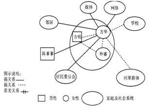

# 第二章　社会工作服务通用过程

## 第 1 题 [问答题]

**题目：** 1.方明和方华是一对孤儿兄妹。哥哥方明17岁，妹妹方华15岁。父亲原来在某市一家童装厂(集体性质)上班，由于身患精神病.糖尿病.心脏病，从1984年开始在家吃劳保，每月劳保金74元。后来，社区居民委员会为他们办理了低保(每月356元)，直至2003年4月15日其父亲在医院过世。其母亲在13年前就失踪了，外婆年事已高，无法照顾兄妹俩。社区居民委员会为兄妹俩办了低保，安装了水电，学校为兄妹俩免了学费。但是兄妹两人的自我照顾能力很弱，家里物品堆放凌乱，散发出阵阵霉味；每个月的低保金不过月半就已花完，靠着邻里的接济过日子；哥哥喜欢上网，经常在网吧上网。两人都没有朋友，经常不上学。父亲生前有一个好友陈爹爹偶尔会回来看望兄妹俩。
问题：
1．结合社会生态系统理论的基本要点，请绘制方华的社会生态系统图。
2．分析方华的主要问题及成因。
3．结合优势视角理论，提出方华的介入服务过程。

**参考答案/解析：**
1．方华的社会生态系统图2．通过到社区居民委员会了解情况，并到方华的家中进行探访，与兄妹进行了面谈，可以了解到如下的情况：(1)家里凌乱不堪，妹妹方华蓬头垢面，家里水电设施已年久失修。(2)兄妹辍学在家，无所事事。(3)妹妹方华的社会交往圈子很小，在现实生活中除了哥哥方明几乎没有交谈的对象，而寄托于网络世界。(4)服务对象每月前半月花完低保金，后半月靠邻居接济和挨饿度日。(5)对于兄妹两人的问题，新闻媒体已作报道，一些热心的邻居已经开始关注。对于方华来说，最开心的日子就是父亲生前好友陈爹爹偶尔来看望他们的时候。社会工作者还跟社区居民委员会的工作人员进行沟通，了解到了兄妹俩的整个成长史，初步判断兄妹俩的问题：缺乏生活自理能力.正常的认知能力.自我管理能力；经济生活拮据；社会交往贫乏，等等。主要是由于自幼生活在一个非正常的家庭环境中，缺少必要的社会化环境和教导。3．结合优势视角理论的介入服务过程：（1）第一步：识别优势。个人优势：兄妹俩坚强面对生活、哥哥有网络技能。环境优势：社区居民委员会关注、邻居热心帮助、父亲好友陈爹爹支持、学校免除学费。资源优势：低保保障、媒体报道带来的社会关注。（2）第二步：建立信任关系。社工主动接触兄妹俩，表达关心和支持。定期家访，了解需求和困难。与陈爹爹建立联系，共同关心兄妹。（3）第三步：设定目标。短期目标：改善居家环境、培养生活自理能力、重返校园。中期目标：建立社会支持网络、提升自我管理能力。长期目标：实现独立生活、融入社会。（4）第四步：实施介入。整合资源：联系社区居民委员会、邻居、志愿者提供支持。能力建设：教授生活技能、理财知识、时间管理。社会交往：鼓励参加社区活动、建立朋辈关系。学业支持：联系学校、安排课业辅导。（5）第五步：评估与调整。定期评估目标达成情况。根据实际情况调整服务计划。巩固已有改变，持续推进服务。参考解析：-

---

## 第 2 题 [问答题]

**题目：** 2.小军，15岁。其父工作繁忙，与小军很少交流；其母对小军要求严格，事事包办、处处操心。期中考试时，小军的成绩降到了班级后几名，被母亲狠狠地训斥了一顿。父亲回家后，母亲又把矛头指向父亲，继而引起夫妻间的激烈争吵。小军觉得再也待不下去，第二天就离家出走了。两天后，父母在同学家里找到了小军，但小军对父母不理不睬，拒绝回家。母亲焦急万分，遂向社会工作者求助。
社会工作者与小军的母亲进行了第一次会谈，主要对话内容如下：
母亲：“辛辛苦苦养他这么大，现在他却离家出走，我实在伤心透了。请你帮帮我，尽快劝我儿子回家吧。”
社会工作者：“我很能理解你现在的心情，也愿意帮助你，我们是否可以商量一下具体该做些什么呢？”
母亲：“这是我儿子同学家的地址，你赶紧去劝劝他吧。”
社会工作者：“我听了你的讲述，觉得儿子的问题也与你平时的态度有关吧，能不能一起探讨一下呢？”
母亲：“我怎么会有问题？我对儿子倾注了这么多心血！要怪就怪我丈夫，一天到晚不在家，回家就骂儿子，一点也帮不了我，要谈你就找我丈夫去谈吧。”
社会工作者：“那你今天来找我，最主要的目的就是让我帮你说服儿子回家？”
母亲：“是的，请你尽快帮我吧，我实在走投无路了”
社会工作者：“好的，我明白了你的需要，我会马上找他的。”
接案面谈就此结束。
问题：结合本案例，指出社会工作者在上述接案面谈中没有完成的主要任务有哪些，并说明理由。

**参考答案/解析：**
1．方华的社会生态系统图2．通过到社区居民委员会了解情况，并到方华的家中进行探访，与兄妹进行了面谈，可以了解到如下的情况：(1)家里凌乱不堪，妹妹方华蓬头垢面，家里水电设施已年久失修。(2)兄妹辍学在家，无所事事。(3)妹妹方华的社会交往圈子很小，在现实生活中除了哥哥方明几乎没有交谈的对象，而寄托于网络世界。(4)服务对象每月前半月花完低保金，后半月靠邻居接济和挨饿度日。(5)对于兄妹两人的问题，新闻媒体已作报道，一些热心的邻居已经开始关注。对于方华来说，最开心的日子就是父亲生前好友陈爹爹偶尔来看望他们的时候。社会工作者还跟社区居民委员会的工作人员进行沟通，了解到了兄妹俩的整个成长史，初步判断兄妹俩的问题：缺乏生活自理能力.正常的认知能力.自我管理能力；经济生活拮据；社会交往贫乏，等等。主要是由于自幼生活在一个非正常的家庭环境中，缺少必要的社会化环境和教导。3．结合优势视角理论的介入服务过程：（1）第一步：识别优势。个人优势：兄妹俩坚强面对生活、哥哥有网络技能。环境优势：社区居民委员会关注、邻居热心帮助、父亲好友陈爹爹支持、学校免除学费。资源优势：低保保障、媒体报道带来的社会关注。（2）第二步：建立信任关系。社工主动接触兄妹俩，表达关心和支持。定期家访，了解需求和困难。与陈爹爹建立联系，共同关心兄妹。（3）第三步：设定目标。短期目标：改善居家环境、培养生活自理能力、重返校园。中期目标：建立社会支持网络、提升自我管理能力。长期目标：实现独立生活、融入社会。（4）第四步：实施介入。整合资源：联系社区居民委员会、邻居、志愿者提供支持。能力建设：教授生活技能、理财知识、时间管理。社会交往：鼓励参加社区活动、建立朋辈关系。学业支持：联系学校、安排课业辅导。（5）第五步：评估与调整。定期评估目标达成情况。根据实际情况调整服务计划。巩固已有改变，持续推进服务。参考解析：-

---

## 第 3 题 [问答题]

**题目：** 3.大勇出生后不久父母便离异了，父母没有尽到照顾大勇的责任。大勇从小在奶奶身边长大，受到的约束比较少，他经常与同学打架，初中毕业后不再上学，接触了很多社会上的朋友。一次为了讲义气，帮朋友打架，被判入狱，后转入社区进行矫治。在矫治期间，大勇对家人感到不满，对现在比他强的朋友感到不满，对社区中显阔的人看不惯，情绪经常出现波动，动不动就大发脾气。社区工作者针对大勇的情况，积极与他进行沟通，并与之建立了良好的专业关系，和大勇达成了用认知行为治疗方法来帮助大勇改变易怒的情绪问题。社区工作者采用基线测量方法介入治疗，让大勇对1-3周情绪激动的次数进行记录（分别为每周8、9、7次），从第四周开始进行介入，记录4-10周情绪激动的次数为每周6、5、4、3、2、2、3次。
问题1.简述基线测量方法的含义。
问题2.从案例内容分析，阐述基线测量的操作程序。

**参考答案/解析：**
1．方华的社会生态系统图2．通过到社区居民委员会了解情况，并到方华的家中进行探访，与兄妹进行了面谈，可以了解到如下的情况：(1)家里凌乱不堪，妹妹方华蓬头垢面，家里水电设施已年久失修。(2)兄妹辍学在家，无所事事。(3)妹妹方华的社会交往圈子很小，在现实生活中除了哥哥方明几乎没有交谈的对象，而寄托于网络世界。(4)服务对象每月前半月花完低保金，后半月靠邻居接济和挨饿度日。(5)对于兄妹两人的问题，新闻媒体已作报道，一些热心的邻居已经开始关注。对于方华来说，最开心的日子就是父亲生前好友陈爹爹偶尔来看望他们的时候。社会工作者还跟社区居民委员会的工作人员进行沟通，了解到了兄妹俩的整个成长史，初步判断兄妹俩的问题：缺乏生活自理能力.正常的认知能力.自我管理能力；经济生活拮据；社会交往贫乏，等等。主要是由于自幼生活在一个非正常的家庭环境中，缺少必要的社会化环境和教导。3．结合优势视角理论的介入服务过程：（1）第一步：识别优势。个人优势：兄妹俩坚强面对生活、哥哥有网络技能。环境优势：社区居民委员会关注、邻居热心帮助、父亲好友陈爹爹支持、学校免除学费。资源优势：低保保障、媒体报道带来的社会关注。（2）第二步：建立信任关系。社工主动接触兄妹俩，表达关心和支持。定期家访，了解需求和困难。与陈爹爹建立联系，共同关心兄妹。（3）第三步：设定目标。短期目标：改善居家环境、培养生活自理能力、重返校园。中期目标：建立社会支持网络、提升自我管理能力。长期目标：实现独立生活、融入社会。（4）第四步：实施介入。整合资源：联系社区居民委员会、邻居、志愿者提供支持。能力建设：教授生活技能、理财知识、时间管理。社会交往：鼓励参加社区活动、建立朋辈关系。学业支持：联系学校、安排课业辅导。（5）第五步：评估与调整。定期评估目标达成情况。根据实际情况调整服务计划。巩固已有改变，持续推进服务。参考解析：-

---

## 第 4 题 [问答题]

**题目：** 4.张丽的丈夫独立经营一家网络公司，因工作繁忙，平时很少过问儿子小雷的事情。为了更好地照顾小雷，张丽目前是全职妈妈。
小雷是独生子女，从小娇生惯养，在小学时学习成绩还不错，可自从上了初中，便开始迷上网络游戏，经常逃课.不写作业，学习成绩急剧下降。张丽意识到是自己疏于管教，于是开始严格要求小雷，并禁止他玩游戏，还停止给他零花钱。任性的小雷竟然以离家出走的方式向母亲抗议，并表示要自己独立。无助的张丽找到社会工作者，希望能够帮助儿子。
问题：
1．界定服务对象的问题或需要。
2．确定服务目的与目标。
3．选择介入策略。

**参考答案/解析：**
1．方华的社会生态系统图2．通过到社区居民委员会了解情况，并到方华的家中进行探访，与兄妹进行了面谈，可以了解到如下的情况：(1)家里凌乱不堪，妹妹方华蓬头垢面，家里水电设施已年久失修。(2)兄妹辍学在家，无所事事。(3)妹妹方华的社会交往圈子很小，在现实生活中除了哥哥方明几乎没有交谈的对象，而寄托于网络世界。(4)服务对象每月前半月花完低保金，后半月靠邻居接济和挨饿度日。(5)对于兄妹两人的问题，新闻媒体已作报道，一些热心的邻居已经开始关注。对于方华来说，最开心的日子就是父亲生前好友陈爹爹偶尔来看望他们的时候。社会工作者还跟社区居民委员会的工作人员进行沟通，了解到了兄妹俩的整个成长史，初步判断兄妹俩的问题：缺乏生活自理能力.正常的认知能力.自我管理能力；经济生活拮据；社会交往贫乏，等等。主要是由于自幼生活在一个非正常的家庭环境中，缺少必要的社会化环境和教导。3．结合优势视角理论的介入服务过程：（1）第一步：识别优势。个人优势：兄妹俩坚强面对生活、哥哥有网络技能。环境优势：社区居民委员会关注、邻居热心帮助、父亲好友陈爹爹支持、学校免除学费。资源优势：低保保障、媒体报道带来的社会关注。（2）第二步：建立信任关系。社工主动接触兄妹俩，表达关心和支持。定期家访，了解需求和困难。与陈爹爹建立联系，共同关心兄妹。（3）第三步：设定目标。短期目标：改善居家环境、培养生活自理能力、重返校园。中期目标：建立社会支持网络、提升自我管理能力。长期目标：实现独立生活、融入社会。（4）第四步：实施介入。整合资源：联系社区居民委员会、邻居、志愿者提供支持。能力建设：教授生活技能、理财知识、时间管理。社会交往：鼓励参加社区活动、建立朋辈关系。学业支持：联系学校、安排课业辅导。（5）第五步：评估与调整。定期评估目标达成情况。根据实际情况调整服务计划。巩固已有改变，持续推进服务。参考解析：-

---

## 第 5 题 [问答题]

**题目：** 5.小美是初二的学生，学习成绩中等偏下，性格孤僻，在学校经常独来独往，放学后也不跟社区里的同龄人玩耍。小美的母亲是从外地农村嫁到城里的 “外来媳”，与亲戚.邻居交往少，因为身体不好，主要在家接一些手工活贴补家里。小美的父亲是一线操作工人，三班倒，工作十分辛苦，收入较低。父亲对小美比较严厉，父女之间交流很少。因为工作时问关系，父母之间很少沟通，家里有什么事，都是父亲说了算。小美一家也不参加任何社区活动，社会工作者在一次“外来媳”家庭走访中遇到了小美，决定对其开展个案服务。在预估阶段，社会工作者只收集了小美对自己问题的看法，就认定小美的问题源于自信心不足。
问题：
1．在本案例的预估阶段，社会工作者应从小美家庭层面收集哪些资料?
2．在本案例的预估阶段，社会工作者还应从小美与环境的互动层面收集哪些资料?

**参考答案/解析：**
1．方华的社会生态系统图2．通过到社区居民委员会了解情况，并到方华的家中进行探访，与兄妹进行了面谈，可以了解到如下的情况：(1)家里凌乱不堪，妹妹方华蓬头垢面，家里水电设施已年久失修。(2)兄妹辍学在家，无所事事。(3)妹妹方华的社会交往圈子很小，在现实生活中除了哥哥方明几乎没有交谈的对象，而寄托于网络世界。(4)服务对象每月前半月花完低保金，后半月靠邻居接济和挨饿度日。(5)对于兄妹两人的问题，新闻媒体已作报道，一些热心的邻居已经开始关注。对于方华来说，最开心的日子就是父亲生前好友陈爹爹偶尔来看望他们的时候。社会工作者还跟社区居民委员会的工作人员进行沟通，了解到了兄妹俩的整个成长史，初步判断兄妹俩的问题：缺乏生活自理能力.正常的认知能力.自我管理能力；经济生活拮据；社会交往贫乏，等等。主要是由于自幼生活在一个非正常的家庭环境中，缺少必要的社会化环境和教导。3．结合优势视角理论的介入服务过程：（1）第一步：识别优势。个人优势：兄妹俩坚强面对生活、哥哥有网络技能。环境优势：社区居民委员会关注、邻居热心帮助、父亲好友陈爹爹支持、学校免除学费。资源优势：低保保障、媒体报道带来的社会关注。（2）第二步：建立信任关系。社工主动接触兄妹俩，表达关心和支持。定期家访，了解需求和困难。与陈爹爹建立联系，共同关心兄妹。（3）第三步：设定目标。短期目标：改善居家环境、培养生活自理能力、重返校园。中期目标：建立社会支持网络、提升自我管理能力。长期目标：实现独立生活、融入社会。（4）第四步：实施介入。整合资源：联系社区居民委员会、邻居、志愿者提供支持。能力建设：教授生活技能、理财知识、时间管理。社会交往：鼓励参加社区活动、建立朋辈关系。学业支持：联系学校、安排课业辅导。（5）第五步：评估与调整。定期评估目标达成情况。根据实际情况调整服务计划。巩固已有改变，持续推进服务。参考解析：-

---

## 第 6 题 [问答题]

**题目：** 6.章文欣，女，13岁，初一学生，与父母感情淡薄。幼年时，因为母亲被派往国外工作，她被寄养在外婆家四年，7岁时与父母团聚，但因为父母工作繁忙，她由保姆照看。章文欣在小学时成绩优秀，老师经常夸奖，但由于性格较内向，团体活动参加较少，只有几个知心好友。小学毕业后，她考入一所重点中学，原来的伙伴都分散了，同时，重点中学里学习压力很大，好强的章文欣变得越来越孤僻。而父母工作繁忙，每天早出晚归，很少与她交流，全家人只有周末偶尔一起吃饭，饭桌上父母又没完没了地告诫她考试要进入班上前3名。搅得她心烦意乱，压力很大，上课无法集中注意力。结果，她期末考试排第5名，父母非常生气，母亲还动手打她。寒假时，她在家里上网，被各类网络游戏吸引，沉溺其中无法自拔。新学期开学后不久，她就不愿上学，被父母强行送到学校，上课注意力极度不集中，情绪不稳定，对同学乱发脾气，放学回家的第一件事就是打开电脑上网，不完成作业，终于引起老师的重视，主动跟家长沟通。现在，章文欣情绪低落已近半年，成绩明显下滑，非常悲观，对任何事物都不感兴趣，甚至想自杀。
【问题】
假如你是章文欣所在学校的社会工作者，其父母和班主任请你为其提供服务。请设计一份服务方案。

**参考答案/解析：**
1．方华的社会生态系统图2．通过到社区居民委员会了解情况，并到方华的家中进行探访，与兄妹进行了面谈，可以了解到如下的情况：(1)家里凌乱不堪，妹妹方华蓬头垢面，家里水电设施已年久失修。(2)兄妹辍学在家，无所事事。(3)妹妹方华的社会交往圈子很小，在现实生活中除了哥哥方明几乎没有交谈的对象，而寄托于网络世界。(4)服务对象每月前半月花完低保金，后半月靠邻居接济和挨饿度日。(5)对于兄妹两人的问题，新闻媒体已作报道，一些热心的邻居已经开始关注。对于方华来说，最开心的日子就是父亲生前好友陈爹爹偶尔来看望他们的时候。社会工作者还跟社区居民委员会的工作人员进行沟通，了解到了兄妹俩的整个成长史，初步判断兄妹俩的问题：缺乏生活自理能力.正常的认知能力.自我管理能力；经济生活拮据；社会交往贫乏，等等。主要是由于自幼生活在一个非正常的家庭环境中，缺少必要的社会化环境和教导。3．结合优势视角理论的介入服务过程：（1）第一步：识别优势。个人优势：兄妹俩坚强面对生活、哥哥有网络技能。环境优势：社区居民委员会关注、邻居热心帮助、父亲好友陈爹爹支持、学校免除学费。资源优势：低保保障、媒体报道带来的社会关注。（2）第二步：建立信任关系。社工主动接触兄妹俩，表达关心和支持。定期家访，了解需求和困难。与陈爹爹建立联系，共同关心兄妹。（3）第三步：设定目标。短期目标：改善居家环境、培养生活自理能力、重返校园。中期目标：建立社会支持网络、提升自我管理能力。长期目标：实现独立生活、融入社会。（4）第四步：实施介入。整合资源：联系社区居民委员会、邻居、志愿者提供支持。能力建设：教授生活技能、理财知识、时间管理。社会交往：鼓励参加社区活动、建立朋辈关系。学业支持：联系学校、安排课业辅导。（5）第五步：评估与调整。定期评估目标达成情况。根据实际情况调整服务计划。巩固已有改变，持续推进服务。参考解析：-

---

