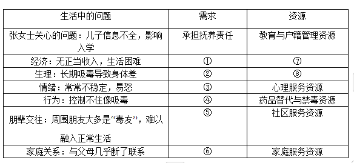

# 2023年中级社会工作者考试《社会工作实务》真题及答案

## 第 1 题 [问答题]

**题目：** 1.某日，王奶奶到镇社工站向社会工作者倾诉，儿子儿媳两年前外出务工平时很少回家对家里的事不管不问，把10岁的孙女丢给自己和老伴照看，她对此感到非常无奈但又不知道如何与儿子儿媳沟通。社会工作者了解到最近王奶奶的老伴因意外摔倒卧床不起，她既要照顾老伴又要照看孙女，经常感到力不从心；王奶奶经常将孙女锁在家里写作业，节假日也不准她外出，生怕发生意外，孙女为此经常与她发生争执。年龄的增长、身体变差、老伴受伤后医疗费支出的增加，让她更加烦躁不安，经常因一点琐事与邻居争吵；现在她也没有时间参加社区活动，与原来的老姐妹逐渐疏远。王奶奶对现在的生活状况很不满意，觉得自己晚年生活没有意思，却不知道该怎么办?社会工作者在征得王奶奶同意后，计划为她开展服务。问题：1、列出本案中的奶奶面临的问题2、依据家庭生命周期理论，分析王奶奶所处的家庭阶段以及面临的主要任务

> **正确答案：** 见解析

**解析：**
问答题
                
                1/5
                
                
                
            
            1.某日，王奶奶到镇社工站向社会工作者倾诉，儿子儿媳两年前外出务工平时很少回家对家里的事不管不问，把10岁的孙女丢给自己和老伴照看，她对此感到非常无奈但又不知道如何与儿子儿媳沟通。社会工作者了解到最近王奶奶的老伴因意外摔倒卧床不起，她既要照顾老伴又要照看孙女，经常感到力不从心；王奶奶经常将孙女锁在家里写作业，节假日也不准她外出，生怕发生意外，孙女为此经常与她发生争执。年龄的增长、身体变差、老伴受伤后医疗费支出的增加，让她更加烦躁不安，经常因一点琐事与邻居争吵；现在她也没有时间参加社区活动，与原来的老姐妹逐渐疏远。王奶奶对现在的生活状况很不满意，觉得自己晚年生活没有意思，却不知道该怎么办?社会工作者在征得王奶奶同意后，计划为她开展服务。问题：1、列出本案中的奶奶面临的问题2、依据家庭生命周期理论，分析王奶奶所处的家庭阶段以及面临的主要任务
            答：

---

## 第 2 题 [问答题]

**题目：** 2.服务对象张女士，40岁。未参加正式工作，现在戒毒期间。社会工作者了解到，张女士的儿子到了上学年龄，因为是非婚生育身份信息不全，影响了入学的办理，张女士为此非常着急。社会工作者决定以此为契机，采用个案管理的方式为张女士提供服务。社会工作者运用社会一心理视角，在“情境中”观察张女士与周国环境互动情况。社会工作者与张女士一起将生活问题转为需求逐一讨论可使用的资源，制作需求与资源分析表。接下来，社会工作者征得张女士同意与相关资源逐一关联确认。并与警察，医生各方紧密合作。提出一整套服务，持续跟进资源的全程使用，保障服务效果。问题：1、将张女士生活中问题转化为需求，并列出她可以运用的资源，只需按照表格中序号，写在答题卡上；  2、结合本案例，分析社会工作者遵循了那些个案管理原则。

> **正确答案：** 见解析

**解析：**
问答题
                
                2/5
                
                
                
            
            2.服务对象张女士，40岁。未参加正式工作，现在戒毒期间。社会工作者了解到，张女士的儿子到了上学年龄，因为是非婚生育身份信息不全，影响了入学的办理，张女士为此非常着急。社会工作者决定以此为契机，采用个案管理的方式为张女士提供服务。社会工作者运用社会一心理视角，在“情境中”观察张女士与周国环境互动情况。社会工作者与张女士一起将生活问题转为需求逐一讨论可使用的资源，制作需求与资源分析表。接下来，社会工作者征得张女士同意与相关资源逐一关联确认。并与警察，医生各方紧密合作。提出一整套服务，持续跟进资源的全程使用，保障服务效果。问题：1、将张女士生活中问题转化为需求，并列出她可以运用的资源，只需按照表格中序号，写在答题卡上；  2、结合本案例，分析社会工作者遵循了那些个案管理原则。
            答：

---

## 第 3 题 [问答题]

**题目：** 3.针对D街道老人和儿童缺乏社区照顾的问题，社会工作服务机构与基金会联合启动了“五社联动”助力“一老一小”项目。社会工作者充分发挥资源经纪人的角色作用，通过问卷调查、入户访谈、绘制社会生态系统图和社区资源图等方式，了解老人和儿童的需求、现存人际关系，识别社区中的服务资源。在此基础上，社会工作者动员与服务对象关系密切的亲友提供支持；将处于困境中的老人和儿童推介给社区志愿服务队，建立长期的陪伴服务关系，培养成立社区互助会，组织有参与意愿的老人和儿童互相认识，互相支持，定期举办社区公益资源集市，促进爱心企业、邻居与有需要的老人及儿童对接；协助老人、儿童掌握联系和使用服务资源的方法、定期回访了解服务对接和资源使用情况。经过多方努力，针对“一老一小”的社区支持网络在D街道得以建立。问题：1、社会工作者在扮演资源经纪人角色时，运用了哪些服务技巧？2、分析社会工作者在本案例中运用了哪些建立社区支持网络的策略?

> **正确答案：** 见解析

**解析：**
问答题
                
                3/5
                
                
                
            
            3.针对D街道老人和儿童缺乏社区照顾的问题，社会工作服务机构与基金会联合启动了“五社联动”助力“一老一小”项目。社会工作者充分发挥资源经纪人的角色作用，通过问卷调查、入户访谈、绘制社会生态系统图和社区资源图等方式，了解老人和儿童的需求、现存人际关系，识别社区中的服务资源。在此基础上，社会工作者动员与服务对象关系密切的亲友提供支持；将处于困境中的老人和儿童推介给社区志愿服务队，建立长期的陪伴服务关系，培养成立社区互助会，组织有参与意愿的老人和儿童互相认识，互相支持，定期举办社区公益资源集市，促进爱心企业、邻居与有需要的老人及儿童对接；协助老人、儿童掌握联系和使用服务资源的方法、定期回访了解服务对接和资源使用情况。经过多方努力，针对“一老一小”的社区支持网络在D街道得以建立。问题：1、社会工作者在扮演资源经纪人角色时，运用了哪些服务技巧？2、分析社会工作者在本案例中运用了哪些建立社区支持网络的策略?
            答：

---

## 第 4 题 [问答题]

**题目：** 4.某中学恢复线下教学后，学校社会工作者发现，部分学生沉迷于网络，出现了情绪低落、疲乏无力、食饮不振等状况，学习成绩和身心健康受到了严重影响。社会工作者通过预估发现：这些学生平均每天上网超过4个小时；虽然大部分学生对长时间上网的危害有所认识，但总是控制不住自己；与现实世界相比，网络世界对他们更有吸引力；他们性格较为内向，在学校很少参加集体活动；与同学，老师及家人的关系都比较疏离；新冠肺炎疫情期间，由于教学活动以线上形式为主，家长对孩子使用电子产品及网络疏于监督和引导，学校也没有就此与家长进行有效沟通。基于上述情况，社会工作者按照行为契约法的五个工作步骤开展服务：第一步，与学生共同确定目标行为，即控制上网时间；第二步，商定奖惩清单，即成功控制上网时间将获得的奖励，没有控物上网时间将受到的惩罚。问题：1、本案例中，社会工作者在预估阶段完成了哪些任务?2、按照行为契约法的五个工作步骤，列出本案例中后续需完成的三个工作步骤。

> **正确答案：** 见解析

**解析：**
问答题
                
                4/5
                
                
                
            
            4.某中学恢复线下教学后，学校社会工作者发现，部分学生沉迷于网络，出现了情绪低落、疲乏无力、食饮不振等状况，学习成绩和身心健康受到了严重影响。社会工作者通过预估发现：这些学生平均每天上网超过4个小时；虽然大部分学生对长时间上网的危害有所认识，但总是控制不住自己；与现实世界相比，网络世界对他们更有吸引力；他们性格较为内向，在学校很少参加集体活动；与同学，老师及家人的关系都比较疏离；新冠肺炎疫情期间，由于教学活动以线上形式为主，家长对孩子使用电子产品及网络疏于监督和引导，学校也没有就此与家长进行有效沟通。基于上述情况，社会工作者按照行为契约法的五个工作步骤开展服务：第一步，与学生共同确定目标行为，即控制上网时间；第二步，商定奖惩清单，即成功控制上网时间将获得的奖励，没有控物上网时间将受到的惩罚。问题：1、本案例中，社会工作者在预估阶段完成了哪些任务?2、按照行为契约法的五个工作步骤，列出本案例中后续需完成的三个工作步骤。
            答：

---

## 第 5 题 [问答题]

**题目：** 5.随着互联网共享经济模式的快速兴起，外卖骑手的需求以及他们面临的问题也日益凸显，社会工作服务机构对某市骑手群体的生存和发展状况开展调查时发现，大部分骑手属于‘新生代农民’他们处于相对弱势地位，遇到困难时主要求助对象为亲友；很多骑手每天工作超过12个小时，业余生活单调枯燥；近4成骑手对目前的工作状态不满意，但又不知道未来能做什么；近三成骑手没有任何类型的保险；近5成骑手曾经还发生过不同程度的交通事故，除了受天气路况和车辆状况等因素影响；主要原因在于担心订单超时不得不违反交通规则或担心在家的小孩儿心神不宁，或不能被消费者尊重理解而心理压力大；调查还发现骑手群体在工作中的积累众多交通安全经验，大多数也有帮助他人的意愿。基于调查结果，该社会工作服务机构依据系统理论，从微观、中观和宏观三个层面，而发起了‘关爱骑手，社会工作在行动’服务。
问题：
依据系统理论，设计关爱骑手，社会工作在行动的服务方案，只需要列出理论要点，服务目标和服务策略。

> **正确答案：** 问答题
                5/5
            5.随着互联网共享经济模式的快速兴起，外卖骑手的需求以及他们面临的问题也日益凸显，社会工作服务机构对某市骑手群体的生存和发展状况开展调查时发现，大部分骑手属于‘新生代农民’他们处于相对弱势地位，遇到困难时主要求助对象为亲友；很多骑手每天工作超过12个小时，业余生活单调枯燥；近4成骑手对目前的工作状态不满意，但又不知道未来能做什么；近三成骑手没有任何类型的保险；近5成骑手曾经还发生过不同程度的交通事故，除了受天气路况和车辆状况等因素影响；主要原因在于担心订单超时不得不违反交通规则或担心在家的小孩儿心神不宁，或不能被消费者尊重理解而心理压力大；调查还发现骑手群体在工作中的积累众多交通安全经验，大多数也有帮助他人的意愿。基于调查结果，该社会工作服务机构依据系统理论，从微观、中观和宏观三个层面，而发起了‘关爱骑手，社会工作在行动’服务。
问题：
依据系统理论，设计关爱骑手，社会工作在行动的服务方案，只需要列出理论要点，服务目标和服务策略。
            答：

**解析：**
见答案

---

