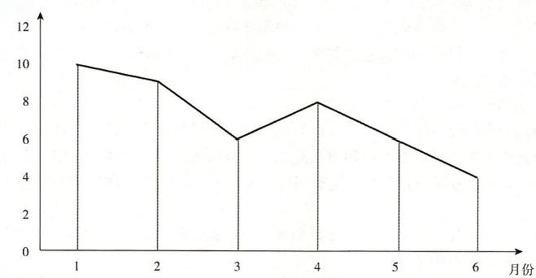

# 02 社会工作服务通用过程_know-373

# 第二章　社会工作服务通用过程

## 第 1 题 [问答题]

**题目：** 1.方明和方华是一对孤儿兄妹。哥哥方明17岁，妹妹方华15岁。父亲原来在某市一家童装厂(集体性质)上班，由于身患精神病.糖尿病.心脏病，从1984年开始在家吃劳保，每月劳保金74元。后来，社区居民委员会为他们办理了低保(每月356元)，直至2003年4月15日其父亲在医院过世。其母亲在13年前就失踪了，外婆年事已高，无法照顾兄妹俩。社区居民委员会为兄妹俩办了低保，安装了水电，学校为兄妹俩免了学费。但是兄妹两人的自我照顾能力很弱，家里物品堆放凌乱，散发出阵阵霉味；每个月的低保金不过月半就已花完，靠着邻里的接济过日子；哥哥喜欢上网，经常在网吧上网。两人都没有朋友，经常不上学。父亲生前有一个好友陈爹爹偶尔会回来看望兄妹俩。问题：1．结合社会生态系统理论的基本要点，请绘制方华的社会生态系统图。2．分析方华的主要问题及成因。3．结合优势视角理论，提出方华的介入服务过程。

> **正确答案：** 1．方华的社会生态系统图  2．通过到社区居民委员会了解情况，并到方华的家中进行探访，与兄妹进行了面谈，可以了解到如下的情况：(1)家里凌乱不堪，妹妹方华蓬头垢面，家里水电设施已年久失修。(2)兄妹辍学在家，无所事事。(3)妹妹方华的社会交往圈子很小，在现实生活中除了哥哥方明几乎没有交谈的对象，而寄托于网络世界。(4)服务对象每月前半月花完低保金，后半月靠邻居接济和挨饿度日。(5)对于兄妹两人的问题，新闻媒体已作报道，一些热心的邻居已经开始关注。对于方华来说，最开心的日子就是父亲生前好友陈爹爹偶尔来看望他们的时候。社会工作者还跟社区居民委员会的工作人员进行沟通，了解到了兄妹俩的整个成长史，初步判断兄妹俩的问题：缺乏生活自理能力.正常的认知能力.自我管理能力；经济生活拮据；社会交往贫乏，等等。主要是由于自幼生活在一个非正常的家庭环境中，缺少必要的社会化环境和教导。3．结合优势视角理论的介入服务过程：（1）第一步：识别优势。个人优势：兄妹俩坚强面对生活、哥哥有网络技能。环境优势：社区居民委员会关注、邻居热心帮助、父亲好友陈爹爹支持、学校免除学费。资源优势：低保保障、媒体报道带来的社会关注。（2）第二步：建立信任关系。社工主动接触兄妹俩，表达关心和支持。定期家访，了解需求和困难。与陈爹爹建立联系，共同关心兄妹。（3）第三步：设定目标。短期目标：改善居家环境、培养生活自理能力、重返校园。中期目标：建立社会支持网络、提升自我管理能力。长期目标：实现独立生活、融入社会。（4）第四步：实施介入。整合资源：联系社区居民委员会、邻居、志愿者提供支持。能力建设：教授生活技能、理财知识、时间管理。社会交往：鼓励参加社区活动、建立朋辈关系。学业支持：联系学校、安排课业辅导。（5）第五步：评估与调整。定期评估目标达成情况。根据实际情况调整服务计划。巩固已有改变，持续推进服务。

**解析：**
无

---

## 第 2 题 [问答题]

**题目：** 2.小军，15岁。其父工作繁忙，与小军很少交流；其母对小军要求严格，事事包办、处处操心。期中考试时，小军的成绩降到了班级后几名，被母亲狠狠地训斥了一顿。父亲回家后，母亲又把矛头指向父亲，继而引起夫妻间的激烈争吵。小军觉得再也待不下去，第二天就离家出走了。两天后，父母在同学家里找到了小军，但小军对父母不理不睬，拒绝回家。母亲焦急万分，遂向社会工作者求助。社会工作者与小军的母亲进行了第一次会谈，主要对话内容如下：母亲：“辛辛苦苦养他这么大，现在他却离家出走，我实在伤心透了。请你帮帮我，尽快劝我儿子回家吧。”社会工作者：“我很能理解你现在的心情，也愿意帮助你，我们是否可以商量一下具体该做些什么呢？”母亲：“这是我儿子同学家的地址，你赶紧去劝劝他吧。”社会工作者：“我听了你的讲述，觉得儿子的问题也与你平时的态度有关吧，能不能一起探讨一下呢？”母亲：“我怎么会有问题？我对儿子倾注了这么多心血！要怪就怪我丈夫，一天到晚不在家，回家就骂儿子，一点也帮不了我，要谈你就找我丈夫去谈吧。”社会工作者：“那你今天来找我，最主要的目的就是让我帮你说服儿子回家？”母亲：“是的，请你尽快帮我吧，我实在走投无路了”社会工作者：“好的，我明白了你的需要，我会马上找他的。” 接案面谈就此结束。问题：结合本案例，指出社会工作者在上述接案面谈中没有完成的主要任务有哪些，并说明理由。

> **正确答案：** 在本案例中，社会工作者在接案会谈中没有完成的主要任务有：（1）了解服务对象对自己的看法。在社会工作者和小军母亲的会谈中，小军母亲一直强调自己对小军倾注了很多心血，而丈夫一天到晚不在家，回家就骂儿子，把过错都推在丈夫身上，没有认识到自身存在的问题。社会工作者应在会谈中深入了解小军母亲对自己的看法，找出问题的原因。（2）澄清角色期望和责任。会谈要澄清双方的期望和应尽的责任，通过协商减少差异。案例中小军母亲一直强调让社会工作者说服小军回家，社会工作者并没有让服务对象承担她自己的责任。小军出走是他的整个家庭造成的，单靠社会工作者一个人，不能从根本上解决问题，应该让小军的母亲承担应有的角色和责任。（3）激励并帮助服务对象进入受助角色。社会工作者在会谈时要帮助并引导小军母亲逐渐接受自己的角色，以便双方能够相互配合，从根本上解决小军出走的问题。（4）促进和引导服务对象态度和行为的改变。小军母亲对小军要求严格，事事包办、处处操心，小军的成绩下降，被母亲狠狠训斥，因此小军离家出走主要是他母亲引起的。然而在会谈中，小军母亲丝毫没有认识到自己的错误，社会工作者也没有进行引导，促使小军母亲改变这种态度和对待小军的行为。

**解析：**
无

---

## 第 3 题 [问答题]

**题目：** 3.大勇出生后不久父母便离异了，父母没有尽到照顾大勇的责任。大勇从小在奶奶身边长大，受到的约束比较少，他经常与同学打架，初中毕业后不再上学，接触了很多社会上的朋友。一次为了讲义气，帮朋友打架，被判入狱，后转入社区进行矫治。在矫治期间，大勇对家人感到不满，对现在比他强的朋友感到不满，对社区中显阔的人看不惯，情绪经常出现波动，动不动就大发脾气。社区工作者针对大勇的情况，积极与他进行沟通，并与之建立了良好的专业关系，和大勇达成了用认知行为治疗方法来帮助大勇改变易怒的情绪问题。社区工作者采用基线测量方法介入治疗，让大勇对1-3周情绪激动的次数进行记录（分别为每周8、9、7次），从第四周开始进行介入，记录4-10周情绪激动的次数为每周6、5、4、3、2、2、3次。问题1.简述基线测量方法的含义。问题2.从案例内容分析，阐述基线测量的操作程序。

> **正确答案：** 问题1.基线测量方法的含义：基线测量方法是在介入开始时对服务对象的状况进行测量，建立一个基线作为对介入行动效果进行衡量的标准基线，以评估介入前后的变化，并以此判断介入目标达到的程度。问题2.操作程序：（1）建立基线。①确定介入的目标。例如，服务对象行为、思想、感觉、社会关系或社会环境的变化及指标。②选择测量工具，包括直接观察或使用标准化问卷及量表。③对目标行为进行测量并记录目标行为的情况。（2）进行介入期测量。建立基线后就开始对服务对象实施介入，并对基线调查中所测量的各项目标行为和指标进行再测量，为数据比较之用。（3）分析和比较。将基线期和介入期的数据按测量时间和顺序制成图表，将每个时期的数据资料进行连接，呈现数据的变化轨迹和变化趋势，并将基线期和介入期的数据进行对比。如果两个数据不同，一般可以认为是介入本身作用的结果。

**解析：**
无

---

## 第 4 题 [问答题]

**题目：** 4.张丽的丈夫独立经营一家网络公司，因工作繁忙，平时很少过问儿子小雷的事情。为了更好地照顾小雷，张丽目前是全职妈妈。 小雷是独生子女，从小娇生惯养，在小学时学习成绩还不错，可自从上了初中，便开始迷上网络游戏，经常逃课.不写作业，学习成绩急剧下降。张丽意识到是自己疏于管教，于是开始严格要求小雷，并禁止他玩游戏，还停止给他零花钱。任性的小雷竟然以离家出走的方式向母亲抗议，并表示要自己独立。无助的张丽找到社会工作者，希望能够帮助儿子。 问题： 1．界定服务对象的问题或需要。 2．确定服务目的与目标。 3．选择介入策略。

> **正确答案：** 1．界定服务对象的问题或需要 (1)发展问题：从生命周期视角看，小雷进入了青春期，处在自我认同对抗同一性混乱阶段。这一阶段的发展任务是发展自我同一性，对他而言，“我是谁”是十分重要的。进入青春期的小雷表现出一定的逆反心理，追求独立，对母亲有抗议行为。青春期生命力旺盛需要释放，可以理解为游戏是释放生命力的一种渠道。 (2)行为问题：小雷需要改进的行为包括迷恋网络游戏.逃课.离家出走。需要用更多时间学习以提高学习成绩，与父母有良好的沟通。 (3)家庭问题：丈夫忙于工作，对于家庭及孩子的事情很少过问。父母不恰当的教育方式等需要改进。 2．确定服务目的与目标 (1)服务目的：帮助小雷顺利度过青春期，有良好的学校和家庭生活。 (2)服务目标：帮助小雷以适当的方式参与有益的活动；改善迷恋网络游戏的习惯与行为；按时上课.按时完成作业，有良好的作息时间；认识青春期，接纳自我；改善小雷的不适宜行为；改善亲子关系；帮助父母更好履行亲职。 3．选择介入策略 (1)直接介入 ——针对小雷的服务： ①运用个案辅导方法应用认识行为模式改善小雷对父母的认知，帮助其了解父母对他的爱和希望。改变小雷对学习和游戏的认识，帮助其制订个人学习计划，针对放学后的时间合理安排.家庭作业的完成等问题进行讨论并签署契约，设定合理的学习目标，并由小雷和父母共同监督。 ②设计并组织公益小组，邀请小雷参加公益小组，转移其注意力，体验新的人际交往，学习团队合作经验。 ③进行家庭辅导，训练家庭沟通技能，帮助建立家庭规范和良好的家庭沟通模式，注重用对方能够接受的方式表达自己的愿望。 (2)间接介入 ——针对环境： ①运用个案辅导方法帮助父母学习正确的育儿理念和教养方法，引导张丽夫妇认识到积极教育方式对孩子的影响，反思自己的教育方式。邀请父母协助管理.监督孩子学习并布置任务。 ②邀请父母参加相关的教育讲座。 ③与老师沟通，得到老师的支持，帮助小雷补习功课并监督其学习。同时，通过“结对子”.学习小组等方法建立朋辈支持系统。

**解析：**
无

---

## 第 5 题 [问答题]

**题目：** 5.小美是初二的学生，学习成绩中等偏下，性格孤僻，在学校经常独来独往，放学后也不跟社区里的同龄人玩耍。小美的母亲是从外地农村嫁到城里的 “外来媳”，与亲戚.邻居交往少，因为身体不好，主要在家接一些手工活贴补家里。小美的父亲是一线操作工人，三班倒，工作十分辛苦，收入较低。父亲对小美比较严厉，父女之间交流很少。因为工作时问关系，父母之间很少沟通，家里有什么事，都是父亲说了算。小美一家也不参加任何社区活动，社会工作者在一次“外来媳”家庭走访中遇到了小美，决定对其开展个案服务。在预估阶段，社会工作者只收集了小美对自己问题的看法，就认定小美的问题源于自信心不足。 问题： 1．在本案例的预估阶段，社会工作者应从小美家庭层面收集哪些资料? 2．在本案例的预估阶段，社会工作者还应从小美与环境的互动层面收集哪些资料?

> **正确答案：** 1．在本案的预估阶段，社会工作者应从小美家庭层面收集以下资料： (1)小美家庭成员的基本情况，小美的家庭成员主要包括父亲.母亲和小美三人。 (2)小美家庭的基本情况，如家庭收入较低.居住环境较差.母亲的身体不好等。 (3)小美家庭成员的角色和互动情况。 (4)小美的家庭规则，如遇到分歧或冲突时父亲说了算。 (5)小美家庭成员间的沟通方式，如父母之间很少沟通.父女之间交流很少等。 (6)小美的家庭关系，小美的家庭关系紧张，父母亲与小美之间关系不够亲密。 (7)小美家庭的决策和分工方式，小美的父亲负责挣钱养家，母亲主要负责照顾家里，小美则以学习为主，家里的事都是父亲一个人说了算。 2．在本案的预估阶段，社会工作者还应从小美与环境的互动层面收集以下资料： (1)小美的社会支持系统包括家庭.学校和社区，这些社会支持系统对小美的影响。 (2)小美所生活的环境对小美需要的满足程度，包括家庭环境.校园环境.社区环境对小美学习.生活和社会交往等需要的满足程度。 (3)小美对周围的环境资源的主观认知情况。 (4)小美的社会网络环境状况等。

**解析：**
无

---

## 第 6 题 [问答题]

**题目：** 6.章文欣，女，13岁，初一学生，与父母感情淡薄。幼年时，因为母亲被派往国外工作，她被寄养在外婆家四年，7岁时与父母团聚，但因为父母工作繁忙，她由保姆照看。章文欣在小学时成绩优秀，老师经常夸奖，但由于性格较内向，团体活动参加较少，只有几个知心好友。小学毕业后，她考入一所重点中学，原来的伙伴都分散了，同时，重点中学里学习压力很大，好强的章文欣变得越来越孤僻。而父母工作繁忙，每天早出晚归，很少与她交流，全家人只有周末偶尔一起吃饭，饭桌上父母又没完没了地告诫她考试要进入班上前3名。搅得她心烦意乱，压力很大，上课无法集中注意力。结果，她期末考试排第5名，父母非常生气，母亲还动手打她。寒假时，她在家里上网，被各类网络游戏吸引，沉溺其中无法自拔。新学期开学后不久，她就不愿上学，被父母强行送到学校，上课注意力极度不集中，情绪不稳定，对同学乱发脾气，放学回家的第一件事就是打开电脑上网，不完成作业，终于引起老师的重视，主动跟家长沟通。现在，章文欣情绪低落已近半年，成绩明显下滑，非常悲观，对任何事物都不感兴趣，甚至想自杀。 【问题】 假如你是章文欣所在学校的社会工作者，其父母和班主任请你为其提供服务。请设计一份服务方案。

> **正确答案：** (1)问题的陈述和分析 上述材料中，章文欣面临的问题主要表现为以下几个方面： ①学校的竞争压力很大，再加上父母施加的压力，使她不堪重压，逐渐患上抑郁症，学习成绩显著下降，情绪低落，态度悲观甚至想自杀。 ②性格比较内向，升学后对新环境适应不良，不愿主动与人交往，没有知心朋友，不参加集体活动，人际交往出现障碍。 ③有与父母分居四年的经历，团聚后又因为父母工作繁忙，与她交流甚少，亲子关系淡漠。母亲望女成风心切，有时责打她，导致母女关系紧张。 ④由于学业的压力和家庭关系的紧张，被各类网络游戏吸引，沉溺其中无法自拔，有互联网成瘾综合症的倾向，但为继发性。 ⑤产生厌学情绪，上课注意力极度不集中。 (2)方案设计 根据上述案主出现的问题，作为社会工作者，应设计的服务方案如下： ①方案目标 a．治疗章文欣的抑郁症，提高其社会适应能力，使她能够与他人进行正常的人际交往； b．改善章文欣与父母的关系，营造一个和睦融洽的家庭氛围； c．加深章文欣的自我认知，重建自信，恢复正常的学习和生活； d．帮助章文欣戒掉网络游戏瘾。 ②方案实施策略 a．通过社交能力训练，提高社会适应能力。 鼓励章文欣学习交友技巧，请家长给孩子创造交友机会，以提高孩子进行人际交往的自信心，引导孩子寻求适当对象交朋友，运用适当方法表达自己的情绪，有利于从根本上消除上学时的孤独感。 b．通过亲情拓展游戏，改善亲子关系，重建家庭功能。 改善章文欣亲子关系是治疗成功的关键因素。要求家长从两个方面配合，第一是多注意爱的情感表达，第二不再打骂女儿，第三是了解女儿的内心想法，不要因为过高期望而给女儿造成压力。建议近期进行亲情拓展游戏，必须严格完成每一个项目，以利于改善亲子关系。 c．加深章文欣的自我认知，重建自信，恢复正常的学习和生活。 帮助章文欣寻找自身优势，激发潜能，培养和重塑章文欣的自信，使其融入正常的学习和生活环境中。 d．通过心理治疗和行为疗法，治愈章文欣的抑郁倾向和网络游戏瘾。 ③方案执行 包括整合家庭与学校相关资源，为案主章文欣提供服务，监督计划执行进度，处理执行过程中的危机等。 ④方案评估 包括章文欣及其父母对服务的满意度.方案执行情况以及效果评估。

**解析：**
无

---

## 第 7 题 [问答题]

**题目：** 7.小军，15岁。其父工作繁忙，与小军很少交流；其母对小军要求严格，事事包办、处处操心。期中考试时，小军的成绩降到了班级后几名，被母亲狠狠地训斥了一顿。父亲回家后，母亲又把矛头指向父亲，继而引起夫妻间的激烈争吵。小军觉得再也待不下去了，第二天就离家出走了。2天后，父母在同学家里找到了小军，但小军对父母不理不睬，拒绝回家。母亲焦急万分，遂向社会工作者求助。社会工作者与小军的母亲进行了第一次面谈，主要对话内容如下。母亲：“辛辛苦苦养他这么大，现在他却离家出走，我实在伤心透了。请你帮帮我，尽快劝我儿子回家吧。”社会工作者：“我很能理解你现在的心情，也愿意帮助你，我们是否可以商量一下具体该做些什么呢?”母亲：“这是我儿子同学家的地址，你赶紧去劝劝他吧。”社会工作者：“我听了你的讲述，觉得你儿子的问题也与你平时的态度有关，能不能一起探讨一下呢?”母亲：“我怎么会有问题，我对儿子倾注了这么多心血!要怪就怪我丈夫，一天到晚不在家，回家就骂儿子，一点也帮不了我，要谈你就找我丈夫去谈吧。”社会工作者：“那你今天来找我，最希望的就是让我帮你说服儿子回家。”母亲：“是的，请你尽快帮帮我吧，我实在走投无路了。”社会工作者：“好的，我明白了你的需要，我会马上找他的。”接案面谈就此结束。问题：结合本案例，指出社会工作者在上述接案面谈中没有完成的主要任务有哪些?并说明理由。

> **正确答案：** 本案例中，社会工作者在接案面谈中没有完成的主要任务有：(1)了解服务对象对自己的看法。在社会工作者和小军母亲的面谈中，小军母亲一直 强调自己对小军倾注了很多心血，而丈夫一天到晚不在家，回家就骂儿子，把过错都推在 丈夫身上，没有认识到自己存在的问题。社会工作者应在面谈中深入了解小军母亲对她自 己的看法，找出问题的原因。(2)澄清角色期望和责任。面谈要澄清双方的期望和应尽的责任，通过协商减小差 异。案例中小军母亲一直强调让社会工作者说服小军回家，社会工作者并没有让服务对象 承担她自己的责任。小军出走是由他的整个家庭造成的，单靠社会工作者一个人，不能从 根本上解决问题，应该让小军的母亲承担应有的角色和责任。(3)激励并帮助服务对象进入受助角色。社会工作者在面谈时要帮助并引导服务对象 逐渐接受自己的角色，以便双方能够相互配合，从根本上解决小军出走的问题。(4)促进和引导服务对象态度和行为的改变。小军母亲对小军要求严格，事事包办、 处处操心，小军的成绩下降，被母亲狠狠训斥，因此小军离家出走主要是由他母亲引起  的。然而在面谈中，小军母亲丝毫没有认识到自己的错误，社会工作者应对其进行引导， 促使小军母亲改变对待小军的这种态度和行为。

**解析：**
无

---

## 第 8 题 [问答题]

**题目：** 8.大学毕业生小梅因车祸导致瘫痪，整天躺在床上无所事事，情绪十分低落。社会工作者小张介入后，对小梅进行了情绪疏导，并与她一起分析讨论，决定开办一家网上工艺品商店。一年来，在小张的协助下，网店发展走上了正轨，小梅已掌握了所有业务流程，情绪也恢复正常。在此情况下，小张觉得可以结案了。一天，小张在家访中告诉小梅，自己的任务已完成，从明天开始将不再来小梅的家。小梅感到十分震惊，情绪又回落到服务前的状态，没有心思处理网店的业务了。问题：1．分析导致小梅在结案时情绪回到以前状态的原因。2．结合案例，说明为避免小梅的负面反应，社会工作者小张在结案时应采取的处理方法。

> **正确答案：** 1．小梅在结案时情绪回到以前状态的原因分析小梅原来是一位大学生，因车祸导致瘫痪后，人生理想与现实的残酷有太大的落差。在社会工作者小张介入之后，小梅感受到了社会工作者的真诚与关注.尊重.接纳和肯定。情绪得到了有效疏导，同时找到了新的人生方向，也习惯了社会工作者的陪伴，在一定程度上必然产生对社会工作者的依赖。而结案意味着社会工作专业关系的终止，小梅要回到自己独立处理问题的生活世界中。因此，当社会工作者单方面提出结案时，小梅出现了结案时期的负面反应，主要原因包括：一是社会工作者未能提前告知小梅，使她做好相应的心理准备；二是社会工作者未能真正进行专业评估，与小梅共同商议是否到了结案时期；三是社会工作者没有较好地安排结案时期的有关工作，包括与小梅一起回顾过去，总结成效；与小梅一起探讨未来，可能出现的问题，并给予指导。2．为避免小梅的负面反应，社会工作者小张在结案时应采取的处理方法如下(1)与小梅一起讨论她对结案是否成熟。社会工作者要与小梅一起回顾整个专业服务的历程，来确定结案时机是否成熟。(2)提前让小梅知道结案时间，早些做好心理准备。比如在制定服务计划时就应该有个服务时间的约定，使小梅心理上有一定的准备，也可以在服务当中进行一些有关结案的探讨。(3)在结案阶段，要逐渐减少与服务对象小梅的接触，提醒小梅要学会自立，给予心理支持，告诉她在有需要时社会工作者将继续提供协助。(4)要估计一些可能会破坏改变成果的因素，预防问题的产生，继续提供一些服务，并为小梅在网店经营方面继续提供有帮助的资源系统的支持，待稳定了改变成果后才最后结束专业助人关系。(5)必要时安排正式的结案活动，让小梅分享自己的收获，以建设性的方式表达感受，相互鼓励，面向未来。

**解析：**
无

---

## 第 9 题 [问答题]

**题目：** 9.刘某与妻子去年刚离婚，夫妻俩谁也不愿放弃儿子刘凯的抚养权，最后法院将读小学的儿子判给了刘某。刘某与前妻非常宠爱儿子，离婚后，他们经常在校门口争着接儿子放学回家，以致刘凯和小伙伴玩耍的机会都没有，而刘某和前妻谁接不到儿子都很失落。刘凯的一个生日要隆重地过两次。起初，刘凯还经常打电话安慰失落的父亲.母亲，后来他渐渐承受不住如此沉重的父爱.母爱，开始厌恶他们，并进行报复。他常常想方设法逃离父母的关心，有时在半夜偷偷离家出走，被追回后整日把自己锁在屋里，不吃不喝，一个人发呆。 【问题】 1．在上述案例中，案主刘凯面临的困境主要有哪些?2．面对刘凯的困境，社会工作者应该采用哪些介入策略?

> **正确答案：** 1．上述案例中，案主刘凯面临的困境主要表现为以下几个方面： (1)家庭关系问题：父母的过分溺爱 刘凯的父母已经离婚，但他们对儿子非常溺爱，都要争取儿子的抚养权；即使离婚后，也抢着接儿子放学回家；儿子的生日都要隆重地过两次。这种过分溺爱使原本就不完整的家庭关系变得不正常，刘凯也渐渐觉得承受不起这样的溺爱，导致刘凯产生逆反心理。 (2)社会关系问题：失去了与同伴玩耍的机会 刘凯是个小学生，正处在娱乐需求很强的阶段，而其父母在校门口争着接他回家，导致他失去了同小伙伴玩耍的机会，缺少同龄朋友。 (3)情感问题：逆反厌恶心理，自闭沉默 刘凯的自由时间和空间被父母的过分关心剥夺，他对父母的行为逐渐厌恶，并进行报复。为了惩罚父母，他半夜偷偷离家出走，被追回后仍然气愤不平，整日把自己锁在屋里，不吃不喝，一个人发呆。 2．面对刘凯的困境，社会工作者应采用的介入策略内容如下： (1)与刘凯进行沟通 社会工作者需要主动接触刘凯，与其建立信任关系，对刘凯的处境表示理解和同情，向刘凯表达愿意协助的态度，引导刘凯说出他对父母的意见和想法，舒缓其压抑已久的逆反和厌恶情绪。 (2)与刘凯父母进行沟通 ①社会工作者需要分别与刘凯的父母进行沟通，让他们表达自己的意见，同时让其了解刘凯的困境和想法，认识到先前的做法不利于刘凯的顺利成长； ②协助刘凯父母进行面对面沟通，进行换位思考，一起制定探望儿子的合适方法以及学习教育孩子的科学方法与技巧。 (3)鼓励刘凯与小伙伴建立良好的关系 刘凯自身有强烈的交朋友的欲望，只是其父母的行为妨碍了他与小伙伴的玩耍，失去了与同辈群体建立良好社会关系的机会。社会工作者需要鼓励刘凯积极参与学校组织的各种活动，与小伙伴快乐交往，使其产生快乐感和归属感。

**解析：**
无

---

## 第 10 题 [问答题]

**题目：** 10.吴先生，45岁，几年前因车祸而瘫痪，妻子在车祸中丧生，吴先生与10岁的儿子相依为命，有时产生轻生的念头。因身体瘫痪，吴先生失去了原本在生产车间的工作，卧病在床的吴先生只得靠亲戚朋友救济。吴先生的母亲听说儿子出了车祸也重病在床。吴先生还有一个弟弟，负责照顾母亲，偶尔也过来看看吴先生父子。日常生活中，吴先生的儿子经常照顾吴先生，但是到了上小学的年纪，没钱交学杂费，所以儿子上学的事就一直拖着没法解决。问题：请根据上述情况分析吴先生的问题并为吴先生设计一份服务方案。

> **正确答案：** 方案设计根据吴先生的上述情况，设计出如下服务方案。(1)服务目标。帮助吴先生调整心态，重新找到生活的目标；帮助吴先生训练简单的 生活自理能力，以减轻家人的负担；为吴先生提供多种资源，帮助改善吴先生一家的生活 状况。(2)方案实施策略。联系相关社区服务机构(如社区志愿者、残联、社会救助站等) 对吴先生给予支持；帮助吴先生寻求合适的社区照顾人员，照料其日常生活；为该家庭申 请经济援助，减缓部分经济压力；对吴先生提供持续性的心理咨询服务。联系附近小学， 针对吴先生的家庭状况，减免费用让吴先生的儿子上小学。(3)方案执行。主要包括提供服务、整合社区资源、联系相关社区服务机构、监督执 行进度等。(4)方案评估。吴先生对服务的满意度测量、方案执行(工作任务完成)情况评估、 服务对象及家庭情况改变评估。

**解析：**
无

---

## 第 11 题 [问答题]

**题目：** 11.小唐，男， 12 小唐的父母在小唐10岁时离婚，之后他就一直跟随母亲生活并很少与父亲联系 但是小唐的母亲在外企工作很忙没有时间照顾小唐将其寄养在外婆家， 长期以来小唐和父母的交流很少，但是和外婆的关系很好 近来外婆发现小唐回家时身上总是满身泥泞， 后来班主任联系了小唐的母亲，告诉了她小唐在学校里和同学打架，母亲得知后气急败坏地把小唐找来，还没听孩子解释就开始了单方面的训斥，然而受到训斥的小唐非但没有哭闹喊冤还很理直气壮，这让母亲更加生气并开始打骂孩子，外婆见状后阻止了她的这种行为。受到母亲打骂的小唐觉得很委屈，就在晚上偷偷给父亲打电话，结果还没说上几句就被母亲发现,母亲让小唐挂断电话，并警告前夫不要再来骚扰他们母子的生活， 接下来的几天 小唐都和母亲保持冷战状态，这使得外婆非常着急，于是在邻居的推荐下向社会工作者求助 。问题1. 结合案例，探讨小唐家主要面临的困境有哪些？ 问题2. 针对小唐现存的困境，社会工作者应当采取哪种介入策略？

> **正确答案：** 问题1.小唐家庭面临的主要困境包括：（1）如何处理好小唐与母亲之间的亲子关系。（2）如何让小唐的父亲发挥出作为父亲应当尽到的责任。（3）如何发挥小唐外婆的调解作用来缓解母子间存在的亲情危机。问题2.主要介入策略：（1）社会工作者应当与小唐的外婆进行沟通并了解小唐家的基本情况，从而为后续的针对性介入工作奠定基础。（2）和小唐进行建设性的沟通，了解小唐心中真实的想法，并将这种想法以合适的方式告知小唐的母亲。（3）与小唐的母亲进行交流，劝导她投入更多的精力去关注孩子的成长，并学会看到孩子的优点，同时传授其亲子沟通的必要技巧。（4）加强与小唐的父亲沟通并鼓励他勇于承担并履行父亲的职责。（5）召集小唐的家人采取合适的方式开展家庭回忆，趁家庭成员都在的时候开展有针对性的家庭治疗。

**解析：**
无

---

## 第 12 题 [问答题]

**题目：** 12.在南京某居民小区，小黄和邻居老刘一家发生了矛盾。小黄早年曾出国，并有了外国国籍，其外国籍的丈夫现在在国外生活。这些经历使小黄的生活习惯.思想意识与本地居民有些不同。小黄的穿着很时髦，还喜欢广交朋友，经常有男男女女到她家聚会。老刘夫妇觉得小黄有伤风化，甚至怀疑小黄生活作风有问题，因此一直在背后数落她。后来，小黄发觉了此事，双方发生争执，老刘的儿子甚至对小黄大打出手。小黄父母认为老刘一家是仗势欺人。而小黄被打后，精神受到了很大刺激，原来的间歇性精神病复发，还出现了情绪失控与心理障碍迹象，行为非常怪异，特别是到了晚上，情况尤其严重。一天晚上，小黄情绪不稳，破坏了老刘家的门。老刘发现这一情况后，向社区社会工作者请求帮助。 【问题】 假如你是该社区的社会工作者，请针对小黄的情况设计一份服务方案。

> **正确答案：** (1)问题的陈述与分析 小黄与邻居老刘一家由于各自的生活方式和理念不同而产生了矛盾，在处理矛盾的过程中，老刘一家对小黄实施了暴力手段，使小黄遭受惊吓，原来的间歇性精神疾病复发，产生情绪失控和心理障碍问题，行为举动异常，由于情绪不稳，还破坏了老刘家的门。 (2)方案设计 根据上述分析，社会工作者设计的服务方案如下： ①方案目标 帮助小黄治愈间歇性精神疾病，化解与邻居老刘家的矛盾，实现彼此间的和睦相处。 ②方案实施策略 a．与小黄的父母及其丈夫建立信任关系。 通过与小黄父母及其丈夫的交流，建立彼此的信任关系，并进一步了解小黄的具体经历，以及周围社会环境的其他具体问题。 b．尽快地把小黄送到专门的治疗机构进行精神疾病的治疗。 进一步做小黄父母及其丈夫的思想工作，使之消除顾虑，尽快地把小黄送到专门的治疗机构进行精神疾病的治疗，帮助小黄过上正常人的生活，摆脱疾病的困扰，同时注意小黄在清醒阶段出现的抗拒行为。 c．建议小黄的父母在小黄的病情初愈阶段带小黄暂时离开南京，到别处静养一段时间。 d．叮嘱老刘一家在小黄的疾病恢复期间避免与小黄直接接触。 e．确定在小黄的精神疾病治愈之后，通过多种途径对小黄与邻居老刘家的关系进行调节，提供两家沟通和交流的机会，摒除双方误解，实现彼此间的和睦相处。 ③方案执行 按照介入计划和设定的目标，通过直接介入和间接介入活动为小黄及其家人提供服务，监督执行进度.处理危机等。 ④方案评估 包括服务对象小黄及其家人以及邻居老刘家对服务的满意度.方案执行情况及效果评估。

**解析：**
无

---

## 第 13 题 [问答题]

**题目：** 13.王仁，男， 1983 月出生，技校毕业，赋闲在家，非常渴望找到工作，但由于其智力水平有限，性格内向、不善言语，一旦有了就业机会也经常因面试时无法从容应对考官的提问而被淘汰 他平时很少出门与朋友来往，社交圈比较狭小，除了偶尔在家看球赛、打游戏机之外并无太多兴趣爱好 王仁为人忠厚老实、做事勤恳踏实，但碰到困难就会失去耐心与信心；有时脾气倔强、态度固执，常因琐事与父母发生争吵问题1.社会工作实务通用过程分哪几个阶段？问题2. 试析上述案例中服务对象存在的问题 问题3. 针对存在的问题提出服务目标与计划

> **正确答案：** 问题1.社会工作实务通用过程包括接案、预估、计划、介入、评估和结案六个阶段，每个阶段都有不同的工作任务、内容、方法与技巧。问题2.上述案例中的王仁存在的主要问题有：（1）生理性问题：自身智力水平有限。（2）生存性问题：急需劳动就业。（3）自信心差，社交能力弱。问题3.服务目标与计划：（1）与服务对象建立良好的专业关系，通过电话、上门等形式，定期与服务对象及其外围系统沟通，赢得服务对象的信任与合作。（2）通过让服务对象参加各类社区活动，引导他多走出家门、接触社会，从而改变服务对象的内向性格，不断增强其社会适应能力，帮助其提高人际交往能力。（3）通过社区职介所、街道劳动服务所、居委会就业援助员、网络等多种渠道，为服务对象提供就业信息，鼓励他出去面试，并做好相应的面试方法指导，提高其就业成功率。（4）服务的最终目标是通过整合一切社会资源，让服务对象顺利融入社会，实现社会参与。

**解析：**
无

---

## 第 14 题 [共享题干单选题]

**题目：** 小牛，今年24岁，大学毕业两年已经更换了5份工作，并且每次工作的时间都不长，究其原因在于他的坏脾气，工作中只要稍微有些不如意，他就会大发雷霆，在单位跟领导和同事们的关系很紧张，所以频繁地更换工作。小牛在家对父母也是如此，虽然他也会事后检讨自己，但是事情发生时总也控制不住自己的坏脾气。小牛深受困扰，找到了专业社会工作者小周帮忙。小周在深入家访了解情况之后，决定从改善小牛的坏脾气入手。小周为小牛制订了一份控制自己发脾气的计划，希望其减少发脾气的次数，并将每月发脾气的次数记录下来。小牛按照社会工作者的计划作着努力。第一个月，他发脾气的次数有10次，第二个月有9次，第三个月有6次，第四个月有8次，第五个月有6次，第六个月有4次。1.  法的含义及应用范围。

> **正确答案：** 基线测量法的含义及应用范围分别为：(1)基线测量法的含义。基线测量方法是在介入开始时对服务对象的状况进行测量， 建立一个基线作为对介入行动效果进行衡量的标准基线，以评估介入前后的变化，并以此 判断介入目标达到的程度。(2)基线测量法的应用范围。基线测量方法可以应用于对个人、家庭、小组或者社区 的工作进行介入评估，通过对服务对象介入前、介入中和介入后的情况的观察和研究，比 较服务提供前后发生的变化。

**解析：**
无

---

## 第 15 题 [共享题干单选题]

**题目：** 小牛，今年24岁，大学毕业两年已经更换了5份工作，并且每次工作的时间都不长，究其原因在于他的坏脾气，工作中只要稍微有些不如意，他就会大发雷霆，在单位跟领导和同事们的关系很紧张，所以频繁地更换工作。小牛在家对父母也是如此，虽然他也会事后检讨自己，但是事情发生时总也控制不住自己的坏脾气。小牛深受困扰，找到了专业社会工作者小周帮忙。小周在深入家访了解情况之后，决定从改善小牛的坏脾气入手。小周为小牛制订了一份控制自己发脾气的计划，希望其减少发脾气的次数，并将每月发脾气的次数记录下来。小牛按照社会工作者的计划作着努力。第一个月，他发脾气的次数有10次，第二个月有9次，第三个月有6次，第四个月有8次，第五个月有6次，第六个月有4次。2.  画出基线图，并根据基线图对社会工作者的服务效果加以评估。

> **正确答案：** 以时间单位为横坐标，以发脾气的次数为纵坐标，可画出基线图，如下图所示。该图量化了小牛发脾气的次数随月份的走势，由图可以看出，小牛发脾气的次数基本呈现下降趋势，说明社会工作者小周的服务效果比较明显。发脾气的次数 

**解析：**
无

---

## 第 16 题 [共享题干单选题]

**题目：** 张丽的丈夫独立经营一家网络公司，因工作繁忙，平时很少过问儿子小雷的事情。为 了更好地照顾小雷，张丽目前是全职妈妈。小雷是独生子，从小娇生惯养，在小学时学习成绩还不错，可自从上了初中，便开始 迷上网络游戏，经常逃课、不写作业，学习成绩急剧下降。张丽意识到是自己疏于管教，于是开始严格要求小雷，并禁止他玩游戏，还停止给他零花钱。对此，任性的小雷竟然以离家出走的方式向母亲抗议，并表示自己要独立。无助的张丽找到社会工作者，希望能够帮助儿子。3.  问题或需要。

> **正确答案：** 界定服务对象的问题或需要(1)发展问题。从生命周期视角看，小雷进入了青春期，处在自我认同对抗同一性混  乱阶段。这一阶段的发展任务是发展自我同一性，对他而言，“我是谁”是十分重要的。 进入青春期的小雷表现出一定的逆反心理，追求独立，对母亲有抗议行为。青春期生命力  旺盛需要释放，可以理解为游戏是释放生命力的 一 种渠道。(2)行为问题。小雷需要改正的行为包括迷恋网络游戏、逃课、离家出走；需要花更 多时间学习以提高学习成绩，同时需要与父母进行良好的沟通。(3)家庭问题。丈夫忙于工作，对家庭及孩子的事情很少过问。父母不恰当的教育方 式等需要改进。

**解析：**
无

---

## 第 17 题 [共享题干单选题]

**题目：** 张丽的丈夫独立经营一家网络公司，因工作繁忙，平时很少过问儿子小雷的事情。为 了更好地照顾小雷，张丽目前是全职妈妈。小雷是独生子，从小娇生惯养，在小学时学习成绩还不错，可自从上了初中，便开始 迷上网络游戏，经常逃课、不写作业，学习成绩急剧下降。张丽意识到是自己疏于管教，于是开始严格要求小雷，并禁止他玩游戏，还停止给他零花钱。对此，任性的小雷竟然以离家出走的方式向母亲抗议，并表示自己要独立。无助的张丽找到社会工作者，希望能够帮助儿子。4.  目标。

> **正确答案：** 确定服务目的与目标(1)服务目的。帮助小雷顺利度过青春期，有良好的学校和家庭生活。(2)服务目标。帮助小雷以适当的方式参加有益的活动；改掉迷恋网络游戏的习惯与 行为；按时上课、按时完成作业，有良好的作息时间；认识青春期，接纳自我。改正小雷 的不适当行为。帮助父母改善亲子关系，更好地履行父母职责。

**解析：**
无

---

## 第 18 题 [共享题干单选题]

**题目：** 张丽的丈夫独立经营一家网络公司，因工作繁忙，平时很少过问儿子小雷的事情。为 了更好地照顾小雷，张丽目前是全职妈妈。小雷是独生子，从小娇生惯养，在小学时学习成绩还不错，可自从上了初中，便开始 迷上网络游戏，经常逃课、不写作业，学习成绩急剧下降。张丽意识到是自己疏于管教，于是开始严格要求小雷，并禁止他玩游戏，还停止给他零花钱。对此，任性的小雷竟然以离家出走的方式向母亲抗议，并表示自己要独立。无助的张丽找到社会工作者，希望能够帮助儿子。5. 

> **正确答案：** （1）直接介入——针对小雷的服务：① 运用个案辅导方法，应用认识行为模式改善小雷对父母的认知，帮助其了解父母对 他的爱和希望。改变小雷对学习和游戏的认识，帮助其制订个人学习计划，针对放学后的 时间安排、家庭作业的完成等问题进行讨论并签署契约，设定合理的学习目标，并由小雷 父母监督。②设计并组织公益小组活动，邀请小雷参加公益小组活动，转移其注意力，使其体验 新的人际交往，学习团队合作经验。③进行家庭辅导，训练小雷及其父母家庭沟通技能，帮助其建立家庭规范和良好的家 庭沟通模式，注重用对方能够接受的方式表达自己的愿望。(2)间接介入 — — 针对环境：① 运用个案辅导方法帮助小雷父母学习正确的育儿理念和教养方法，引导张丽夫妇认 识到积极教育方式对孩子的影响，反思他们的教育方式。邀请父母协助管理、监督孩子学 习并布置任务。②邀请父母参加相关的教育讲座。③与老师沟通，得到老师的支持，帮助小雷补习功课并监督其学习。同时，通过“结 对子”、学习小组等方法建立朋辈支持系统。

**解析：**
无

---

## 第 19 题 [共享题干单选题]

**题目：** 大学毕业生小梅因车祸导致瘫痪，整天躺在床上无所事事，情绪十分低落。社会工作者小张介入后，对小梅进行了情绪疏导，并与她一起分析讨论，决定开办一家网上工艺品商店。一年来，在小张的协助下，网店发展走上了正轨，小梅已经掌握了所有业务流程，情绪也恢复正常。在此情况下，小张觉得可以结案了。一天，小张在家访中对小梅说，自己的任务已经完成，从明天开始将不再来小梅的家。小梅感到十分震惊，情绪又回落到服务前的状态，没有心思处理网店的业务了。6.  结案时情绪回到以前状态的原因。

> **正确答案：** 导致小梅在结案时情绪回到以前状态的原因主要有两点。(1)结案是一个转折性事件，服务对象在这个阶段可能会出现两极情感反应：因将与 社会工作者分离而产生失落、难过等负面情绪，兴奋、充满成就感和希望等正面情绪。很 明显，小梅在结案时产生的是负面情绪。(2)结案是一个工作过程，从开始结案到最后与服务对象告别需要做很多的工作。案 例中，没有看到社会工作者小张提供了哪些帮助结案的工作，只是自己觉得小梅能够掌握 网店的业务流程，可以独立操作，就决定结案并告知其以后不再来小梅家。对小梅来说这 个结案通知太过突然，没有给小梅一个心理缓冲时间，也没有帮助小梅从助人工作到自助 工作良好过渡。也许小张认为“事”已经解决(协助服务对象开了网店并能独立操作), 但是“情”是否解决?情绪的疏导往往比具体的事件解决更需要时间和陪伴。

**解析：**
无

---

## 第 20 题 [共享题干单选题]

**题目：** 大学毕业生小梅因车祸导致瘫痪，整天躺在床上无所事事，情绪十分低落。社会工作者小张介入后，对小梅进行了情绪疏导，并与她一起分析讨论，决定开办一家网上工艺品商店。一年来，在小张的协助下，网店发展走上了正轨，小梅已经掌握了所有业务流程，情绪也恢复正常。在此情况下，小张觉得可以结案了。一天，小张在家访中对小梅说，自己的任务已经完成，从明天开始将不再来小梅的家。小梅感到十分震惊，情绪又回落到服务前的状态，没有心思处理网店的业务了。7.  为避免小梅的负面反应，社会工作者小张在结案时应采取的处理方法。

> **正确答案：** 为避免小梅的负面反应，社会工作者小张在结案时应采取如下处理方法。(1)回顾工作过程， 一起讨论他们对结案准备的情况。(2)提前让服务对象知道结案时间，早点做好心理准备。(3)逐渐减少与服务对象小梅的接触，提醒她要学会自立，给她以心理支持，告诉服 务对象在有需要时他将继续提供协助。(4)估计一些可能会破坏改变成果的因素，预防问题的产生，并为服务对象提供能够 帮助她的资源系统的支持，如可以为小梅提供家庭系统的帮助，稳定和巩固小梅的改变 成果。(5)必要时安排正式的结案活动，让服务对象分享自己的收获，以建设性的方式表达 感受，鼓励其面向未来。

**解析：**
无

---

## 第 21 题 [共享题干单选题]

**题目：** 社区戒毒人员张某找到社会工作者，要求得到各类困难补助，但社会工作者认为其部分要求不符合政策规定，无法协助办理。张某声称要投诉社会工作者，并出言不逊，而社会工作者认为自己并没有做错什么,双方关系陷入僵局。机构主管对社会工作者进行督导后，社会工作者主动约张某再次面谈。社会工作者：“对不起啊，上次我只考虑到政策规定，没有考虑到你的感受…….”张某一愣。社会工作者：“你一个人带着孩子不容易，我也知道虽然生活很辛苦，但你在努力想办法克服困难……”张某被触动了，低下了头。社会工作者：“这次我想进一步了解情况，看看我们可以采取哪些办法一起面对困难，好吗?”张某：“上次我发火也是因为着急，孩子最近……”(张某叙述了孩子的近况)社会工作者：“噢!孩子现在怎么样了?”张某：“情况好些了。”社会工作者：“嗯，你确实不容易，你发火我很理解。但也不要太着急，总有办法解决的。把你的困难和想法再具体谈一下，我会根据我了解及掌握的情况，与你共同商量，一起想办法解决，好吗?”张某表示同意。8.  作者在面谈中运用的建立专业关系的技巧及案例中对应的内容。

> **正确答案：** 本案例中社会工作者在面谈中运用的建立专业关系的技巧如下：(1)同感。同感是一个人进入另一个(群)人的情感与经历中的能力，是助人者努 力、积极、主动进入服务对象的生活世界中，在不丧失自己立场与观点的前提下，感受服 务对象的处境，并运用这种理解去帮助对方提升的能力。社会工作者表达的“你一个人带 着孩子不容易，我也知道虽然生活很辛苦，但你在努力想办法克服困难……”及“嗯，你 确实不容易，你发火我很理解”都是同感技巧的运用。(2)诚恳。社会工作者要在专业关系中始终保持诚恳的、开放的、真实的态度。向服 务对象实事求是地介绍机构的政策和社会工作者的角色；完全以服务对象的需要作为自己 工作的出发点，接纳服务对象，对服务对象的处境感同身受。案例中“对不起啊，上次我 只考虑到政策规定，没有考虑到你的感受 … … ”体现出社会工作者的诚恳。(3)温暖与尊重。关心服务对象的一切，并将这种关怀传达给服务对象。例如，社会 工作者表达的“把你的困难和想法再具体谈一下，我会根据我了解及掌握的情况，与你共 同商量，一起想办法解决，好吗?”体现出温暖与尊重。(4)积极主动。社会工作者积极主动的态度有助于与服务对象成功地建立关系，表达 其对服务对象的关注与支持。案例中，“这次我想进一步了解情况，看看我们可以采取哪 些办法一起面对困难，好吗?”清楚地表达出本次会谈的目的。

**解析：**
无

---

## 第 22 题 [共享题干单选题]

**题目：** 社区戒毒人员张某找到社会工作者，要求得到各类困难补助，但社会工作者认为其部分要求不符合政策规定，无法协助办理。张某声称要投诉社会工作者，并出言不逊，而社会工作者认为自己并没有做错什么,双方关系陷入僵局。机构主管对社会工作者进行督导后，社会工作者主动约张某再次面谈。社会工作者：“对不起啊，上次我只考虑到政策规定，没有考虑到你的感受…….”张某一愣。社会工作者：“你一个人带着孩子不容易，我也知道虽然生活很辛苦，但你在努力想办法克服困难……”张某被触动了，低下了头。社会工作者：“这次我想进一步了解情况，看看我们可以采取哪些办法一起面对困难，好吗?”张某：“上次我发火也是因为着急，孩子最近……”(张某叙述了孩子的近况)社会工作者：“噢!孩子现在怎么样了?”张某：“情况好些了。”社会工作者：“嗯，你确实不容易，你发火我很理解。但也不要太着急，总有办法解决的。把你的困难和想法再具体谈一下，我会根据我了解及掌握的情况，与你共同商量，一起想办法解决，好吗?”张某表示同意。9.  立专业关系的哪些要素?

> **正确答案：** 本案例体现了建立专业关系的5个要素：(1)与服务对象准确沟通想法和感受。(2)与服务对象沟通相互之间的资料。(3)沟通充满亲切感和关怀。(4)与服务对象角色互补。(5)与服务对象建立信任。

**解析：**
无

---

## 第 23 题 [共享题干单选题]

**题目：** 小美是初二的学生，学习成绩中等偏下，性格孤僻，在学校经常独来独往，放学后也不跟社区里的同龄人玩耍。小美的母亲是从外地农村嫁到城里的“外来媳”,与亲戚、邻居交往少，因为身体不好，主要在家接一些手工活贴补家里。小美的父亲是一线操作工人，三班倒，工作十分辛苦，收入较低。父亲对小美比较严厉，父女之间交流很少。因为 工作时间关系，父母之间很少沟通，家里有什么事都是父亲说了算。小美一家也不参加任何社区活动，社会工作者在一次“外来媳”家庭走访中遇到了小美，决定对其开展个案服务。在预估阶段，社会工作者只收集了小美对自身问题的看法，就认定小美的问题缘于自信心不足。10.  阶段，社会工作者应从小美家庭层面收集哪些资料?

> **正确答案：** 在本案例的预估阶段，社会工作者应从小美家庭层面收集以下资料。(1)小美家庭成员的基本情况，小美的家庭成员主要包括父亲、母亲和小美三人。(2)小美家庭的基本情况，如家庭收入较低、母亲的身体不好等。(3)小美家庭成员的角色和互动情况。(4)小美的家庭处事规则，如遇到分歧或冲突时父亲说了算。(5)小美家庭成员间的沟通方式，如父母之间很少沟通、父女之间交流很少等。(6)小美的家庭关系，如家庭关系紧张，父母与小美之间关系不够亲密。(7)小美家庭的决策和分工方式，小美的父亲负责挣钱养家，母亲主要负责照顾家 里，小美则以学习为主，家里的事都是父亲一个人说了算。

**解析：**
无

---

## 第 24 题 [共享题干单选题]

**题目：** 小美是初二的学生，学习成绩中等偏下，性格孤僻，在学校经常独来独往，放学后也不跟社区里的同龄人玩耍。小美的母亲是从外地农村嫁到城里的“外来媳”,与亲戚、邻居交往少，因为身体不好，主要在家接一些手工活贴补家里。小美的父亲是一线操作工人，三班倒，工作十分辛苦，收入较低。父亲对小美比较严厉，父女之间交流很少。因为 工作时间关系，父母之间很少沟通，家里有什么事都是父亲说了算。小美一家也不参加任何社区活动，社会工作者在一次“外来媳”家庭走访中遇到了小美，决定对其开展个案服务。在预估阶段，社会工作者只收集了小美对自身问题的看法，就认定小美的问题缘于自信心不足。11.  阶段，社会工作者还应从小美与环境的互动层面收集哪些资料?

> **正确答案：** 在本案例的预估阶段，社会工作者还应从小美与环境的互动层面收集以下资料：(1)小美的社会支持系统包括家庭、学校和社区，这些社会支持系统对小美的 影响。(2)小美所生活的环境对小美需要的满足程度，包括家庭环境、校园环境、社区环境 对小美生活、学习和社会交往等需要的满足程度。(3)小美对周围的环境资源的主观认知情况。(4)小美的社会网络环境状况等。

**解析：**
无

---

## 第 25 题 [共享题干案例题]

**题目：** 服务对象陈阿姨，65岁，独居，退休金微薄，患有慢性病需长期服药。她向社区社会工作者抱怨楼道照明设施损坏数月无人修理，夜间出行非常不便且危险。她曾向物业反映多次，但问题迟迟未解决，她感到非常无助和气愤。社会工作者小高在接案并了解情况后，认为这不仅是个别老人的问题，而且是影响整栋楼居民安全的公共问题。小高协助陈阿姨梳理了诉求，并联系了楼内其他几位有同样困扰的居民，共同起草了一份联合签名信，由小高陪同居民代表与物业公司进行正式沟通。最终，物业公司承诺在1周内修复照明设施。问题解决后，陈阿姨对社会工作者的帮助表示感谢。1.  会工作者小高扮演了哪些角色?

> **正确答案：** 社会工作者在介入过程中可能扮演经纪人、使能者/促进者、教育者、倡导者、调解者等多种角色。小高扮演的角色包括：(1)使能者/促进者：协助陈阿姨梳理诉求，并联系其他居民，促进其参与解决问题。(2)经纪人：将陈阿姨及居民与物业公司这一资源系统链接起来。(3)倡导者：代表居民利益，陪同他们与物业进行正式沟通，促使问题解决。

**解析：**
无

---

## 第 26 题 [共享题干案例题]

**题目：** 服务对象陈阿姨，65岁，独居，退休金微薄，患有慢性病需长期服药。她向社区社会工作者抱怨楼道照明设施损坏数月无人修理，夜间出行非常不便且危险。她曾向物业反映多次，但问题迟迟未解决，她感到非常无助和气愤。社会工作者小高在接案并了解情况后，认为这不仅是个别老人的问题，而且是影响整栋楼居民安全的公共问题。小高协助陈阿姨梳理了诉求，并联系了楼内其他几位有同样困扰的居民，共同起草了一份联合签名信，由小高陪同居民代表与物业公司进行正式沟通。最终，物业公司承诺在1周内修复照明设施。问题解决后，陈阿姨对社会工作者的帮助表示感谢。2.  模式”哪个基本系统发挥关键作用?并阐述其定义。

> **正确答案：** 通用模式的四个基本系统包括改变媒介系统、服务对象系统、目标系统、行动系统。发挥关键作用的是行动系统。行动系统是指那些与社会工作者一起努力，实现改变目标的合作者。在本案例中，行动系统包括被动员起来的楼内其他居民以及居民代表。社会工作者小高(改变媒介系统)通过构建这个行动系统，形成了合力，共同向目标系统(物业公司)施加影响。

**解析：**
无

---

## 第 27 题 [共享题干案例题]

**题目：** 服务对象陈阿姨，65岁，独居，退休金微薄，患有慢性病需长期服药。她向社区社会工作者抱怨楼道照明设施损坏数月无人修理，夜间出行非常不便且危险。她曾向物业反映多次，但问题迟迟未解决，她感到非常无助和气愤。社会工作者小高在接案并了解情况后，认为这不仅是个别老人的问题，而且是影响整栋楼居民安全的公共问题。小高协助陈阿姨梳理了诉求，并联系了楼内其他几位有同样困扰的居民，共同起草了一份联合签名信，由小高陪同居民代表与物业公司进行正式沟通。最终，物业公司承诺在1周内修复照明设施。问题解决后，陈阿姨对社会工作者的帮助表示感谢。3.  行动属于哪种类型?其特点是什么?

> **正确答案：** 介入行动可分为直接介入、间接介入和综合介入。间接介入是社会工作者代表服务对象采取行动，通过介入服务对象以外的其他系统以间接帮助服务对象。本案例中的介入属于间接介入。其特点是：社会工作者的行动焦点不是直接改变陈阿姨的个人心理或行为，而是改变其所处环境(物业的服务响应)。通过影响目标系统(物业公司)，解决了楼道照明问题，从而间接地满足了陈阿姨的安全需求，增进了其福祉。这体现了“人在情境中”的视角。

**解析：**
无

---

## 第 28 题 [共享题干案例题]

**题目：** 经过近半年的个案社会工作服务，服务对象杨先生的情况有了显著改善。杨先生曾因失业和婚姻破裂而陷入深度抑郁，在社会工作者小刘的帮助下，他逐渐走出情绪低谷，找到了新的工作，并与前妻就孩子的抚养问题达成了良好沟通。小刘认为已基本达到服务目标，决定结案。在最后一次会谈中，小刘首先与杨先生一起回顾了从最初求助到现在的整个改变历程，重点强调了杨先生自身付出的努力和展现出的能力。杨先生感慨万千，承认自己“比以前强多了”，但也流露出对小刘即将离开的不舍和对自己能否独自应对未来的些许担忧。小刘肯定了这种情绪的正常性，并与杨先生讨论了未来可能遇到的挑战及应对资源，约定3个月后进行1次跟进回访。4.  会工作者小刘是如何帮助杨先生“巩固已有改变”的?

> **正确答案：** 巩固已有改变的方法包括回顾工作过程、强化服务对象已有的改变、表达积极支持的态度。小刘帮助杨先生巩固已有改变体现在：(1)回顾工作过程：与杨先生一起回顾近半年的改变历程，使其清晰看到自己的进步轨迹。(2)强化服务对象已有的改变：重点强调杨先生“自身付出的努力和展现出的能力”，提升其自我效能感和自信心。(3)表达积极支持：肯定杨先生的能力，并约定跟进回访，使其感到支持仍在。

**解析：**
无

---

## 第 29 题 [共享题干案例题]

**题目：** 经过近半年的个案社会工作服务，服务对象杨先生的情况有了显著改善。杨先生曾因失业和婚姻破裂而陷入深度抑郁，在社会工作者小刘的帮助下，他逐渐走出情绪低谷，找到了新的工作，并与前妻就孩子的抚养问题达成了良好沟通。小刘认为已基本达到服务目标，决定结案。在最后一次会谈中，小刘首先与杨先生一起回顾了从最初求助到现在的整个改变历程，重点强调了杨先生自身付出的努力和展现出的能力。杨先生感慨万千，承认自己“比以前强多了”，但也流露出对小刘即将离开的不舍和对自己能否独自应对未来的些许担忧。小刘肯定了这种情绪的正常性，并与杨先生讨论了未来可能遇到的挑战及应对资源，约定3个月后进行1次跟进回访。5.  工作者应如何处理服务对象类似杨先生的情绪反应?

> **正确答案：** 结案时服务对象可能出现依赖、忧郁等负面反应，需妥善处理。方法包括提前告知结案、开放讨论感受并肯定正常化情绪、强调支持网络、逐步减少接触等。处理杨先生的情绪反应，小刘应：(1)提前告知结案：让杨先生有心理准备。(2)开放讨论感受并肯定正常化情绪：允许并鼓励杨先生表达不舍与担忧，并告知这是结案时的正常反应。(3)探讨未来支持：引导杨先生关注已建立的内在能力(如应对技巧)和外在资源(工作、与前妻的沟通机制)，减少其对社会工作者的依赖感。

**解析：**
无

---

## 第 30 题 [共享题干案例题]

**题目：** 经过近半年的个案社会工作服务，服务对象杨先生的情况有了显著改善。杨先生曾因失业和婚姻破裂而陷入深度抑郁，在社会工作者小刘的帮助下，他逐渐走出情绪低谷，找到了新的工作，并与前妻就孩子的抚养问题达成了良好沟通。小刘认为已基本达到服务目标，决定结案。在最后一次会谈中，小刘首先与杨先生一起回顾了从最初求助到现在的整个改变历程，重点强调了杨先生自身付出的努力和展现出的能力。杨先生感慨万千，承认自己“比以前强多了”，但也流露出对小刘即将离开的不舍和对自己能否独自应对未来的些许担忧。小刘肯定了这种情绪的正常性，并与杨先生讨论了未来可能遇到的挑战及应对资源，约定3个月后进行1次跟进回访。6.  中跟进服务的意义及小刘计划采用的跟进方法。

> **正确答案：** 跟进服务是结案后的回访与跟踪，旨在了解服务对象结案后的情况，提供必要帮助，巩固服务成果。方法包括电话跟进、个别会面、集体会面等。意义在于：(1)了解杨先生在真实环境中能否维持改变成果。(2)使杨先生感受到持续关怀，增强其独立面对未来的信心。跟进方法：小刘计划采用的“3个月后进行一次跟进回访”属于个别会面(或可先通过电话跟进)，可以直接了解杨先生的近况，并提供及时的支持。

**解析：**
无

---

## 第 31 题 [共享题干案例题]

**题目：** 社会工作者小林为社区内一群面临就业困难的青年开展了一个为期3个月的“职场启航”能力建设小组。小组计划目标是提升组员的求职技巧和就业信心。在小组中期评估时，小林设计了一份问卷，内容涵盖组员对活动内容的满意度，自我效能感在简历撰写、面试技巧方面的提升程度(采用1—5分评分)，并邀请组员提出改进建议。同时，小林也观察了小组活动中的互动情况，并与部分组员进行了个别访谈。评估结果显示，组员对活动满意度的平均分4.2，自我效能感提升的平均分3.8，但有组员反映缺乏真实的面试演练机会。小林根据评估结果，在后续活动中增加了模拟面试环节。7.  方法属于哪种类型?其重点是什么?

> **正确答案：** 评估类型包括过程评估和结果评估。过程评估是对介入过程进行监测，了解服务过程中发生了什么以及为什么发生。小林在小组中期进行的评估属于过程评估。其重点在于评估小组介入活动的执行情况(活动内容是否合适)、组员的参与和反应(满意度、自我效能感提升)、工作方法的效果(是否需要增加模拟面试)，以便及时调整和优化后续活动方案。

**解析：**
无

---

## 第 32 题 [共享题干案例题]

**题目：** 社会工作者小林为社区内一群面临就业困难的青年开展了一个为期3个月的“职场启航”能力建设小组。小组计划目标是提升组员的求职技巧和就业信心。在小组中期评估时，小林设计了一份问卷，内容涵盖组员对活动内容的满意度，自我效能感在简历撰写、面试技巧方面的提升程度(采用1—5分评分)，并邀请组员提出改进建议。同时，小林也观察了小组活动中的互动情况，并与部分组员进行了个别访谈。评估结果显示，组员对活动满意度的平均分4.2，自我效能感提升的平均分3.8，但有组员反映缺乏真实的面试演练机会。小林根据评估结果，在后续活动中增加了模拟面试环节。8.  评估工作遵循了哪些原则。

> **正确答案：** 评估原则包括服务对象中心原则、动态持续原则、证据为本原则、伦理优先原则、目标导向原则。本案例遵循的原则有：(1)服务对象中心原则：问卷和访谈均以组员的感受和反馈为核心。(2)动态持续原则：在小组中期进行评估，体现了评估贯穿介入过程。(3)证据为本原则：结合了量化问卷数据(评分)和质性资料(观察、访谈建议)。(4)目标导向原则：评估内容紧密围绕小组计划目标(提升求职技巧和信心)。

**解析：**
无

---

## 第 33 题 [共享题干案例题]

**题目：** 社会工作者小林为社区内一群面临就业困难的青年开展了一个为期3个月的“职场启航”能力建设小组。小组计划目标是提升组员的求职技巧和就业信心。在小组中期评估时，小林设计了一份问卷，内容涵盖组员对活动内容的满意度，自我效能感在简历撰写、面试技巧方面的提升程度(采用1—5分评分)，并邀请组员提出改进建议。同时，小林也观察了小组活动中的互动情况，并与部分组员进行了个别访谈。评估结果显示，组员对活动满意度的平均分4.2，自我效能感提升的平均分3.8，但有组员反映缺乏真实的面试演练机会。小林根据评估结果，在后续活动中增加了模拟面试环节。9.  组后续工作有何作用?

> **正确答案：** 评估的目的是考察介入效果、总结经验、改善工作技巧、为后续决策提供依据。评估结果的作用在于：(1)发现了服务过程中的不足：识别出缺乏真实的面试演练机会。(2)直接指导了介入策略的调整：小林据此在后续活动中增加了模拟面试环节，使服务更贴合组员需求，提升了介入的针对性和有效性。这体现了评估对改善服务的实践价值。

**解析：**
无

---

## 第 34 题 [共享题干案例题]

**题目：** 幸福社区是一个老龄化程度较高的社区，调查显示，许多高龄、独居老人面临日常照料不足、精神慰藉缺失、社会隔离感强等问题。社区居委会希望引入社会工作专业服务，设计一个综合性项目来回应这些老人的需求，提升他们的晚年生活质量。作为项目负责人，你需要一份服务方案。问题：请基于社会工作服务通用过程，为该社区高龄独居老人关爱项目设计一份方案，需详细说明：10.  点收集哪些方面的资料以准确评估老人需求?

> **正确答案：** 预估需全面收集个人资料(生理、心理、社会功能)和环境资料(家庭、社区支持系统)。应重点收集：(1)个人层面：老人的健康状况、日常生活自理能力、经济状况、主观感受(孤独感、对生活的满意度)、兴趣爱好、过往生活经历。(2)环境层面：家庭支持网络(子女探望频率、关系质量)、社区非正式支持(邻里互助、老伙伴关系)、社区正式资源(养老设施、医疗服务、社区活动)。可通过问卷调查、入户访谈、焦点小组等方法收集。

**解析：**
无

---

## 第 35 题 [共享题干案例题]

**题目：** 幸福社区是一个老龄化程度较高的社区，调查显示，许多高龄、独居老人面临日常照料不足、精神慰藉缺失、社会隔离感强等问题。社区居委会希望引入社会工作专业服务，设计一个综合性项目来回应这些老人的需求，提升他们的晚年生活质量。作为项目负责人，你需要一份服务方案。问题：请基于社会工作服务通用过程，为该社区高龄独居老人关爱项目设计一份方案，需详细说明：11.  的主要介入策略(至少两个)及其理论依据。

> **正确答案：** 介入策略需基于对问题的分析，并有其理论支撑。策略一：建立“邻里互助圈”和开展“兴趣小组”。理论依据：社会支持网络理论。通过构建社区非正式支持系统(邻里互助圈)和促进同辈群体交往(兴趣小组)，为老人提供情感支持和实际帮助，减轻社会隔离感。策略二：链接并整合社区养老服务资源(如日间照料、上门护理、健康讲座)。理论依据：生态系统理论。通过改善老人所处的社区环境(中观、外部系统)，链接正式资源，弥补其个人(微观系统)照料能力的不足，提升整体福祉。

**解析：**
无

---

## 第 36 题 [共享题干案例题]

**题目：** 幸福社区是一个老龄化程度较高的社区，调查显示，许多高龄、独居老人面临日常照料不足、精神慰藉缺失、社会隔离感强等问题。社区居委会希望引入社会工作专业服务，设计一个综合性项目来回应这些老人的需求，提升他们的晚年生活质量。作为项目负责人，你需要一份服务方案。问题：请基于社会工作服务通用过程，为该社区高龄独居老人关爱项目设计一份方案，需详细说明：12.  设计项目的评估方案(需包含评估方法和指标)?

> **正确答案：** 评估方案需包括评估方法(如问卷、访谈、观察)和指标(可量化、可观察)。评估方案设计：(1)过程评估。方法：通过活动记录、参与者满意度问卷、社会工作者观察进行评估。指标：活动开展次数、老人参与率、活动满意度平均分。(2)结果评估。方法：在项目前后使用标准化量表(如孤独感量表、生活满意度量表)进行测量，并结合对老人及其家属的访谈。指标：老人孤独感得分的变化、生活满意度得分的变化、老人社会参与频率的增减、特殊案例的改善情况(质性描述)。通过对比前后数据，评估目标达成度。

**解析：**
无

---

## 第 37 题 [共享题干案例题]

**题目：** 李女士，38岁，因长期遭受家庭暴力，在社区邻居的鼓励下，鼓起勇气主动前往街道家庭综合服务中心求助。接案社会工作者小王在初次面谈时，发现李女士情绪高度紧张，说话断断续续，反复强调“不想把事情闹大，只想让他别再打我了”。她担心丈夫知道后报复，也担心影响正在读初中的孩子。在整个面谈过程中，李女士双手紧握，眼神躲闪。小王耐心倾听，不时点头，并轻声回应：“我理解您的担忧，来到这里需要很大的勇气。您能具体说说最近一次的情况吗?我们这里谈话是保密的。”经过近1个小时的沟通，李女士的情绪逐渐平稳，开始更详细地叙述自己的处境和恐惧。13.  的接案面谈中，社会工作者小王完成了哪些主要任务。

> **正确答案：** 接案阶段的主要任务包括了解服务对象来源及问题、初步评估问题、建立专业关系、决定是否提供服务、订立初步合约等。在本案例中，社会工作者小王完成的任务包括：(1)了解了李女士是主动求助者，其核心问题是家庭暴力和由此引发的安全恐惧、心理压力。(2)通过耐心倾听和共情，初步与李女士建立了信任的专业关系。(3)初步评估了问题的严重性(涉及人身安全)和李女士的迫切需求(停止暴力、保障安全)。(4)通过说明保密原则，为后续可能的服务奠定了基础。

**解析：**
无

---

## 第 38 题 [共享题干案例题]

**题目：** 李女士，38岁，因长期遭受家庭暴力，在社区邻居的鼓励下，鼓起勇气主动前往街道家庭综合服务中心求助。接案社会工作者小王在初次面谈时，发现李女士情绪高度紧张，说话断断续续，反复强调“不想把事情闹大，只想让他别再打我了”。她担心丈夫知道后报复，也担心影响正在读初中的孩子。在整个面谈过程中，李女士双手紧握，眼神躲闪。小王耐心倾听，不时点头，并轻声回应：“我理解您的担忧，来到这里需要很大的勇气。您能具体说说最近一次的情况吗?我们这里谈话是保密的。”经过近1个小时的沟通，李女士的情绪逐渐平稳，开始更详细地叙述自己的处境和恐惧。14.  社会工作者小王在面谈中是如何运用“治疗性沟通”的。

> **正确答案：** 治疗性沟通是指社会工作者通过与服务对象的交流达到对其进行帮助的目的，功能包括提供支持、减轻焦虑、协助建立正确认知、促成有效行动。小王运用治疗性沟通体现在：(1)提供支持：通过表达“需要很大的勇气”来肯定李女士的行为，给予其心理支持。(2)减轻焦虑：承诺“保密”，创造一个安全的谈话环境，缓解其紧张情绪。(3)协助建立正确认知：引导李女士具体描述情况，帮助其厘清问题和需求。(4)促成有效行动：通过专业回应，让李女士感到被理解，增强了其寻求帮助和改变的意愿。

**解析：**
无

---

## 第 39 题 [共享题干案例题]

**题目：** 李女士，38岁，因长期遭受家庭暴力，在社区邻居的鼓励下，鼓起勇气主动前往街道家庭综合服务中心求助。接案社会工作者小王在初次面谈时，发现李女士情绪高度紧张，说话断断续续，反复强调“不想把事情闹大，只想让他别再打我了”。她担心丈夫知道后报复，也担心影响正在读初中的孩子。在整个面谈过程中，李女士双手紧握，眼神躲闪。小王耐心倾听，不时点头，并轻声回应：“我理解您的担忧，来到这里需要很大的勇气。您能具体说说最近一次的情况吗?我们这里谈话是保密的。”经过近1个小时的沟通，李女士的情绪逐渐平稳，开始更详细地叙述自己的处境和恐惧。15.  工作者需要特别注意的接案注意事项是什么?

> **正确答案：** 接案注意事项包括决定是否需要紧急介入、权衡是否有能力处理问题、决定问题解决的次序、保证服务符合机构范围等。本案中需特别注意：(1)决定是否需要紧急介入：必须立即评估李女士当前的人身安全风险，如需紧急庇护，应跳过常规接案流程，直接启动危机介入，联系公安、妇联或庇护所。(2)权衡是否有能力处理问题：家庭暴力涉及法律、心理、安全等多方面，社会工作者需评估自身及机构能力，必要时需联动法律顾问、心理咨询师等专业人士。

**解析：**
无

---

## 第 40 题 [共享题干案例题]

**题目：** 某中学社工站接到班主任转介，初二学生小杰(14岁)近期多次与同学发生冲突，上课注意力不集中，作业完成质量差。社会工作者小张接案后，并未立即与小杰会谈，而是先走访了班主任和几位科任老师，查阅了小杰的学业记录和日常表现评语，并与其父母进行了电话沟通，了解到小杰父母近期关系紧张，经常在家争吵。小张还注意到小杰小学时成绩优异，曾担任班干部。完成这些资料收集后，小张才预约了小杰进行初次会谈。16.  在接案会谈前进行的准备工作属于哪个步骤?该步骤主要包括哪些内容?

> **正确答案：** 接案是一个有结构的操作过程，包括准备、会谈、收集资料和记录等步骤。小张的行为属于“准备”步骤。该步骤主要内容包括：(1)资料准备：研读服务对象相关资料(如学业记录);了解服务对象是否接受过服务；了解其特别关切(如家庭状况);走访其社会网络和所处环境(如老师、家长)。(2)拟定会谈提纲：为后续与小杰的会谈做好准备，使会谈更有针对性。

**解析：**
无

---

## 第 41 题 [共享题干案例题]

**题目：** 某中学社工站接到班主任转介，初二学生小杰(14岁)近期多次与同学发生冲突，上课注意力不集中，作业完成质量差。社会工作者小张接案后，并未立即与小杰会谈，而是先走访了班主任和几位科任老师，查阅了小杰的学业记录和日常表现评语，并与其父母进行了电话沟通，了解到小杰父母近期关系紧张，经常在家争吵。小张还注意到小杰小学时成绩优异，曾担任班干部。完成这些资料收集后，小张才预约了小杰进行初次会谈。17.  小张在预估阶段收集了哪些层面的资料。

> **正确答案：** 预估阶段需收集个人资料(基本资料、主观经验、动机、功能)和环境资料(家庭、社会环境)。小张收集的资料包括：(1)个人资料：小杰的基本情况(年龄、年级)、当前行为表现(多次发生冲突、注意力差)、过往经历(小学时成绩优异)。(2)环境资料：家庭环境(父母关系紧张)、学校环境(师生反馈)。这为全面评估小杰问题提供了多角度信息。

**解析：**
无

---

## 第 42 题 [共享题干案例题]

**题目：** 某中学社工站接到班主任转介，初二学生小杰(14岁)近期多次与同学发生冲突，上课注意力不集中，作业完成质量差。社会工作者小张接案后，并未立即与小杰会谈，而是先走访了班主任和几位科任老师，查阅了小杰的学业记录和日常表现评语，并与其父母进行了电话沟通，了解到小杰父母近期关系紧张，经常在家争吵。小张还注意到小杰小学时成绩优异，曾担任班干部。完成这些资料收集后，小张才预约了小杰进行初次会谈。18.  法对后续预估有何意义?

> **正确答案：** 全面、多层面的资料收集是进行准确预估的基础，有助于理解问题的全貌，避免片面性。其意义在于：(1)避免仅凭表面行为(如冲突)进行简单归因，通过了解家庭因素(父母争吵)和过往优势(小学时优秀)，能更深入地理解小杰问题产生的根源(如可以用问题行为转移对家庭压力的注意力)。(2)为制定介入计划提供了方向，如不仅需处理小杰的行为问题，可能还需进行家庭介入。

**解析：**
无

---

