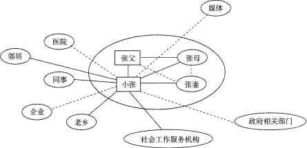
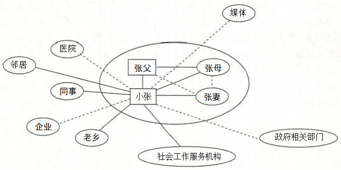

# 第十一章　企业社会工作服务

## 第 1 题 [问答题]

**题目：** 1.社会工作者在某企业提供服务时发现，员工小张的父亲最近遭遇严重车祸住院治疗，小张的生活和经济面临巨大压力，情绪低落，工作多次出错，还出现擅自离岗的情况，企业领导多次批评，并声称要扣发奖金。 社会工作者在预估中，绘制了小张的社会生态系统图：   问题： 1．依据上图，分析小张的社会生态系统状况。 2．依据企业社会工作的服务内容，社会工作者可以为小张提供那些服务?

> **正确答案：** 1．根据上图，实线表示强关系，虚线表示弱关系，分析小张的社会生态系统状况， 可以看出： (1)小张的家庭： ①小张的原生家庭：小张与父母关系紧密，并且其父母关系也非常融洽，彼此能够给予足够的支持，虽然小张父亲住院，但是其母亲可以照顾。 ②小张的家庭：小张与妻子关系融洽，表现为强关系。妻子能够给小张提供较多支持。 ③小张的家庭和原生家庭之间的关系：小张和妻子关系很好，和父母也有较好的关系，但小张妻子和公婆之间的关系较弱。不过可以考虑将来作为可开发的资源来缓解小张照顾父亲压力的有利资源。 (2)小张的家庭系统与周围环境系统之间： ①小张及其家庭系统的非正式资源非常丰富，其邻居.同事.老乡等等都表现为强关系，这些都能为他提供帮助。 ②小张及其家庭的正式资源需要开发，其中仅仅只有社会工作服务机构提供了服务，医院.企业.政府.媒体等正式组织表现为弱关系，在为小张开展服务时可以考虑开发这一方的资源，为其提供服务。 2．按照企业社会工作的服务内容，社会工作者可以为小张提供如下服务： (1)介入职工情绪管理：小张由于父亲严重车祸，生活和经济上突然发生巨大的变故，情绪非常低落，企业社会工作者可以对小张展开个案工作，进行相应的心理疏导，改善其心理状态。 (2)介入职工的工作生活平衡：小张家庭突然遭遇重大变故，企业应该更好地关注小张的家庭困难和家庭状况，应该给小张适当准假，让小张能够更好地照顾自己的家庭。 (3)介入困难群体关怀：小张父亲由于发生交通事故，家里的经济突然面临巨大压力，对于突然面对生活困难的群体，企业社会工作者可以协调企业内外各种资源给予困难群体社会支持，帮助困难职工改善短期内不利的生活状况。 ①经济帮助：a．与医院进行沟通，争取适当减免相关费用，减轻压力。b．组织同事捐款，帮助他渡过难关。c．在争取小张同意的前提下，与其领导进行沟通，将他的具体情况告诉他的领导，争取领导的理解，或可争取更多的时间照顾父亲。 ②家庭关系修正：与其妻子沟通，希望在这个情况下，她可以站在小张的身边，和他一起渡过难关，帮助他一起照顾住院的父亲。 (4)介入职工职业生涯规划：企业社会工作者还可以为小张重新规划职工的职业生涯，为小张在工作方面提供可行的建议。

**解析：**
无

---

## 第 2 题 [问答题]

**题目：** 2.某企业为了在市场竞争中占据有利地位，采取了技术改革措施，并在企业内部进行了职工岗位调动，最终导致了部分职工的下岗。由于这次变动涉及了多方的利益，特别是涉及到部分下岗职工的生存问题，因此该企业和部分职工多次就岗位调动和下岗问题进行了激烈的争论。 该企业的综合部负责整个企业的劳资管理.人力资源开发.社会保障工作以及老干部管理，在这次改革中，综合部负责下岗职工的工龄买断金发放.养老保障手续的办理等工作，所以他们每天需要直接面对大量情绪激动的下岗职工。在实施改革的这段时间里．综合部的员工压力很大，除了要完成领导交代的任务，还要负责安抚下岗职工的情绪，他们夹在中间很难受，有苦说不出，并且与下岗职工之间还出现了沟通障碍。有时候，遇到一些顽固的下岗职工也避免不了一顿争吵。在这样紧张的氛围中工作，他们已出现消极怠工.烦躁等行为和情绪。 【问题】 1．这个案例中存在哪些问题和需要?2．假如你是一名企业社会工作者，你认为介入的目标有哪些?3·针对上述案例中的情况，社会工作者可以采取哪些介入策略?

> **正确答案：** 1．上述案例中存在的问题和需要主要有： (1)综合部工作人员工作压力大，情绪不稳定，出现了消极怠工的情况，存在解压等心理疏导和情绪调节的需要。 (2)部分下岗职工存在心理疏导和再就业的心理与社会支持需要。面对转岗和下岗的安排，部分职工情绪激动，对企业心存不满。 (3)劳动关系协调的需要。企业与职工之间存在较严重的冲突关系，存在监督企业落实涉及职工权益的法律.法规的需要。 2．介入的目标有： (1)介入职工情绪管理。为企业管理部门的员工提供心理疏导，帮助有不良情绪的职工减压和调节情绪，以疏导和缓和其不良隋绪，改善心理状态。 (2)介入困难群体关怀。为转岗和下岗职工提供帮助，不仅要在精神上安抚他们的情绪，还要帮助他们得到相应的福利保障。协调企业内外的各种资源为他们提供心理和社会支持，帮助其改善生活境况，增强转岗和下岗后的适应和发展能力。 (3)介入劳动关系协调。建立职工和企业关系的调解机制，使职工和企业之间发生的矛盾.冲突，能够得到及时有效的妥善解决。 (4)介入企业履行社会责任。如果企业社会工作者通过进一步了解情况，发现企业在劳资纠纷事件中发生了侵害职工权益的行为，应向其传播社会工作的价值理念，推动企业不单纯追求经济利益，履行其在维护职工权益方面的责任。 3．针对上述案例中的情况，企业社会工作者可以采取的介入策略有： (1)直接介入的策略 ①开展情绪问题的个案工作。针对综合部工作人员的具体情况，制定介入计划，实施个案工作。具体包括：与消极怠工的个别员工建立良好的专业关系，给予他们情感支持，通过心理辅导处理不良情绪，协助他们掌握情绪管理的技巧，调整好心态，积极工作。 ②开展针对适应问题的个案工作。对情绪激动的转岗和下岗职工开展个别辅导，调解他们的情绪，运用同理心给予情感支持。 ③开展针对权益维护与资源支持的个案工作。对转岗和下岗职工开展再就业的心理与社会支持，开展可能因此导致生活困难的援助。 ④建立支持小组，开展小组工作，使职工获得支持。利用小组工作方法，把有消极怠工行为.烦躁等不良情绪的职工组织起来，开展互助小组，加强与朋辈群体的沟通，让员工在小组中发泄情绪与压力，获得彼此的支持，增强正向动机和能量。针对下岗职工也可以开展支持性小组，让他们在小组中宣泄情绪，获得支持。开展综合部员工和下岗职工混合小组，加强他们之间的沟通，让他们学会换位思考，理解对方，缓和关系。 ⑤建立教育小组。针对转岗和下岗职工在职业技能上的不足，可以举办劳动技能培训班和再就业技能培训班。 ⑥运用社区工作的方法，对职工和企业相关状况进行调查研究，了解企业的相关制度，向下岗职工解释清楚，向企业传达下岗职工的心声。可制定可行性计划，组织企业和职工的会谈活动，引导职工合理.合法表达自己的意见，维护自身权益，与企业管理方进行对话与沟通，消除因沟通不畅而引发的矛盾与冲突。 (2)间接介入的策略 通过介入职工以外的其他系统，以问接帮助服务对象。例如，发动转岗和下岗职工的家人和朋友给予他们心理和社会的支持，以帮助其更好地适应生活。

**解析：**
无

---

## 第 3 题 [问答题]

**题目：** 3.某电子厂有300多名女性员工，其中80%为已婚育龄女性，50%为留守儿童母亲。经过调研发现：有一部分女性员工因孕期、哺乳期权益没有得到充分保障，存在岗位调整不合理、休假困难等一连串问题；留守儿童母亲因长期与孩子分离，产生强烈的思念与愧疚情绪，影响了工作的专注度；部分女性员工因为工作压力大、家庭责任重，出现了情绪低落、人际关系紧张等情况。企业希望社会工作者设计一份针对女性员工的专项支持服务方案。问题：请结合企业社会工作服务的内容与方法，设计一份“女性员工权益保障与身心支持服务方案”。

> **正确答案：** 1、方案名称。“巾帼护航·安心职场”——电子厂女性员工权益保障与身心支持服务方案。2、服务对象。某电子厂300余名女性员工，重点覆盖孕期/哺乳期女性员工、留守儿童母亲，以及因工作压力和家庭责任出现情绪低落、人际关系紧张等情况的女性员工。3、服务目标。(1)权益保障：帮助80%以上孕期、哺乳期女性员工清晰知晓《女职工劳动保护特别规定》中的岗位调整、休假等权益，推动企业在1个月内优化相关制度，解决“调岗降薪、休假审批难”等问题。(2)情绪支持：让70%以上留守儿童母亲通过亲情互动技巧提升远程陪伴质量，缓解思念与愧疚情绪。(3)关系改善：让60%以上有情绪困扰的女性员工掌握1—2种情绪调适方法，改善与同事、家人的沟通方式。4、服务内容。(1)权益保障模块：①开展“女性职工权益普法工作坊”:邀请工会律师用“案例+漫画”讲解孕期调岗、哺乳期哺乳时间等权益要点，为每位孕期/哺乳期女性员工发放印有“权益清单+维权渠道”的“权益明白卡”。②搭建“女性权益沟通热线”:社会工作者每周三驻厂，为女性员工提供“一对一”权益咨询，协助有需求的员工填写“岗位调整/休假申请沟通函”，对接企业行政部门协商解决问题。③推动企业成立“女性权益监督小组”:由2名女性员工代表、1名工会代表和社会工作者组成，每2周收集1次权益问题，向企业整改建议。(2)留守儿童母亲支持模块：①组织“亲情联结小组”:每周开展1次，教授“5分钟睡前故事”“视频互动小游戏”等技巧，组织员工分享亲子陪伴经验。②链接户籍地社区资源：与员工家乡的社区社会工作者合作，为留守儿童提供每周1次的学业辅导和心理陪伴，每月向母亲反馈孩子的学习和生活情况。③设立“亲情关爱日”:每月1天，企业为留守儿童母亲提供4小时带薪“远程陪伴假”，协助申请“亲子团聚交通补贴”。(3)身心与关系支持模块：①组织“压力释放与情绪管理小组”:每周开展1次，通过“呼吸放松练习”“非暴力沟通技巧”等内容，帮助员工缓解压力、改善人际沟通。②提供“一对一”心理疏导：为有严重情绪问题的员工每月开展2次个案辅导，协助梳理压力来源，制定“工作-家庭平衡小计划”。③组建“女性互助社群”:每月开展1次手工疗愈或茶话会活动，让员工在轻松氛围中交流互助，建立支持网络。5、实施步骤。(1)需求调研(1周):通过“线上问卷+10名员工访谈”确认权益、情绪等需求细节，调整服务内容。(2)服务启动(1周):举办方案启动会，现场发放“权益明白卡”，招募小组活动参与人员。(3)服务开展(12周):按“权益保障—亲情支持—身心与关系支持”的顺序推进，每月收集1次员工反馈，调整服务内容。(4)总结巩固(1周):举办成果分享会，为员工发放“服务手册”，建立“女性互助社群”作为长效支持平台。6、评估指标。(1)定量指标：女性员工权益知晓率(通过问卷测试)、留守儿童母亲与孩子的周沟通时长、情绪困扰员工的焦虑量表得分变化。(2)定性指标：员工填写的“权益问题解决满意度表”、主管反馈的员工工作专注度变化、员工分享的人际关系改善情况。

**解析：**
无

---

## 第 4 题 [问答题]

**题目：** 4.小邓，四川人，23岁，未婚，因肠炎做过手术，但身体还不错。父母在他5岁时就离婚了，小邓和父亲生活在一起。父亲在四川阿坝县打零工，有自己的一份收入。小邓现在A市某外资企业上班，每月有3000多元收入，除了每月寄给父亲500元外，其余的主要花在租房和打游戏.买游戏装备上，特别是休息日，基本上是通宵达旦玩游戏。小邓没有什么朋友，对在外地打工也没有什么信心，不知道未来该怎样走，生活得过且过。问题：1．结合案例，服务对象小邓的问题主要体现在哪些方面?2．什么是问题视角的企业社会工作服务?3．从问题视角为小邓开展服务，社会工作者可以怎么做?

> **正确答案：** 1．服务对象小邓的问题主要体现在以下几个方面：(1)缺少良好的生活习惯，生活没有规律。除了上班就是玩游戏，甚至通宵达旦。(2)身体健康存在潜在威胁。早年因患肠炎做过手术，需要良好的调理和规律的生活，但打工生涯缺少条件，而且小邓对自己缺少约束。(3)生活没有规划，对打工生涯缺乏信心，缺少良好的职业规划和职业发展动力，得过且过。(4)身处异乡，打工生活单调，迷恋游戏机，缺少人际互动，人际交往圈子狭小，缺少人际支持。(5)没有理财观念，没有积蓄，难以有可供持续成长支持的积累。2．问题视角的企业社会工作服务是指将关注点聚焦在服务对象所面临的问题上，基于对服务对象所遭遇到的问题的分析，首先对问题进行界定，然后再根据问题属性制订一系列帮助和改变服务对象的计划。问题视角的企业社会工作服务实务以“什么是真实的情况”为思考的切入点，因而在实务操作中往往围绕服务对象所遇到的问题开展服务。3．为服务对象小邓开展的服务可以包括以下方面：(1)协助小邓理清思路，开展职业生涯规划和指导服务。(2)鼓励小邓参与小组工作，帮助提升小邓自信心。(3)通过企业文化建设，促进小邓企业融入和扩大小邓的朋友圈。(4)开展生活技能等职工素质提升服务，促使小邓拥有健康的生活状态。

**解析：**
无

---

## 第 5 题 [问答题]

**题目：** 5.某连锁餐饮企业有2500名员工，其中门店一线员工2000名、总部职能岗员工500名。近1年，门店员工因“高峰时段高强度工作、顾客投诉压力、住宿环境简陋”，出现情绪崩溃，离职率达20%;总部职能岗员工因“跨区域门店协调难、加班无边界、职业成长路径模糊”，团队协作效率下降30%，核心岗位员工流失率达10%。同时，企业缺乏员工心理健康支持与职业发展指导体系，员工对企业归属感不足。企业希望通过企业社会工作服务，改善员工工作体验，降低员工流失率，提升团队效能。问题：请结合企业社会工作实务技术(员工咨商、职业生涯规划、员工援助计划、纠纷化解)，设计一份“连锁餐饮企业员工综合支持服务方案”。

> **正确答案：** 1、方案名称。“食光暖心·职路同行”——连锁餐饮企业员工综合支持服务方案。2、服务对象。某连锁餐饮企业全体员工，重点覆盖：门店一线有情绪压力、离职倾向的员工；总部职能岗有协作困扰、职业迷茫的员工。3、服务目标。(1)情绪与体验改善：帮助80%门店一线员工掌握顾客投诉应对与压力调适技巧，情绪崩溃发生率降低50%，门店员工离职率降至12%。(2)职业发展支持：让70%总部职能岗员工明确“专业岗—管理岗”成长路径，核心岗位员工流失率降至6%。(3)协作效能提升：总部职能岗团队协作效率提升40%，跨区域门店协调周期缩短30%。(4)归属感提升：员工对企业的归属感评分提升至80分(满分100分)，门店顾客满意度提升15%。4、服务内容。(1)员工咨商服务。①搭建“门店员工情绪支持专线”:在门店设立“情绪疏导角”，配备驻场社会工作者，采用“生物-心理-社会”评估模型，为一线员工提供“投诉压力疏导、住宿环境改善协商”等“一对一”咨商服务。②组织“职能岗协作压力小组”:每月开展4次小组活动，通过“协调冲突案例复盘、边界感建立练习”，帮助职能岗员工缓解协作压力。③建立“咨商-后勤联动机制”:对接企业行政部，为咨商中反映住宿问题的员工协调改善宿舍设施，解决实际生活困难。(2)职业生涯规划服务。①分层职业规划工作坊：门店员工：开展“门店成长阶梯工作坊”，解读“星级员工—店长助理—店长”的晋升标准，协助制定“服务技能提升+管理能力培养”计划。总部职能岗员工：开展“职能岗双轨发展工作坊”，明确“专业资深岗—部门主管”的成长要求，每季度2次。②实施“门店一总部轮岗计划”:为优秀门店员工提供总部职能岗短期轮岗机会，为总部员工提供门店一线体验机会，拓展职业认知。(3)员工援助计划(EAP)①需求评估与方案制定：与企业运营部、人力资源部访谈，开展员工匿名调研，制定“门店/总部差异化EAP服务方案”。②宣传与启动：举办“EAP暖心服务周”，通过门店公告栏、企业OA系统宣传服务内容，开通“24小时心理热线+线上EAP小程序”。③服务落地：为门店员工提供“高峰时段压力管理培训+顾客沟通技巧辅导”，为总部员工提供“跨区域协调工具培训+加班边界设置指导”，每月覆盖120名员工。④评估与优化：每季度统计服务使用率、员工满意度，调整服务内容，推动EAP与“优秀门店/明星员工”评选挂钩。(4)纠纷化解服务①建立“门店-总部冲突调解站”:配备调解专员，采用托马斯-基尔曼冲突模型，针对门店与总部的协调冲突采用“合作型策略”推动双方制定流程标准，针对员工间的人际冲突采用“妥协型策略”达成共识。②开展“沟通与冲突预防培训”:为门店店长、部门负责人开展“非暴力沟通+投诉应对技巧”培训，每季度1次。③建立“问题反馈直通车”:在门店与总部设立“员工意见箱”，每周收集并反馈问题，预防冲突升级。5、实施步骤。(1)需求调研与方案审批(1个月):完成员工需求调研，制定方案并获企业管理层审批。(2)项目启动与宣传(半个月):举办启动仪式，完成EAP平台与咨商专线的宣传推广。(3)服务开展(7个月):按“情绪咨商—职业规划—EAP—纠纷化解”的顺序推进，每月收集员工反馈，调整服务。(4)总结评估与长效机制建立(1个月):完成服务效果评估，制作“员工支持长效服务手册”，将服务纳入企业年度员工关怀计划。6、评估指标。(1)定量指标：门店员工离职率、总部核心岗流失率、团队协作效率、员工归属感评分、顾客满意度。(2)定性指标：门店员工的情绪改善反馈、职能岗员工的职业清晰程度、企业管理层对服务效果的评价、跨区域协调问题的解决时长。

**解析：**
无

---

## 第 6 题 [问答题]

**题目：** 6.小坤是一名工地搬运工，长期在工地从事沙石搬运工作，工地上整日尘土飞扬，最开始小坤觉得环境有些恶劣，但是习惯后也就适应了。但最近一个月，小坤感觉自己在工作时，呼吸越来越不顺畅，人也日渐消瘦了下来，最初他以为是工作太累的缘故，没有多在意，继续坚持工作。直到有一天，小坤在工地突然晕倒，被工友送到医院才得知自己得了尘肺病，整个肺部全是阴影，严重影响了他的呼吸功能，需要及时住院治疗。小坤的医疗费花了将近万元，出院时医生告知小坤，他以后不能再去工地那种环境做工，也不能再从事重体力劳动。 小坤无法接受自己生病和无法工作的现实，情绪一直很差。小坤的朋友向社会工作者小青介绍了小坤的情况，希望能得到小青的帮助。 【问题】 假如你是社会工作者小青，接到小坤这个案例后你会怎么做?

> **正确答案：** 1．接案 小坤是经朋友介绍来的，社会工作者小青首先要与小坤接触，通过与小坤面谈.与其周围的朋友访谈，了解他的基本情况及其需求。在这个过程中，运用真诚.接纳.同感等方式，让小坤对社会工作者小青产生信任，进而确定合作的服务关系。 2．预估 针对小坤的身体病痛问题，社会工作者小青通过深入访谈，结合心理一社会治疗模式理论，将其问题成因主要归结为两个方面：生理因素是小坤患病后，身体受到了严重的伤害，无法再从事工地的工作；心理因素是身体病痛使得小坤无法接受现实，出现了负面情绪。明确问题成因后，社会工作者小青梳理了小坤案例的介入的优势与资源：一是与当地职业病防治医院联系，联结医疗资源，为小坤提供后续的康复治疗；二是联系小坤身边的亲戚和朋友，帮助他建立社会支持网络；三是寻求政策帮助，看是否能够帮小坤报销部分医疗费。 3．计划 基于预估情况，社会工作者小青计划采取社区康复疗法，同时采取心理康复疗法。从生物—心理—社会角度出发，对小坤进行心理干预，提高其心理健康水平。具体目标和行动是帮助小坤联系职业病防治医院；联系其朋友和家人，帮助小坤走出低落的情绪，恢复和提高自信心。个案工作是一个有序开展的系统过程，制订合理的计划就是其中一个体现。完整的计划包括服务要达到的目标和为了达到目标采取的行动及介入策略。 4．介入 介入过程也被称为治疗与服务或干预过程。社会工作者小青开展的干预活动可分为以下几点：首先是联结资源，解决生理问题；其次是心理辅导，调节情绪；然后是与小坤的朋友和家人交谈，促使他们给予小坤足够的情感支持；最后动员社区医疗资源及其邻居为小坤提供支持与帮助。 5．评估与结案 介入过程结束后需对个案工作进行评估，以确认服务目标达成的程度.服务对象改变的程度以及服务方式是否合理有效。评估的作用在于它是一种整体性反思，能促使社会工作者做出及时的实务经验总结，这有助于提高以后的服务水平。在本案例中，经过社会工作者小青的介入，小坤的问题得到了解决，各方面都有了明显的变化。评估结束后就可以结案，根据具体情况，结案后还可以进行继续跟进和跟踪服务。 【提示】本题考点是企业社会工作方法的个案工作方法。

**解析：**
无

---

## 第 7 题 [问答题]

**题目：** 7.随着互联网共享经济模式的快速兴起，外卖骑手的需求以及他们面临的问题也日益凸显。社会工作服务机构在对某市骑手群体的生存和发展状况开展调查时发现，大部分骑手属于“新生代农民”,他们处于相对困难境地，遇到困境时主要求助对象为亲友。很多骑手每天工作超过12小时，业余生活单调枯燥；近四成骑手对目前的工作状态不满意，但又不知道未来能做什么;近三成骑手没有任何类型的保险；近五成骑手曾经发生不同程度的交通事故，除了受天气路况和车辆状况等因素影响，主要原因在于订单超时不得不违反交通规则，或担心在家的小孩而心神不宁，或不能被消费者尊重理解而心理压力大。调查丕发现骑手群体在工作中积累了众多关于交通安全的经验，大多数也有帮助他人的意愿。基于调查结果，该社会工作服务机构依据系统理论，从微观、中观和宏观3个层面，起了“关爱骑手，社会工作在行动”服务。问题：依据系统理论，设计“关爱骑手，社会工作在行动”的服务方案，只需列出理论要点、服务目标和服务策略。

> **正确答案：** 1、系统理论要点系统理论着眼于分析构成整个系统的各要素之间存在的复杂联系和相互关系，以及存 主于社会场境和外部环境中的其他相互影响的要素，即各子系统之间的相互影响。在系统 见角下，个人、群体、组织和社区的环境系统是社会工作者介入和改变的场域，在这个场 或里所有的元素彼此相互交错和影响，因而它们都是社会工作者需要分析和介入的场域。2、服务方案：“关爱骑手，社会工作在行动”服务(1)微观层面。服务目标：①改善骑手的心理情绪状况；②加强对骑手的安全教育，避免交通意外发 ;③建立对骑手的社会支持网络，解除骑手的后顾之忧；④为骑手做职业生涯规划 甫 导 。实施策略：①为有需要的骑手开展个案辅导，通过心理疏导服务缓解骑手的焦虑、担 心等不良情绪；②开展对骑手的安全教育讲座，增强骑手的生命安全意识；③在社区层面骑手搭建社会支持网络，如联结志愿者等，可提供家庭支持，降低骑手对家庭等状况的 旦忧；④针对骑手对自身工作不满，对未来迷茫的情况，开设职业生涯规划辅导服务。(2)中观层面。服务目标：①推动建立骑手组织，构建骑手支持网络；②开通骑手服务热线；③开展 手支持小组。实施策略：①在企业层面推动建立骑手组织，并推动组织与组织之间的增能赋权；②开通骑手服务热线，提供专业的热线辅导、危机干预、资源整合等服务；③推动开展驼 手支持小组，鼓励骑手之间加强联结、共同解决问题。(3)宏观层面。服务目标：①建立保障机制，为骑手购买保险；②推动立法与政策完善(政策倡导)③推动企业履行企业社会责任。实施策略：①企业建立健全完善保障机制.为骑手购买保险：②通过政策倡导，出台 专门针对骑手的政策法规；③积极帮助企业践行企业社会责任，加强对骑手的关爱。

**解析：**
无

---

## 第 8 题 [问答题]

**题目：** 8.20世纪80年代中期之后，我国珠三角地区外向型工业高速发展，这一地区聚集了中国乃至世界上最大数量的女工，她们来自全国各地的农村，被当地人称作“外来打工妹”，这一群体为经济发展默默的贡献着，同时也默默承受着一些不合理的待遇。据有关的统计数据显示，九成的外来打工妹都得不到任何的社会保障.医疗津贴.病假.产假，且每月平均加班时长达到150小时，远远高于法定工作时间。由于广东的工厂多以劳动密集型产业为主，工伤事故发生的频率也是相当高的，这些外来打工妹对于工伤事故后申请赔偿的程序和要求赔偿的途径都很陌生，她们不懂该如何去维护自己的合法权益，甚至因担心失去工作而选择忍气吞声。外来女工群体除了要面对低工资.高劳动强度外，她们的身体健康也饱受摧残，这些女工多分布在鞋厂.玩具厂.皮具厂.电子厂和电池厂等，工作过程中长期接触有毒有害的物质，加之其生理特点，女性得职业病的比率远远高于男性。这些女工还面临着在融入当地环境的过程中受到排斥等困难。 【问题】 1．上述案例中，外来女工群体面临哪些问题? 2．针对上述案例中存在的问题，作为企业社会工作者应如何介入?

> **正确答案：** 1．在上述案例中，外来女工群体面临的问题有： (1)企业女工的职业安全与健康问题。女工由于自身生理特点，再加上健康意识不强，工作中长期接触有毒有害物质，患职业病的比率较高。 (2)企业女工的权益保障问题。由于权益意识不强，大部分的外来打工妹都得不到任何的社会保障.医疗津贴.病假.产假，而每月平均加班时长达到150小时，工作强度难以负荷；她们在遭遇工伤事故后，不清楚申请赔偿的程序和途径，维权意识薄弱。案例中外来女工在遭遇工伤后不知该如何去维护自己合法的权益，甚至因担心失去工作而选择忍气吞声。 (3)城市融入困难的问题。案例中外来女工在融入当地环境的过程中受到排斥。 2．针对上述案例中存在的问题，企业社会工作者采取的介入策略如下： (1)介入职业安全与健康： ①通过为企女工提供个案咨询.辅导和提供社会资源，对因工受伤或患病的女工进行慰问，落实相关补偿，为她们的康复提供全方位支持。 ②利用小组工作方法对女工工进行培训，提供劳工权益.职业健康和安全信息的宣传和培训。通过各类活动，例如开展小组活动及教育性研讨会，把《劳动法》《劳动保护条例》及职业安全意识广传于外来女工群体，鼓励她们关注职业健康和安全问题。③开展外来女工互助小组。通过小组动力，将自主.自强.互助的精神传递女工群体，增强她们的维权和自我意识。同时，加强有关职业病防治和女性生殖健康的知识讲座。 (2)介入困难群体关怀： 企业社会工作关注女工群体中的困难群体包括老.弱.病.残.孕等群体，协调企业内外的各种资源，向困难女工群体提供心理和社会支持，帮助困难女工改善生活境况，增强发展能力。 (3)介入劳动关系协调： 建立企业职工关系调解机制，使企业和女工之间发生的矛盾.冲突能够及时有效地得到解决，通过定期沟通，将女工对企业的意见.建议及时反馈给管理层，管理层可以针对问题的性质和重要性制定出解决办法，提升女工对企业的满意度和改善企业管理方式，实现企业与职工的双赢。 (4)介入企业履行社会责任：社工向企业传播社会工作的价值理念，推动企业不单纯追求经济利益，履行其在维护女工权益等方面的责任。 (5)促进外来女工与当地社区共融。通过组织文艺汇演.社区活动.维护社区卫生等活动，推动当地居民与外来女工的良好互动，提高外来女工的自信心，促进外来女工群体融入进程。 【提示】本题考点是企业社会工作的主要内容，将其与案例材料相结合。

**解析：**
无

---

## 第 9 题 [共享题干单选题]

**题目：** 某企业为适应市场竞争采取了技术改革，并在企业内部进行了职工岗位调动，甚至导致部分职工下岗。由于这次变动涉及了多方的利益，该企业和部分职工多次就岗位调动和下岗问题产生激烈的争论，特别是部分下岗职工情绪激动。该企业的综合部负责整个企业的劳资管理、人力资源开发、社会保障工作以及老干部管理，在这次改革中，负责下岗职工的买断金发放、养老保障的办理等工作，他们每天要直接面对大量情绪激动的下岗职工。这段时间里，综合部的员工有很大的压力，既要完成企业领导交代的任务，又要安抚下岗职工的情绪，他们夹在中间很不好受，甚至是有苦说不出，与下岗职工的沟通出现了障碍，有时候遇到一些偏激的下岗职工也避免不了一顿争吵。在这样紧张的氛围中工作，他们已出现情绪低落、烦躁等情况。1.  哪些问题和需要?

> **正确答案：** 上述案例中的问题和需要主要有以下几个方面。(1)综合部工作人员工作压力大，情绪烦躁，出现了情绪低落的情况，存在解压等心 理疏导和情绪调节的需要。(2)部分下岗职工存在心理疏导和再就业的心理与社会支持需要。面对转岗和下岗的 安排，部分职工情绪激动，对企业心存不满，需要一定途径宣泄情绪、表达不满，因此应 探索合理解决途径。(3)劳动关系协调的需要。企业与职工之间存在较严重的冲突关系，存在监督企业落 实涉及职工权益的法律、法规的需要。

**解析：**
无

---

## 第 10 题 [共享题干单选题]

**题目：** 某企业为适应市场竞争采取了技术改革，并在企业内部进行了职工岗位调动，甚至导致部分职工下岗。由于这次变动涉及了多方的利益，该企业和部分职工多次就岗位调动和下岗问题产生激烈的争论，特别是部分下岗职工情绪激动。该企业的综合部负责整个企业的劳资管理、人力资源开发、社会保障工作以及老干部管理，在这次改革中，负责下岗职工的买断金发放、养老保障的办理等工作，他们每天要直接面对大量情绪激动的下岗职工。这段时间里，综合部的员工有很大的压力，既要完成企业领导交代的任务，又要安抚下岗职工的情绪，他们夹在中间很不好受，甚至是有苦说不出，与下岗职工的沟通出现了障碍，有时候遇到一些偏激的下岗职工也避免不了一顿争吵。在这样紧张的氛围中工作，他们已出现情绪低落、烦躁等情况。2.  业社会工作者，你认为介入的目标有哪些?

> **正确答案：** 上述案例中，企业社会工作者的介入目标有以下几个方面。(1)介入职工情绪管理。为企业综合部的员工提供心理疏导，帮助存在不良情绪的取 工减压和调节情绪，以疏导和缓和其不良情绪，改善心理状态。(2)介入困难群体关怀。为那些转岗和下岗职工提供帮助，不仅要在精神上安抚他们 的情绪，还要帮助他们得到相应的福利保障。协调企业内外的各种资源，为他们提供心理 和社会支持，帮助其改善生活境况，提升转岗和下岗后职工的适应和发展能力。(3)介入劳动关系协调。建立职工和企业关系的调解机制，使职工和企业之间发生的 矛盾、冲突能够及时有效地得到妥善解决。(4)介入企业履行社会责任。如果企业社会工作者通过进一步了解情况，发现企业在 劳资纠纷事件中发生了侵害职工权益的行为，应传播社会工作的价值理念，推动企业不再求经济利益，还要履行其在维护职工权益方面的责任。

**解析：**
无

---

## 第 11 题 [共享题干单选题]

**题目：** 某企业为适应市场竞争采取了技术改革，并在企业内部进行了职工岗位调动，甚至导致部分职工下岗。由于这次变动涉及了多方的利益，该企业和部分职工多次就岗位调动和下岗问题产生激烈的争论，特别是部分下岗职工情绪激动。该企业的综合部负责整个企业的劳资管理、人力资源开发、社会保障工作以及老干部管理，在这次改革中，负责下岗职工的买断金发放、养老保障的办理等工作，他们每天要直接面对大量情绪激动的下岗职工。这段时间里，综合部的员工有很大的压力，既要完成企业领导交代的任务，又要安抚下岗职工的情绪，他们夹在中间很不好受，甚至是有苦说不出，与下岗职工的沟通出现了障碍，有时候遇到一些偏激的下岗职工也避免不了一顿争吵。在这样紧张的氛围中工作，他们已出现情绪低落、烦躁等情况。3.  的情况，社会工作者可以采取哪些介入策略?

> **正确答案：** 针对上述案例中的情况，企业社会工作者可以采取的介入策略有以下几个方面。（1）直接介入的策略。开展针对情绪问题的个案工作。针对综合部工作人员的具体情况，制订介入计划， 案工作。具体包括：与消极怠工的个别员工建立专业的关系，给予他们情感支持， 理辅导处理不良情绪，协助他们掌握情绪管理的技巧，调整好心态，积极工作。开展针对适应问题的个案工作。对情绪激动的转岗和下岗职工给予个别辅导，调节 情绪，运用同理心给予其情感支持。开展针对权益维护与资源支持的个案工作。对转岗和下岗职工给予再就业的心理与 持，开展可能因此导致生活困难的援助。建立支持小组，开展小组工作，使职工获得支持。利用小组工作方法，把具有消 躁等不良情绪的职工组织起来，开展互助小组，加强与朋辈群体的沟通，让员工在 发泄情绪与压力，获得彼此的支持，增强正向动机和能量。同样，针对下岗职工也 展支持性小组，让他们在小组中宣泄情绪、获得支持。此外，还可以组织综合部员 岗职工组成混合小组，加强他们相互之间的沟通，让他们学会换位思考，理解对 和他们的关系。建立教育小组。针对转岗和下岗职工在职业技能上的不足，可以举办劳动技能培训 就业技能培训班。运用社区工作的方法，对职工和企业相关状况进行调查研究，了解企业的相关制  向下岗职工解释清楚。另外，要向企业传达下岗职工的心声。应制订可行性计划， 业和下岗职工的会谈活动，引导下岗职工合理、合法表达自己的意见，维护自身权  企业管理方进行对话与沟通，解决因沟通不畅而引发的激烈冲突。（2）间接介入的策略。过介入职工以外的其他系统间接帮助服务对象，如发动转岗和下岗职工的家人和朋 其心理和社会的支持，以帮助其更好地适应生活。

**解析：**
无

---

## 第 12 题 [共享题干单选题]

**题目：** 某企业试用期职工小张收入不高，家庭也比较困难，前段时间小张突发疾病入院治,发现企业没有给自己办理社会保险，医疗费用无法报销，这让他感到经济压力很大。张与企业部门经理沟通，要求企业为他补办社会保险并补偿医疗费，但多次交涉未果。为此，小张情绪失控，扬言如果不能解决，就要采取过激行为。企业社会工作者了解情况后，对小张进行了危机介入，通过心理疏导帮助他宣泄负面情绪，使其逐渐恢复平静；联系慈善组织，为他提供物质帮助，减轻其家庭负担；引导什聚焦紧迫性问题，共同探讨解决问题的可行方案，教导他理性表达诉求及合法维护权益白方法。在此过程中，社会工作者始终重视恢复和增强小张自主、合理解决问题的能力。此外，社会工作者一方面协助企业分析用工管理中存在的问题，督促企业落实劳动假障监察的相关规定；另一方面配合工会开展劳动保障法律法规宣传，推动企业完善用工制度。在社会工作者的协调下，企业为小张办理并补缴了社会保险，赔偿了因此而导致的纟济损失。4.  工作者运用了哪些危机介入的技巧?

> **正确答案：** 本案例中，社会工作者运用了以下危机介入的技巧。(1)将焦点放在帮助服务对象恢复和发挥功能上，而不是解决整个问题。因为危机  现之前服务对象拥有满意的社会功能，所以危机介入要针对危机出现时的机制失灵问题 帮助服务对象恢复应对问题的能力以解除危机。本案例中，社会工作者在紧急介入的日 候，优先关注小张的情绪、物质等急切问题。(2)帮助服务对象宣泄由危机带来的紧张情绪，给予其心理等方面的支持，以防精礻 崩溃。案例中提到“对小张进行了危机介入，通过心理疏导帮助他宣泄负面情绪，使其  渐恢复平静”。(3)瞄准服务对象当前需要。介入目标要现实，对服务对象不能要求太高。案例中 导服务对象聚焦紧迫性问题，共同探讨解决问题的可行方案。(4)担任教导角色。包括告诉服务对象应该做什么,同时也为他们做一些力所能及白 事。当服务对象功能逐步恢复时，就可以结束介入行动。案例中提到“在此过程中，社 工作者始终重视恢复和增强小张自主、合理解决问题的能力”。

**解析：**
无

---

## 第 13 题 [共享题干单选题]

**题目：** 某企业试用期职工小张收入不高，家庭也比较困难，前段时间小张突发疾病入院治,发现企业没有给自己办理社会保险，医疗费用无法报销，这让他感到经济压力很大。张与企业部门经理沟通，要求企业为他补办社会保险并补偿医疗费，但多次交涉未果。为此，小张情绪失控，扬言如果不能解决，就要采取过激行为。企业社会工作者了解情况后，对小张进行了危机介入，通过心理疏导帮助他宣泄负面情绪，使其逐渐恢复平静；联系慈善组织，为他提供物质帮助，减轻其家庭负担；引导什聚焦紧迫性问题，共同探讨解决问题的可行方案，教导他理性表达诉求及合法维护权益白方法。在此过程中，社会工作者始终重视恢复和增强小张自主、合理解决问题的能力。此外，社会工作者一方面协助企业分析用工管理中存在的问题，督促企业落实劳动假障监察的相关规定；另一方面配合工会开展劳动保障法律法规宣传，推动企业完善用工制度。在社会工作者的协调下，企业为小张办理并补缴了社会保险，赔偿了因此而导致的纟济损失。5.  工作者提供了哪些企业社会工作服务?

> **正确答案：** 本案例中，社会工作者提供了以下企业社会工作服务。企业社会工作服务包括10个方面：职业生涯规划、职工心理健康辅导与情绪管理 职工素质提升(合法权利维护增权、参与职业教育、激励职工工作)、安全与健康(消 或减少不安全因素、为受伤员工提供援助、争取补偿、社区康复)、职工参与企业管理 工作生活平衡、劳动关系协调、企业文化建设、困难群体关怀、履行企业社会责任。结 本案例中小张的实际情况，社会工作者主要提供的服务包括：(1)职业心理健康辅导与情绪管理：案例中提到“对小张进行了危机介入，通过 理疏导帮助他宣泄负面情绪，使其逐渐恢复平静”。(2)劳动关系协调：案例中提到“社会工作者一方面协助企业分析用工管理中存 的问题，督促企业落实劳动保障监察的相关规定；另一方面配合工会开展劳动保障法律 规宣传，推动企业完善用工制度”。(3)困难群体关怀：案例中提到“联系慈善组织，为他提供物质帮助，减轻其家 负担；引导他聚焦紧迫性问题，共同探讨解决问题的可行方案，教导他理性表达诉求及 法维护权益的方法”。(4)履行企业社会责任：案例中提到“企业为小张办理并补缴了社会保险，赔偿了 因此而导致的经济损失”。结合本案例中小张的实际情况，社会工作者主要提供的服务包括：职业心理健康与情 者管理：案例中提到“对小张进行了危机介入，通过心理疏导帮助他宣泄负面情绪，使其 逐渐恢复平静”。劳动关系协调：案例中提到“社会工作者一方面协助企业分析用工管理 中存在的问题，督促企业落实劳动保障监察的相关规定；另一方面，配合工会开展劳动保 章法律法规宣传，推动企业完善用工制度”。

**解析：**
无

---

## 第 14 题 [共享题干单选题]

**题目：** 王某，35岁，已婚，在东莞某工厂上班已有10年，8岁的儿子在四川老家由父母看护，妻子跟随王某从老家出来，在同一家工厂工作。夫妻虽同在一家工厂上班，但是住名自的宿舍。平日里，小两口会因为小事情而斗嘴，但关系还算融洽。可最近王某发现妻于 的有些行为比较奇怪，会经常接听陌生人的电话，还会经常删除手机里面的短信。通过-段时间的仔细观察，王某发现妻子与某一车间工人走得比较近，行为举止也较为亲密，手是怀疑妻子有了第三者。 一天晚上，王某偷偷跟着妻子，直到妻子进了宿舍，却忽然听宿舍里有男人的声音，随即叫开门，过了一会儿妻子才打开门。进去后王某发现妻子衣不整，并且在厕所里发现了那个工人。王某当时十分气愤，随后妻子跪在地上保证和那个工人断绝关系并请求原谅，但被王某拒绝了。经过此事件后，王某对妻子已经没有了信任感，而且自己感到十分焦虑。王某深知自己十分爱妻子，想继续维持这段婚姻，也尝试和妻子交谈，但每次谈话效果都不好。王某还曾采取跟随妻子上班、跟踪监视、不定时打电话等方式，甚至有时候在上班过程中偷作到车间观察妻子与那个工人的行为，这些措施和行为反而使得夫妻关系更加紧张。为了止妻子趁着自己睡着偷偷跑出去，王某竟然连续几天晚上不时到妻子宿舍“查岗”,导至其没有睡好觉。王某感到自己精神紧张，严重影响了个人的工作与家庭生活，于是主动到企业社会工作者求助。6.  务对象主要面临哪些问题?

> **正确答案：** 上述案例中，案主主要面临以下几个问题。(1)情绪和心理方面的问题。由于在婚姻关系中遭到打击，案主面临较大的精神压力 多疑、猜忌、失眠、情绪低落，尤其是在事情发生后，情绪波动较大，经常感到精神紧张。(2)行为方面的问题。服务对象发现妻子出轨后，对妻子爱恨交加，变得十分敏感 猜忌心重，甚至跟踪、监视妻子和那个工人的行为。(3)婚姻关系存在问题。妻子与第三者的婚外情，导致婚姻关系破裂的危机。

**解析：**
无

---

## 第 15 题 [共享题干单选题]

**题目：** 王某，35岁，已婚，在东莞某工厂上班已有10年，8岁的儿子在四川老家由父母看护，妻子跟随王某从老家出来，在同一家工厂工作。夫妻虽同在一家工厂上班，但是住名自的宿舍。平日里，小两口会因为小事情而斗嘴，但关系还算融洽。可最近王某发现妻于 的有些行为比较奇怪，会经常接听陌生人的电话，还会经常删除手机里面的短信。通过-段时间的仔细观察，王某发现妻子与某一车间工人走得比较近，行为举止也较为亲密，手是怀疑妻子有了第三者。 一天晚上，王某偷偷跟着妻子，直到妻子进了宿舍，却忽然听宿舍里有男人的声音，随即叫开门，过了一会儿妻子才打开门。进去后王某发现妻子衣不整，并且在厕所里发现了那个工人。王某当时十分气愤，随后妻子跪在地上保证和那个工人断绝关系并请求原谅，但被王某拒绝了。经过此事件后，王某对妻子已经没有了信任感，而且自己感到十分焦虑。王某深知自己十分爱妻子，想继续维持这段婚姻，也尝试和妻子交谈，但每次谈话效果都不好。王某还曾采取跟随妻子上班、跟踪监视、不定时打电话等方式，甚至有时候在上班过程中偷作到车间观察妻子与那个工人的行为，这些措施和行为反而使得夫妻关系更加紧张。为了止妻子趁着自己睡着偷偷跑出去，王某竟然连续几天晚上不时到妻子宿舍“查岗”,导至其没有睡好觉。王某感到自己精神紧张，严重影响了个人的工作与家庭生活，于是主动到企业社会工作者求助。7.  案的企业社会工作者，准备进行介入的目标主要有哪些?

> **正确答案：** 针对上述问题，企业社会工作者可以介入的目标有：(1)介入职工情绪管理。通过对服务对象的危机介入，为其提供心理辅导，帮助他缓解情绪困扰，正视婚姻危机带来的问题和挑战，增强面对生活的勇气和信心。(2)介入夫妻关系协调。通过对服务对象夫妻关系的调解，使夫妻之间发生的矛盾、 中突能够及时有效地得到协商和解决。(3)介入职工的工作生活平衡。通过向企业申请夫妻合住宿舍，让服务对象及其妻子 不再“两地分居”,营造便于沟通和交流的环境。

**解析：**
无

---

## 第 16 题 [共享题干单选题]

**题目：** 王某，35岁，已婚，在东莞某工厂上班已有10年，8岁的儿子在四川老家由父母看护，妻子跟随王某从老家出来，在同一家工厂工作。夫妻虽同在一家工厂上班，但是住名自的宿舍。平日里，小两口会因为小事情而斗嘴，但关系还算融洽。可最近王某发现妻于 的有些行为比较奇怪，会经常接听陌生人的电话，还会经常删除手机里面的短信。通过-段时间的仔细观察，王某发现妻子与某一车间工人走得比较近，行为举止也较为亲密，手是怀疑妻子有了第三者。 一天晚上，王某偷偷跟着妻子，直到妻子进了宿舍，却忽然听宿舍里有男人的声音，随即叫开门，过了一会儿妻子才打开门。进去后王某发现妻子衣不整，并且在厕所里发现了那个工人。王某当时十分气愤，随后妻子跪在地上保证和那个工人断绝关系并请求原谅，但被王某拒绝了。经过此事件后，王某对妻子已经没有了信任感，而且自己感到十分焦虑。王某深知自己十分爱妻子，想继续维持这段婚姻，也尝试和妻子交谈，但每次谈话效果都不好。王某还曾采取跟随妻子上班、跟踪监视、不定时打电话等方式，甚至有时候在上班过程中偷作到车间观察妻子与那个工人的行为，这些措施和行为反而使得夫妻关系更加紧张。为了止妻子趁着自己睡着偷偷跑出去，王某竟然连续几天晚上不时到妻子宿舍“查岗”,导至其没有睡好觉。王某感到自己精神紧张，严重影响了个人的工作与家庭生活，于是主动到企业社会工作者求助。8.  采取怎样的介入策略?

> **正确答案：** 针对上述介入的目标，企业社会工作者可以采取的介入策略有：(1)开展针对情绪和行为问题的个案工作。具体包括：与服务对象建立专业的关系，给 予其情感支持，通过心理辅导处理不良情绪，协助其掌握情绪管理的技巧，调整好心态，积 及 工 作 。在具体的个案工作介人模式上，可以选择理性情绪疗法帮助服务对象管理情绪和改变行 内。服务对象在经历了妻子出轨事件后，虽然妻子已经知道错了，但是，服务对象对妻子产 了“以后再也不能信任她了”的不合理信念，担心妻子会再次出轨，因此导致了“查 岗”、跟踪监视等不合理的行为。这样，一方面容易引起妻子的不满；另一方面这种焦虑的 青绪也在一定程度上加速了婚姻关系的紧张，影响服务对象个人的工作和家庭生活，反而不 于维护服务对象的婚姻。社会工作者可以引导服务对象换位思考，协助其分析先前采取的措施的合理性与不合 里性，以及与期望的后果的偏差等，让服务对象充分认识到自己行为的后果。社会工作者 要进一步了解服务对象的情绪和需求，根据服务对象具体的情况和需求，与服务对象一起 订服务方案，协助服务对象明确目标      维护婚姻的稳定，加强情绪管理。(2)开展针对家庭问题的个案工作。社会工作者协助服务对象增进夫妻间的感情，重 听建立夫妻间的信任感，维护婚姻稳定。还要鼓励服务对象与妻子沟通，协助服务对象制 丁与妻子谈话的方案，以及在谈话过程中可能出现的问题的解决方案，以促进服务对象与 妻子关系的改善，维护服务对象婚姻的稳定。(3)推荐服务对象参加支持与减压小组。利用小组工作方法，加强服务对象与朋辈群 本的沟通，让服务对象在小组中发泄情绪与压力，获得组员的支持，增强正向动机和 量。(4)寻求企业的资源支持。通过向企业申请夫妻合住宿舍，让服务对象及其妻子不再 两地分居”,营造便于沟通和交流的环境。

**解析：**
无

---

## 第 17 题 [共享题干单选题]

**题目：** 社会工作者在某企业提供服务时发现，员工小张的父亲最近遭遇严重车祸住院治疗，小张的生活和经济面临巨大压力，情绪低落，工作多次出错，还出现擅自离岗的情况，企业领导多次批评，并声称要扣发奖金。社会工作者在预估中，绘制了小张的社会生态系统图，如下图所示。  9.  小张的社会生态系统状况。

> **正确答案：** 根据上图，实线表示强关系，虚线表示弱关系，分析小张的社会生态系统状况， 可以看出：(1)小张的家庭系统。①小张的原生家庭。小张与父母关系紧密，并且其父母关系也非常融洽，彼此能够给 予足够的支持，虽然小张的父亲住院，但是其母亲可以照顾。②小张的家庭。小张与妻子关系融洽，表现为强关系。妻子能够给小张提供较多支持。③小张的家庭和原生家庭之间的关系。小张和妻子的关系很好，和父母也有较好的关 系，但小张妻子和公婆之间的关系较弱，不过可以考虑将来作为可开发的资源来缓解小张 照顾父亲的压力。(2)小张的家庭系统与周围环境系统。①小张及其家庭系统的非正式资源非常丰富，与邻居、同事、老乡等之间的关系都表 现为强关系，这些都能为他提供帮助。②小张及其家庭的正式资源需要开发，目前只有社会工作服务机构提供了服务，医 院、企业、政府相关部门、媒体等正式组织表现为弱关系，在为小张开展服务时可以考虑 开发这些方面的资源，为其提供服务。

**解析：**
无

---

## 第 18 题 [共享题干单选题]

**题目：** 社会工作者在某企业提供服务时发现，员工小张的父亲最近遭遇严重车祸住院治疗，小张的生活和经济面临巨大压力，情绪低落，工作多次出错，还出现擅自离岗的情况，企业领导多次批评，并声称要扣发奖金。社会工作者在预估中，绘制了小张的社会生态系统图，如下图所示。  10.  作的服务内容，社会工作者可以为小张提供哪些服务?

> **正确答案：** 按照企业社会工作的服务内容，社会工作者可以为小张提供以下服务。(1)介入职工情绪管理。小张由于父亲遭遇严重车祸，生活和经济上突然发生巨大的 变故，情绪非常低落。对此，企业社会工作者可以对小张开展个案工作，进行相应的心理 疏导，改善其心理状态。(2)介入职工的工作生活平衡。小张家庭突然遭遇重大变故，企业应该更好地关注小 张的家庭困难和家庭状况，应该给小张适当时间，让小张能够更好地照顾自己的家庭。(3)介入困难群体关怀。由于小张父亲发生交通事故，家里的经济突然面临巨大  力。对于突然面对生活困难的群体，企业社会工作者可以协调企业内外各种资源给予其社 会支持，帮助困难职工改善短期内不利的生活状况。①经济帮助。a. 与医院进行沟通，争取适当减免相关费用，减轻压力。 b. 组织同事 捐款，帮助他渡过难关。c. 在争取小张同意的前提下，与其领导进行沟通，将他的具体情 况告诉他的领导，争取领导的理解，或可争取更多的时间照顾父亲。②家庭关系修正。与小张的妻子沟通，希望在这种情况下，她可以站在小张的身边 和他一起渡过难关，帮助他照顾住院的父亲。(4)介入职工职业生涯规划。企业社会工作者还可以为小张重新规划职工的职业生 涯，为小张在工作方面提供可行的建议。

**解析：**
无

---

## 第 19 题 [共享题干单选题]

**题目：** 国珠三角地区聚集着大量来自全国各地农村的女工。有关统计数据显示，大量外工没有加入社会保障系统，医疗津贴、病假、产假没有保障，有的每月平均加班时长150小时，远远高于法定工作时间。由于工厂多以劳动密集型产业为主，工伤事故的频率比较高，这些外来女工对工伤事故发生后申请赔偿的程序和要求赔偿的途径陌生，她们不懂该如何去维护自己的合法权益，甚至因担心失去工作而选择忍气吞声。外来女工群体除了要面对低工资、高劳动强度，她们的身体健康也饱受摧残，这些女工分布在鞋厂、玩具厂、皮具厂、电子厂和电池厂等，工作过程中长期接触有毒有害的，加之其生理特点，女性患职业病的概率远远高于男性。另外，这些女工还面临着在外地环境的过程中受到排斥等困难。11.  来女工群体面临哪些问题?

> **正确答案：** 在上述案例中，外来女工群体面临的问题有：(1)职业安全与健康问题。女性由于自身生理特点，再加上健康意识不强，工作中 期接触有毒有害物质，罹患职业病的概率较高。(2)权益保障问题。由于权益意识不强，大部分的外来女工没有社会保障，即医疗 贴、病假、产假，有的每月平均加班时长达到150小时，工作强度难以负荷；她们在遭道 工伤事故后，不知该如何去维护自己合法的权益，不懂申请赔偿的程序和途径，维权意话 薄弱，甚至因担心失去工作而选择忍气吞声。(3)城市融入困难的问题。案例中，外来女工在融入当地环境的过程中受到排斥。

**解析：**
无

---

## 第 20 题 [共享题干单选题]

**题目：** 国珠三角地区聚集着大量来自全国各地农村的女工。有关统计数据显示，大量外工没有加入社会保障系统，医疗津贴、病假、产假没有保障，有的每月平均加班时长150小时，远远高于法定工作时间。由于工厂多以劳动密集型产业为主，工伤事故的频率比较高，这些外来女工对工伤事故发生后申请赔偿的程序和要求赔偿的途径陌生，她们不懂该如何去维护自己的合法权益，甚至因担心失去工作而选择忍气吞声。外来女工群体除了要面对低工资、高劳动强度，她们的身体健康也饱受摧残，这些女工分布在鞋厂、玩具厂、皮具厂、电子厂和电池厂等，工作过程中长期接触有毒有害的，加之其生理特点，女性患职业病的概率远远高于男性。另外，这些女工还面临着在外地环境的过程中受到排斥等困难。12.  存在的问题，企业社会工作者应如何介入?

> **正确答案：** 针对上述案例中存在的问题，企业社会工作者可以采取的介入策略如下：(1)介入职业安全与健康。① 通过为企业女工提供个案咨询、辅导和社会资源，对因工受伤或患病的女工进行 问，落实相关补偿，为她们的康复提供全方位支持。②利用小组工作方法对女工进行培训，提供劳工权益、职业健康和安全信息的宣传 培训。通过各类活动，如开展小组活动及教育性研讨会，把劳动法、劳动保护条例及职 安全意识广泛传于外来女工群体，鼓励她们关注职业健康和安全问题。③开展外来女工互助小组。通过小组动力，将自主、自强、互助的精神传递给外来 工群体，增强她们的维权和自我意识。同时，加强有关职业病防治和女性生殖健康的知讠话 宣讲。(2)介入困难群体关怀。企业社会工作关注女工群体中的困难群体(包括老、弱 病、残、孕等群体),协调企业内外的各种资源向困难女工群体提供心理和社会支持，表 助困难女工改善生活境况，提升发展能力。(3)介入劳动关系协调。建立企业与职工关系调解机制，使企业和女工之间发生的 盾、冲突能够及时有效地得到解决，通过定期沟通，将女工对企业的意见和建议及时反馆 给管理层，管理层可以针对问题的性质和重要性制定出解决办法，提升女工对企业的满 度和改进企业管理方式，实现企业与职工的双赢。(4)介入企业履行社会责任。社会工作者应向企业传播社会工作的价值理念，推动1 业不再单纯追求经济利益，要履行其维护女工权益等方面的责任。(5)促进外来女工与当地社区共融。通过组织文艺会演、社区活动、维护社区卫生 活动，推动当地居民与外来女工良好互动，增强外来女工的自信心，加快外来女工群体副 入进程。

**解析：**
无

---

## 第 21 题 [共享题干案例题]

**题目：** 某化工企业发生安全事故，导致5名员工重伤、10名员工轻伤。重伤员工需要长期住院，并进行康复治疗，这存在高额的医疗费用、工伤认定及重返工作岗位的顾虑；轻伤员工也因为事故造成了严重的心理创伤，出现恐惧、失眠、害怕等创伤后应激反应，无法正常复工；企业里的其他员工因为担心工作环境安全，害怕再次发生事故而士气低落，部分员工萌生离职想法。企业管理层虽然愿意承担责任，但在工伤补偿、康复支持等方面缺乏系统方案，需社会工作者全面介入。1.  同受影响员工的需求层次。

> **正确答案：** 结合马斯洛需要层次理论，可将不同受影响员工的需求拆解为以下层次。(1)重伤员工：①生理需要：获得长期住院治疗、康复治疗的资源支持，缓解身体伤痛。②安全需要：解决高额医疗费用问题，完成工伤认定并获得合理补偿，消除“重返工作岗位后因身体受限被边缘化”的顾虑。③归属与爱的需要：获得企业、同事的情感关怀，缓解因长期住院产生的孤独感。④自我实现需要：在康复后能回到合适的工作岗位，或获得职业转型支持，继续实现个人价值。(2)轻伤员工：①生理需要：完成身体创伤的恢复，缓解事故带来的身体不适。②安全需要：获得工作环境安全整改的明确信息，消除对“再次发生事故”的恐惧。③心理需要：消除事故带来的创伤后应激反应(恐惧、失眠等)，恢复心理稳定，能正常复工。④归属与爱的需要：获得企业和同事的理解与支持，避免因“无法正常工作”产生自我否定。(3)其他员工：①安全需要：获得工作环境安全评估报告和整改措施，确认工作环境的安全性。②心理需要：缓解因担心安全产生的焦虑情绪，重建对企业安全管理的信任。③归属与爱的需要：获得企业对员工安全诉求的积极回应，增强对企业的认同感，打消离职念头。

**解析：**
无

---

## 第 22 题 [共享题干案例题]

**题目：** 某化工企业发生安全事故，导致5名员工重伤、10名员工轻伤。重伤员工需要长期住院，并进行康复治疗，这存在高额的医疗费用、工伤认定及重返工作岗位的顾虑；轻伤员工也因为事故造成了严重的心理创伤，出现恐惧、失眠、害怕等创伤后应激反应，无法正常复工；企业里的其他员工因为担心工作环境安全，害怕再次发生事故而士气低落，部分员工萌生离职想法。企业管理层虽然愿意承担责任，但在工伤补偿、康复支持等方面缺乏系统方案，需社会工作者全面介入。2.  何联动企业、医疗机构、社保部门等多方资源，为受影响员工提供全方位支持?

> **正确答案：** 社会工作者可通过“资源整合+精准对接”的方式联动多方资源。(1)联动医疗机构：①为重伤员工对接医院康复科，制定个性化康复计划，协调医院开通“工伤康复绿色通道”，优先安排康复治疗；链接医院社会工作部，为重伤员工提供住院期间的心理陪伴和康复指导。②为轻伤员工对接心理咨询师，组织“创伤后应激障碍干预小组”，通过“情绪宣泄、认知调整、放松训练”等方式缓解心理创伤。③为其他员工开展“安全心理疏导讲座”，缓解其对工作环境的担忧。(2)联动社保部门：①协助重伤员工整理工伤认定材料，陪同前往社保部门办理工伤认定手续，解读工伤保险报销政策，确保医疗费用按规定报销。②联动社保部门工伤科，为企业和员工开展“工伤补偿政策解读会”，明确工伤补偿的标准和流程，避免因对政策不了解而产生争议。(3)联动企业：①与企业管理层协商，为重伤员工预支医疗费用，制定“工伤补偿分期支付计划”，同步为其保留工作岗位，康复后根据身体情况调整至合适的岗位。②推动企业开展“工作环境安全整改”，邀请第三方机构进行安全评估，公示整改方案和进度，为员工发放“安全防护升级物资”。③开展“员工关怀行动”，安排同事定期探望重伤员工，为轻伤员工调整复工后的工作强度，为其他员工开展“安全主题团建”，重建团队信心。(4)链接其他资源：①链接工会资源，为重伤员工申请“工伤员工专项慰问基金”，缓解其经济压力。②链接职业技能培训机构，为康复后无法从事原岗位的重伤员工提供职业转型培训，帮助其获得新的就业技能。

**解析：**
无

---

## 第 23 题 [共享题干案例题]

**题目：** 某互联网企业推行“996”工作制度后，研发部门20多名员工连续6个月高强度加班。近期多名员工出现身体不适，其中3人因过度劳累住院；员工之间的沟通减少，团队协作效率也大大降低，员工之间甚至出现争吵冲突；部分员工向人力资源部门提出离职，认为企业忽视职工健康权益。企业社会工作者受邀介入，需协助突破当前的困境。3.  部门员工面临的主要问题。

> **正确答案：** 结合案例中“996”工作制下员工的现状，可从健康、情绪与关系、职业与权益三个维度拆解主要问题。(1)职业安全与健康问题：连续6个月高强度加班导致身体透支，多名员工出现身体不适，3人因过度劳累住院，健康权益被忽视，存在“过劳”引发的健康风险。(2)情绪与人际关系问题：长期高压导致负面情绪积累，员工之间沟通减少、协作效率下降，甚至出现争吵冲突，团队氛围紧张，人际关系出现裂痕。(3)职业倦怠与权益问题：工作负荷过大引发职业倦怠，部分员工因企业忽视健康权益产生不满，提出离职，存在人才流失风险，同时员工的休息权、健康保障权未得到充分保障。

**解析：**
无

---

## 第 24 题 [共享题干案例题]

**题目：** 某互联网企业推行“996”工作制度后，研发部门20多名员工连续6个月高强度加班。近期多名员工出现身体不适，其中3人因过度劳累住院；员工之间的沟通减少，团队协作效率也大大降低，员工之间甚至出现争吵冲突；部分员工向人力资源部门提出离职，认为企业忽视职工健康权益。企业社会工作者受邀介入，需协助突破当前的困境。4.  用哪些企业社会工作实务方法介入?并说明每种方法的具体应用场景。

> **正确答案：** 社会工作者可采用的企业社会工作实务方法及具体应用场景。针对员工的困境，可结合小组社会工作服务、个案社会工作服务、政策倡导与协调、资源链接等实务方法介入。(1)小组社会工作服务。应用场景：组织“压力管理支持小组”，每周开展1次活动，邀请员工分享加班压力下的情绪与困扰，学习呼吸放松、正念冥想等减压技巧，缓解负面情绪；组织“团队协作修复小组”，通过“信任盲行”“问题共创解决”等互动游戏，重建员工之间的沟通信任，提升团队协作效率。(2)个案社会工作服务。应用场景：为因过度劳累住院的员工提供“一对一”心理疏导和康复支持，协助对接企业申请医疗补贴、合理的休养时间；为提出离职的员工提供职业规划与情绪疏导，了解其核心诉求，协助其与企业商议改善工作条件的可能性。(3)政策倡导与协调。应用场景：与企业管理层沟通，梳理员工健康数据与团队协作问题，倡导优化“996”工作制度，推动落实“弹性排班、强制调休、增设健康体检”等健康保障措施；协助员工代表与企业协商，明确加班补偿、健康权益保障等具体制度。(4)资源链接。应用场景：链接外部医疗机构，为研发部门员工提供免费的“过劳风险筛查”与健康咨询；链接心理咨询机构，为员工提供免费的线上心理支持；链接企业工会资源，申请“员工健康关爱基金”，为住院员工提供慰问与补贴。

**解析：**
无

---

## 第 25 题 [共享题干案例题]

**题目：** 某制造企业新入职100名青年员工，均为应届毕业生。入职3个月后，人力资源部门反馈：部分员工因不适应流水线高强度工作节奏，出现焦虑、失眠等情绪问题；部分员工因职业发展路径模糊，不清楚晋升渠道，工作积极性不高；还有员工反映宿舍环境简陋、业余生活单调，归属感不强。企业管理层希望企业社会工作者介入，帮助新员工尽快适应职场。5.  作的服务内容，分析该企业新员工的核心需求。

> **正确答案：** 从企业社会工作“情绪支持、职业发展、生活支持、职场适应”四大服务维度出发，结合案例中新员工的现状，其核心需求具体如下。(1)情绪与心理适应需求：新员工均为应届毕业生，刚从校园的宽松环境转入流水线高强度、高重复的工作节奏，身体和心理尚未完成过渡，出现焦虑、失眠等负面情绪问题，需要专业的情绪疏导和压力缓解支持，建立适应职场压力的心理韧性，避免情绪问题影响工作状态。(2)职业发展与动力需求：新员工对企业内部的晋升渠道、职业发展路径缺乏清晰认知，不清楚“如何从流水线岗位向技术岗或管理岗发展”“晋升需要满足哪些具体条件”，导致工作缺乏目标感，积极性不高，需要明确的职业规划指导和晋升规则解读，建立“工作-成长”的关联认知，提升工作动力。(3)生活支持与归属感需求：新员工反馈宿舍环境简陋，影响生活质量；业余生活单调，社交圈狭窄，难以在企业中找到“归属感”，需要改善住宿条件、丰富业余社交活动，建立与同事、企业的情感联结，增强对企业的认同感。(4)职场适应技能需求：新员工对流水线工作的节奏把控、效率提升、人际协作等职场技能缺乏经验，部分员工因不熟悉工作流程产生挫败感，需要学习工作技能和人际协作技巧，更快适应职场角色。

**解析：**
无

---

## 第 26 题 [共享题干案例题]

**题目：** 某制造企业新入职100名青年员工，均为应届毕业生。入职3个月后，人力资源部门反馈：部分员工因不适应流水线高强度工作节奏，出现焦虑、失眠等情绪问题；部分员工因职业发展路径模糊，不清楚晋升渠道，工作积极性不高；还有员工反映宿舍环境简陋、业余生活单调，归属感不强。企业管理层希望企业社会工作者介入，帮助新员工尽快适应职场。6.  上述需求，可扮演哪些核心角色?并说明各角色的具体职责。

> **正确答案：** 针对新员工的需求，社会工作者可通过扮演以下核心角色提供精准服务。(1)咨询辅导者。职责：为新员工提供“一对一”的情绪疏导和职业规划咨询，帮助员工识别焦虑、失眠的诱因，教授呼吸放松、渐进式肌肉放松等情绪调适技巧；同时结合企业岗位设置，为员工绘制“职业发展路径图”，清晰解读晋升条件与发展步骤，解答职业发展困惑。(2)资源链接者。职责：对接企业行政部门，宿舍环境改善建议，协调企业增加宿舍配套设施；链接企业工会、团委资源，申请新员工文化活动经费，策划周末观影、户外拓展等业余活动；同时链接人力资源部门，获取新员工晋升制度手册，为员工提供制度支持。(3)促进者。职责：组织“新员工适应支持小组”，每周开展1次活动，通过职场适应经验分享、工作技巧交流等环节，让员工互相学习适应方法；推动企业建立“新老员工结对帮扶制”，为每名新员工匹配1名老员工，指导新员工熟悉工作流程、融入团队；组建新员工交流群，促进同伴互助。(4)教育者。职责：开展“职场适应技能培训”，内容包括流水线工作节奏把控、高效沟通协作等，通过案例讲解和模拟练习帮助员工掌握技能；同时开展“情绪管理工作坊”，教授员工识别和调适情绪的方法，提升心理适应能力。

**解析：**
无

---

## 第 27 题 [共享题干案例题]

**题目：** 某大型集团公司旗下子公司分布在3个城市，员工总数5000人。近年来，集团员工流失率逐年上升，尤其是核心技术岗位与基层岗位。调研发现：核心技术岗位的员工因为工作压力过大、晋升空间有限、家庭与工作失衡而离职；基层岗位员工因为工资待遇低、工作环境差、缺乏职业成长机会而流失。同时，集团内部缺乏员工心理健康支持体系，跨城市员工缺乏归属感，企业文化建设薄弱。集团管理层希望企业社会工作者介入，构建长期有效的员工支持体系，降低员工流失率。7.  服务的系统视角，分析员工流失的深层原因。

> **正确答案：** 从“个体-组织-系统”三个层面的互动关系分析。(1)个体层面：①核心技术岗位员工：工作压力与家庭责任形成冲突，晋升空间有限导致“成长需求”未满足，工作与家庭失衡引发离职意愿。②基层岗位员工：工资待遇低无法满足生存需求，工作环境差影响体验，缺乏职业成长机会导致“发展需求”缺失。③跨城市员工：因地域分散缺乏情感联结，心理健康支持缺失，负面情绪无法有效疏导，归属感薄弱。(2)组织层面：①制度设计缺陷：核心技术岗晋升通道狭窄，基层岗薪酬与成长机制不健全，未匹配员工的“成长-回报”预期。②支持体系缺失：缺乏员工心理健康支持平台，跨城市员工无统一的归属感建设活动，企业文化未传递到个体层面。(3)系统层面。①集团与子公司的资源分配不均衡，跨城市员工无法享受同等的福利与支持资源。②企业“以人为本”的理念未落地，个体需求与组织发展未形成良性互动，导致员工与企业的“绑定关系”弱化。

**解析：**
无

---

## 第 28 题 [共享题干案例题]

**题目：** 某大型集团公司旗下子公司分布在3个城市，员工总数5000人。近年来，集团员工流失率逐年上升，尤其是核心技术岗位与基层岗位。调研发现：核心技术岗位的员工因为工作压力过大、晋升空间有限、家庭与工作失衡而离职；基层岗位员工因为工资待遇低、工作环境差、缺乏职业成长机会而流失。同时，集团内部缺乏员工心理健康支持体系，跨城市员工缺乏归属感，企业文化建设薄弱。集团管理层希望企业社会工作者介入，构建长期有效的员工支持体系，降低员工流失率。8.  何协助集团构建“预防-支持-发展”三位一体的长效员工支持机制?

> **正确答案：** 协助集团构建“预防-支持-发展”三位一体的长效员工支持机制。(1)预防层面：需求前置与制度优化。①开展“员工需求年度调研”:按“核心技术岗/基层岗/跨城市岗”分类收集需求，为集团优化薪酬、晋升、福利制度提供依据。②推动制度调整：为核心技术岗拓宽“技术专家-管理岗”双轨晋升通道，为基层岗建立“技能等级-薪酬一晋升”挂钩机制，为跨城市岗增设“家庭团聚补贴”。(2)支持层面：资源整合与情感联结。①搭建“跨城市员工心理支持平台”:开通线上心理咨询热线，每月开展“压力管理小组”直播活动，为员工提供情绪疏导服务。②开展“跨城市归属感活动”:每季度组织“线上主题沙龙”“线下城市联动团建”，推动员工间的互动，传递统一的企业文化。③建立“员工健康档案”:为核心技术岗员工提供年度“过劳风险筛查”，为基层岗员工改善工作环境(如增设休息区、优化劳保用品)。(3)发展层面：能力提升与价值匹配。①为核心技术岗员工提供“技术前沿培训+领导力提升课程”，匹配其职业成长需求。②为基层岗员工开展“技能进阶培训”，对接内部岗位转岗机会，拓展职业发展空间。③推动“员工价值与企业目标绑定”，设立“员工创新提案奖”，让员工参与企业发展决策，增强其对企业的认同感。

**解析：**
无

---

