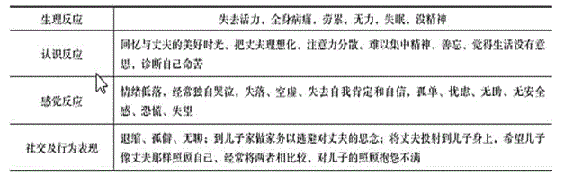

# 第十五章　老年社会工作服务

## 第 1 题 [问答题]

**题目：** 1.某城某小区内有一位孙阿婆，现年78岁。孙阿婆的老伴已经去世多年，平时她跟独身的小儿子一起居住，其他5个子女都已成家立业，分别居住在同一城市的其他地方。去年冬，孙阿婆的小儿子意外身亡，孙阿婆一下子变成了依靠低保金生活的独居老人，身体状况也每况愈下。孙阿婆的其他5个子女谁都不肯照顾和赡养母亲。现在，年老多病的孙阿婆孤身一人独自生活，因行动不便也很少出门，有一顿没一顿地苦熬着日子。 【问题】 1．在上述案例中。孙阿婆面临的困境主要有哪些?2．针对孙阿婆目前的困境，社会工作者应采取什么样的介入策略?

> **正确答案：** 未知

**解析：**
1．上述案例中，孙阿婆面临的困境主要有以下几个方面： (1)年老多病，缺乏照顾 孙阿婆年老多病，行动不便，生活无人照料，过着有一顿没一顿的日子。 (2)独自生活，精神落寞 孙阿婆的老伴已经去世多年，一起居住的小儿子又不幸身亡，身边无人陪伴，缺乏精神慰藉。 (3)生活拮据，苦熬日子 孙阿婆的小儿子去世后，孙阿婆的生活来源只剩下低保金。 2．针对孙阿婆目前的困境，社会工作者应采取的介入策略如下： (1)联系孙阿婆的5个子女，确定照顾孙阿婆的实施方案 与孙阿婆的5个子女取得联系，要求他们通过协商，确定照顾孙阿婆的实施方案： ①将孙阿婆接到他们自己家中居住照顾(固定或轮流居住照顾)； ②轮流定期前来照料孙阿婆的日常生活； ③为孙阿婆请一名保姆照顾其日常生活； ④将孙阿婆送进敬老院，实施院舍照顾。 必要时，社会工作者可以通过社区法律援助中心实施法律监督，督促孙阿婆的子女切实担负起照顾和赡养母亲的责任和义务。 (2)联系社区卫生服务中心，开展相关医疗服务 社会工作者可以与社区卫生服务中心进行联系，请医生定期上门为孙阿婆做身体健康检查，或设立家庭病床，开展医疗服务，改善其身体状况。 (3)组织社区志愿者开展服务 社会工作者可以组织社区志愿者上门看望孙阿婆，与孙阿婆聊天谈心，开展精神慰藉活动；在条件允许的情况下，鼓励孙阿婆多参加社区组织的老年人活动，加强与同龄老人的交往，缓解心理上的苦闷情绪，增强自我认同感。

---

## 第 2 题 [问答题]

**题目：** 2.某社区社会工作者计划成立“手拉手”志愿者俱乐部，运用推动居民参与的工作方法，希望动员社区中的低龄老年人为有需求的高龄老年人提供志愿服务。但是，社会工作者在动员低龄老年人参与时，遇到了一些问题：部分老年人不愿意参与志愿服务，认为社区在搞形式主义，都是做表面文章，没什么实际意义，持观望态度。部分老年人想参与，但遭到家人的反对，“子女怕我出意外，就不要给他添麻烦了，而且参加了对我自己也没有什么好处，还是算了吧。”部分老年人对自身的能力有所顾虑，“我没有什么特长，能干些什么呀?”问题：针对上述问题，本案例中社会工作者在推动社区低龄老年人参与志愿服务时应采取哪些策略?说明运用这些策略时的工作重点。

> **正确答案：** 未知

**解析：**
参考答案：针对本案例中提及的各种问题，社会工作者在推动社区低龄老年人参与志愿服务时应 采取以下策略。1、进行社区教育和社区宣传部分老年人不愿意参与志愿服务，认为社区在搞形式主义，没有实际意义，持观望 态度，这是没有认识到参与的价值，认为参与之后并不能影响和改变目前的状况，缺乏 参与的热情。针对这一情况，社会工作者在推动工作进行时，应促进社区低龄老年人对 参与志愿服务的价值的肯定，通过社区教育和社区宣传的方法，如社区研讨会、座谈 会、居民大会、社区展览会、教育讲座等，让社区居民认识到“手拉手”志愿者俱乐 部不是在搞形式主义，而是切实为高龄老年人提供志愿服务，从而提高这一部分低龄老 年人的参与热情。2、组织家人体验活动部分老年人想参与，但由于家人反对，便打消了参与社会事务的念头。面对这种情 况，社会工作者应邀请和鼓励他们的家人参与志愿体验。3、心理辅导调整认知通过个别辅导、团体辅导和活动体验，使这些低龄老年人认识到他们变为高龄老年人  时也会有人为其提供志愿服务，可以减轻子女的负担，这与他们的生活、利益密切相关， 让子女有意愿鼓励自己的父母参加志愿活动或尽量减少负面影响。4、运用优势视角帮助挖掘潜能通过沟通与互动帮助老人发现自身的优点和长处，增强自信和工作热情。5、进行志愿者培训部分老年人对自身能力有所顾虑，担心自己什么也干不了。面对这类老年人，社会工 作者应向其说明社区会对志愿者进行参与能力的培训，可采用个别培训或小组训练的方法 帮助老年人认识参与志愿活动的过程，提高表达、沟通、讨论等技巧，更重要的是协助他 们掌握社区的基本资料和最新动态，以便在讨论时能充分论证，具有说服力，提高老年人 的信心。参考解析：无

---

## 第 3 题 [问答题]

**题目：** 3.某社区有很多老年残疾人，他们大多需要子女的照顾才能生活。但是，由于不少子女工作繁忙，使得这些残疾老年人的生活照顾无法得到保障。更糟糕的是，该社区中还存在一些“空巢”老年残疾人，他们的生活更加困难。 【问题】 假如你是该社区的一位社会工作者，请针对这些老年残疾人的需要。拟订一份社区服务方案。

> **正确答案：** 未知

**解析：**
参考答案：（1）需求评估随着人口老龄化的加剧，我国老年人数量不断增长，老年残疾人的数量也随之增加。该社区老年残疾人群体面临的主要问题和需求包括："空巢"老年残疾人缺乏家人关怀：子女不在身边，情感支持不足，孤独感强烈；日常生活缺乏照料和扶助：子女工作繁忙，无法提供充分的日常照顾，基本生活需求难以保障；与社会隔绝：由于缺乏社区活动能力，社会参与度低，容易产生边缘化；缺乏医疗和疾病常识：自我照料能力不足，健康知识匮乏，疾病预防意识薄弱。（2）目标设定①总目标：改善社区老年残疾人的生活质量，建立完善的社区照顾支持体系，实现"老有所养、老有所医、老有所乐"。②具体目标：组织不同形式的社区活动，提升老年残疾人的社区参与度；构建社会支持网络，让老年残疾人获得更多的社会支持；满足基本生活照顾需求，保障日常生活质量；提供医疗康复服务，提升自我照顾能力。（3）实施策略①建立老年残疾人互助小组：举办疾病预防知识讲座，普及医学常识，提升自我照顾能力；组织小组活动，丰富老年残疾人的生活，培养兴趣爱好；建议老年残疾人的子女参与小组活动，增进家人之间的交流与沟通。②充分利用社区医疗资源：联合社区居委会、社区卫生服务中心，定期为社区老年残疾人提供上门义诊服务，包括健康检查、用药指导、康复训练等。③整合社区资源，提供社区照顾：组织社区志愿者，为行动不便又无人照料的老年残疾人提供居家养老服务，如送餐、打扫卫生、代购代办等。④组织大学生志愿者服务：定期探望老人，通过探望帮助老年残疾人了解社会现状，避免与社会脱节，同时提供精神慰藉和陪伴。（4）资源整合社会工作者需要整合社区资源，联合以下人员为社区活动的开展与实施进行专业辅导和监督：社区相关医疗人员：提供医疗健康服务支持；大学生志愿者：提供陪伴、探访等服务；社会工作督导：提供专业指导和监督；社区居委会：提供组织协调支持；社区志愿者队伍：提供日常照顾服务；老年残疾人家属：参与家庭支持活动。（5）评估总结①评估内容：服务对象满意度：老年残疾人对服务的满意度；家属满意度：老年残疾人家属对服务的满意度；方案执行情况：服务覆盖率、服务人次等；效果评估：生活质量改善情况、社会支持网络完善程度等。②评估方法：问卷调查；深度访谈；服务记录分析；案例跟踪。③评估周期：过程评估：每季度进行一次；效果评估：每半年进行一次；年度总结评估：每年进行一次。参考解析：无

---

## 第 4 题 [问答题]

**题目：** 4.某街道有200名65岁及以上的老人，其中40%的老人独居，30%的老人与子女同住但子女白天上班(“空巢老人”)。街道社工站通过前期走访发现，该群体存在三大需求：一是“健康管理”需求，部分老人患有慢性病(高血压、糖尿病)，但缺乏专业健康监测和用药指导，有老人因漏服、错服药物住院；二是“精神慰藉”需求，独居、空巢老人长期缺乏陪伴，有15%的老人出现抑郁情绪，经常说“活着没意思”;三是“社会参与”需求，大部分老人退休后未参与社区活动，觉得自己与社会脱节，希望能“发挥余热”。街道社工站计划为该群体设计为期6个月的“银龄关爱”服务方案。问题：请结合老年社会工作服务“积极老龄化理论”，设计该服务方案，方案需包含服务名称、服务目标(分总目标、分目标)、服务对象、服务内容(分3个模块，每个模块含具体活动、实施时间、负责人员)、评估方法5个部分。

> **正确答案：** 未知

**解析：**
参考答案：1、服务名称。“银龄健康陪伴奉献——街道积极老龄化服务方案”。2、服务目标。总目标：提升街道老人健康管理能力，缓解精神孤独，促进社会参与，实现积极老龄化。分目标1:90%的慢性病老人掌握正确用药方法，健康监测率达80%。分目标2:80%的独居、空巢老人抑郁情绪得到缓解，每周获得至少2次陪伴服务。分目标3:60%的老人参与社区志愿活动，培养社会参与意识。3、服务对象。某街道65岁及以上独居、空巢老人，以及有健康管理、社会参与需求的老人，共200人。4、服务内容。(1)模块一“健康管理服务”:活动1:“慢性病用药讲座”，每月1次，邀请社区医生讲解高血压、糖尿病用药知识，发放“用药提醒卡”;负责人员：1名社会工作者+1名社区医生。活动2:“上门健康监测”，每周2次，由社区护士上门为老人测血压、血糖，记录健康数据；负责人员：2名社区护士+4名志愿者。(2)模块二“精神慰藉服务”:活动1:“同伴陪伴小组”，每周1次，组织老人开展聊天、下棋、看电影等活动；负责人员：2名社会工作者+6名志愿者。活动2:“线上亲情陪伴”，每天1次，志愿者通过微信视频帮老人与外地子女沟通；负责人员：3名志愿者。(3)模块三“社会参与服务”:活动1:“银龄志愿队组建”，第1个月开展招募，组建“社区环境维护队”“邻里互助队”;负责人员：1名社会工作者。活动2:“志愿活动实施”，每周1次，组织志愿队开展社区清洁、独居老人探访等活动；负责人员：志愿队队长+1名社会工作者。5、评估方法。健康数据记录(评估健康管理效果)、抑郁量表测评(评估精神慰藉效果)、志愿活动参与记录(评估社会参与效果)、老人满意度问卷(评估整体服务质量)。参考解析：无

---

## 第 5 题 [问答题]

**题目：** 5.王阿姨今年68岁，现在独自一人生活。她幼年丧母，与家人感情淡漠，成家之后与家人几乎不再来往。丈夫对王阿姨很照顾，夫妻感情很好，但丈夫已去世三年。他们中年得子，对儿子非常宠爱。现在儿子35岁，已经成家生子，孙子2岁。儿子和儿媳处于事业高峰期，工作忙碌。　　王阿姨身体状况欠佳，患有关节炎、高血压等慢性病，全身经常病痛，但她不顾自己身体劳累，几乎每天到儿子家为其做家务，但与儿子沟通很少。王阿姨经常抱怨儿子不够孝顺、自私，对于母亲的病痛和劳累不管不问。　　此外，王阿姨仍然非常想念丈夫在世时两人的美好时光，经常失眠，胡思乱想。她患有轻度的抑郁症，虽然通过治疗，有所好转，但是偶尔还是会压抑苦闷。王阿姨性格比较内向，不善于表达，与别人交往不多，朋友很少。居委会反映王阿姨也很少参加社区活动。　　王阿姨每月有1000元左右的退休养老金，正常情况下能应付平时生活开支，可是现在扣除医药费、医疗费及给儿子、孙子不时买东西的费用，每个月的钱就所剩无几了。　　【问题】　　1．上述王阿姨的案例反映了哪些典型的老年人问题？　　2．针对上述问题，社会工作者应采取什么样的介入策略？

> **正确答案：** 未知

**解析：**
参考答案：1．老年问题包括因个人的老化而导致的问题，以及由于社会人口老龄化而出现的问题。在现代社会，老年人常面临以下一些方面的困境和问题：　　（1）疾病与医疗问题。王阿姨步入老年，身体状况欠佳，患有关节炎、高血压等慢性病，全身经常病痛，王阿姨受到慢性疾病的折磨，生活质量下降。　　（2）家庭照顾问题。城市化、家庭小型化、妇女职业化、离婚率上升和年轻人口的高流动性等都使得家庭照顾老年人的功能严重受损。王阿姨的老伴去世、儿子成家，一个人孤独生活，家庭支持不够，晚年生活境况凄凉。　　（3）老年人医疗费用负担重，经济困难。王阿姨的退休工资低于全职时的工资，虽然有养老金，但是因为随着年龄增长，容易生病，医疗费用支出较多，不能完全保障其生活。　　（4）社会隔离问题。老年人闲暇的增多与社会交往的减少使得老年人的社会隔离越来越严重。王阿姨退休在家，可自由支配的闲暇时间大大增加，但是因职业生涯的结束，社会交往的圈子却大大缩小。加上王阿姨比较内向，不善于与别人交往，也很少参加社区活动，朋友很少，晚年生活显得孤独寂寞。　　（5）丧亲造成的长期抑郁情绪。个人在接受自己不可避免的死亡或他人的死亡时会经历一个痛苦的过程。王阿姨的老伴虽然去世三年，但她仍然非常哀伤和悲痛，还未到接受期的阶段。目前王阿姨的反应如表5-1所示。表5-1  　（6）代际隔阂问题。王阿姨幼年丧母，本来就与原来的家人关系淡漠；对儿子也表现出不满，认为儿子不够孝顺，很少考虑到自己。　　2．针对王阿姨的问题，社会工作者可以采取的介入策略如下：　　（1）进行丧亲辅导，帮助王阿姨宣泄抑郁情绪，规划新的生活　　①进行综合评估。收集资料并注意观察，了解王阿姨哀伤的性质和阶段。　　②提供感情支持。提供空间让王阿姨表达、静默及回忆，给予王阿姨情绪上的支持和理解。　　③提供丧亲辅导。与王阿姨谈谈往日无暇完成的心愿，并重新计划日常起居生活与人际交往活动等，协助王阿姨调整心态，逐步适应痛失至亲的变故，减少对儿子的抱怨，重建生活的意义和归属感，积极面对现在的生活。　　（2）利用社区资源，丰富王阿姨的生活，提供社区支持网络　　①与社区居委会联系，协助王阿姨享受独居老人的社会福利政策，如居家服务费用减免等政策，并安排社区医疗中心的医护人员为王阿姨提供上门医疗服务，缓解王阿姨的病痛，使其享受更好的生活；　　②与社区老年服务机构联系，邀请王阿姨参加社区大型活动和老年秧歌队、健身队等，通过日渐丰富的日常生活，让她多结识老年朋友，扩大社会支持网络，开阔眼界、愉悦身心；　　③发动社区志愿者与王阿姨结成帮扶对子，经常上门看望，开展精神慰藉，改善其精神状况。　　（3）争取王阿姨的儿子与儿媳的支持　　与王阿姨的儿子和儿媳进行沟通，让他们了解老人现在的状况，请他们多关心母亲的身体和情感生活，经常去看望母亲，帮助母亲度过哀伤抑郁阶段，切实担负起照顾老人的责任和义务。参考解析：无

---

## 第 6 题 [问答题]

**题目：** 6.黄奶奶今年89岁，老伴去世很多年了，她有两个儿子和两个女儿，两个女儿都嫁到了外地。黄奶奶最初是在两个儿子家中轮流生活，但因为与两个儿媳的关系都不太好，现在居住在某养老机构，每月的费用由两个女儿从外地邮寄。女儿在外地很少来看望黄奶奶，而两个儿子因为较忙，也很少来看她。黄奶奶看到周围的老人们经常会有家人来看望，只有自己每天盼得望眼欲穿，却没有人来探望。黄奶奶有严重的高血压，每当犯病的时候就很难过，她感觉自己被家人抛弃了，没有人管她，更没有人在乎她的存在，于是她想到自杀。黄奶奶以失眠为借口，向工作人员及其他老人索要安眠药，就在她积攒到一定数量的时候，被清洁工小安在收拾房间时发现，并向工作人员报告了相关情况。问题：1．老年社会工作的对象有哪些?2．黄奶奶面临的困境如何?3．假如你作为机构内的一名社会工作者，应如何开展介入工作?

> **正确答案：** 未知

**解析：**
1．老年社会工作的对象既包括那些空巢(独居).残疾.困难的高龄老人，也包括一般的健康老人。很多时候，老年人周围的人，如亲属.朋友.邻居.志愿者等也会成为老年人社会工作的对象。更宏观些的系统，如单位和服务组织也有可能成为老年社会工作的对象。无论是直接以老年人为工作对象，还是以外围人群或组织机构为工作对象，都是为了让老年人有更佳的生活质量。2．黄奶奶面临的困境主要有：(1)黄奶奶的身体不好，有严重的高血压，每次犯病时都会很难过。(2)黄奶奶的年纪大了，身体又不好，需要有人来照顾她的生活。(3)看着身边的老人都有家人来看望，只有自己没有人来看望，这让黄奶奶的精神很受打击，需要安慰。(4)黄奶奶感觉自己被家人抛弃，有自杀的想法。3．社会工作者可以从以下几方面开展服务：(1)与黄奶奶的家人进行沟通，向他们介绍黄奶奶现在的情况以及内心的想法，让他们多来看望黄奶奶。(2)联系医生给黄奶奶做检查，教授黄奶奶正常的用药方法，给黄奶奶提供受人关注的支持。(3)组织志愿者照料黄奶奶的日常生活，并给予精神慰藉。(4)在养老机构开展一些适合的集体活动，促进老人之间的沟通。

---

## 第 7 题 [问答题]

**题目：** 7.杨老伯今年75岁，一年前患上了老年痴呆症，现在症状越来越严重，不认识老伴金老太和两位女儿，行为比较怪异，老伴走到哪里就会跟到哪里，还每隔两个小时便吵着要吃一次饭，吃饭需要老伴喂。金老太现在由于日夜照顾杨老伯而显得十分憔悴，而两位女儿因在其他城市居住，无法为母亲分忧，以致金老太时时感到孤寂无助.内心非常焦虑。金老太担心杨老伯病情严重时自己一个人照顾不了他，尤其担心自己一旦累病后杨老伯无人照顾。无奈中，金老太满腹忧愁地找到社区社会工作者寻求帮助。 【问题】 假如你是金老太所求助的社区社会工作者，请你针对案主杨老伯的需求，拟订一份服务方案。

> **正确答案：** 未知

**解析：**
(1)问题的陈述与分析 上述案例中反映的问题为：杨老伯身患老年痴呆症，其老伴金老太因为日夜照顾他而心力憔悴。 (2)方案设计 根据上述分析，社会工作者设计的服务方案如下： ①方案目标 控制杨老伯持续恶化的病情，协助金老太照料杨老伯。 ②方案实施策略 a·对金老太提供心理辅导和情感支持，缓解其焦虑.忧愁情绪，帮助她调整心态，积极面对生活； b．协助金老太分析杨老伯患病的原因，在日常生活中加以特殊照顾； c·与杨老伯在外地生活的两位女儿进行沟通，请她们常回家看望.照顾两位老人，多关心金老太，给金老太提供家庭支持力量，并与金老太一起制定照顾杨老伯的计划； d．联系较好的医疗资源，为杨老伯提供较好的治疗，缓解杨老伯的症状； e．为杨老伯建立社区支援网络，安排专门的医护人员定期为杨老伯提供上门医疗服务，并请社区志愿者为两位老人提供日间照料，减轻金老太的负担； f．教授金老太为杨老伯进行按摩的方法，多带其进行一些户外活动，与人交往等； 9．当杨老伯病情严重时，帮助其入住医院，解除金老太的担忧。 ③方案执行 主要包括整合社区资源.提供服务.监督服务执行进度.处理危机等。 ④方案评估 包括金老太对服务的满意度.方案执行情况及效果评估等。

---

## 第 8 题 [问答题]

**题目：** 8.社会工作者阿华在社区需求调查中发现，社区中有一些老年人不参与社会交往，除了不得不出来买菜购物，几乎整天待在家里。这些老人中有的又是独居老人，阿华偶尔碰到他们热情地与其打招呼问候，他们只是勉强点点头。阿华看在眼里急在心里，他想：要是这样下去，老人的生命力就会越来越低，退化、衰老的进程就会加快，不行!我得为他们做点什么。问题：结合案例中描述的社区老人状况，依据老年社会工作方法设计恰当的服务计划。

> **正确答案：** 未知

**解析：**
参考答案：1、问题与需求分析根据案例中的描述，社区老人的主要问题是闭锁在家里不出屋，不参与社会交往。人 是社会性动物，具有趋群性，人际交往是人类的主要行为。特别是老年人，长期缺少社会 接触会让老年人的交往能力受损，变得淡漠和了无生气，强化退缩倾向。因此，社区老人 的生活热情需要被激发和唤醒。2、确定服务目的与目标服务的目的即是激发老人的生活热情，保持和提高老人的生命力。具体目标包括：动 员老人走出家门参与社区活动；建立人际交往与社会支持网络；开发兴趣参与活动，在其 中感受合作与乐趣；挖掘志愿精神为社区建设发挥余热，作出贡献。3、介入策略选择：组织实施“动机激发小组”动机激发小组的目的就是要激发那些不再对眼前或将来感兴趣的人。小组活动是用来 帮助老年人重新与他人建立联系，摆脱一直以来满脑子装的都是自己和自己麻烦的状况。动机激发小组一般由10~15名老年人组成，成员没有患失智症或抑郁症，有一定的听 力和语言表达能力，能积极参与小组活动。小组活动共有6~12节，每周举办一次最好。动机激发小组通常挑选相互了解的人或有共同兴趣的人做组员，会减少一些老年人对加入 小组的犹豫。社会工作者需要非常了解每位老人，能开展有感召力的小组活动，然后运用 已掌握的老年人情况去激发每个人的兴趣。4、工作步骤(1)进行家访，接触“宅家”老人，通过问候、同感表达、关怀、即时服务等建立 信任关系，了解需求，动员对园艺种植有兴趣的老人参加“园艺-动机激发小组”。(2)设计小组计划，计划6次活动，每次活动1个半小时，半个月聚会1次，6次活 动的内容包括：第一次活动：学习园艺种植知识，请农科院专家通过照片展示、录像展示、讲解等方 法讲授种植技术，之后组织老人到农科技术基地现场参观，选购蔬菜种子或幼苗，回家 种 植 。第二次活动：分享种植经验，包括展示自己的种植成果，分享经验，提出问题，解答 问题，调整技术。第三次活动：分享种植经验，进行团队建设，推选团队领袖，创建团队文化。第四次活动：分享果实，集体聚餐，享受劳动果实。第五次活动：探访农科技术基地，与科研人员研讨经验，建立联结。第六次活动：总结回顾历程，发展其他兴趣(为以后活动发展主题),培养团队领袖， 工作人员退出小组。参考解析：无

---

## 第 9 题 [问答题]

**题目：** 9.李奶奶今年已经75岁了，老伴几年前去世。李奶奶终生没有生育，只有一个养子。李奶奶在养子结婚后就和养子一家生活在一起。养子一家居住的是平房，养子主要是干推销工作的，经常在外面奔波。养子的妻子是商店营业员。养子的儿子已上高中，住校经常不回来。 最近邻居发现，李奶奶整天在外面捡垃圾，并以垃圾中的剩菜剩饭为食。邻居们找到社会工作者，社会工作者上门去进行家访，发现养子一家早就和李奶奶分开住了。养子一家住在大平房中，而李奶奶居住在旁边一个放杂物的小棚子里面。社会工作者发现李奶奶居住的小屋中堆满了垃圾，散发出一股难闻的味道。养子的妻子介绍说，这些东西都是老人捡回来的。养子也不断向社会工作者倾诉苦水。从几个月前，李奶奶就开始从外面往家里捡垃圾，并且也越来越不爱说话，家里人阻拦她捡垃圾就和家人嚷叫，哭闹，所以现在就成了社会工作者看到的这种情况。据养子介绍，李奶奶在老伴死后就出现了一些幻觉，她总和家人说“你爸爸在那边说没有吃的，他饿呀”之类的话语。养子一家看老太太行为正常，也没太在意，没料到现在竟成了这样。 【问题】 1．如果你是社会工作者，你认为李奶奶现在面临哪些问题? 2．她需要得到社会工作者的哪些帮助?

> **正确答案：** 未知

**解析：**
1．李奶奶现在面I临的问题主要有： (1)从身体状况来说，可能存在某种疾病。李奶奶原来行为正常，现在出现以垃圾为食的行为，并且不听家人劝阻，社会工作者可以考虑是否存在生理上或精神上的疾病。并且李奶奶最近经常以垃圾为食，也可能因不讲卫生染上疾病。 (2)精神上由于老伴去世以后，精神上没有寄托，经常出现幻觉。 (3)家人对于李奶奶缺乏必要的关心。养子和其妻子工作都很忙，孙子又上高中不经常在家，所以他们无暇顾及老人的感受，疏于对老人的照料，尤其是心理层面的支持和安慰等。另外社会工作者也要注意是否家庭存在虐待问题。 (4)缺乏必要的社会支持。李奶奶年事已高，养子夫妇又经常不在家，所以李奶奶的照顾和看管就成了问题。 2．社会工作者可能提供的帮助： (1)联系相关医疗机构，可以安排为李奶奶进行身体和精神检查。通过此项检查．可以确定李奶奶是否患病。 (2)对李奶奶的家人进行必要的辅导。让李奶奶的家人了解老人的现状，和李奶奶所处年龄阶段老人的特点和需求，让李奶奶的养子和其妻子了解老人的心理特点。 (3)联系所在社区，看能否给予此家庭以一定的帮助，比如利用社区志愿者资源提供一定的支持和照顾等。

---

## 第 10 题 [问答题]

**题目：** 10.社会工作者在一次走访中发现王老先生独自在家。对于社会工作者的到来，他很高兴，交谈中社会工作者了解到，王老先生现与儿子一家同住，儿子和儿媳外出工作时，家里只留下他一个人，社会工作者观察发现，王老先生的房间杂乱无章，身上衣服泛黄并发出异味，已经多日没有换洗。老人抱怨，退休工资都交给儿媳，身上没有任何零花钱。同时，社会工作者还注意到王老先生手臂有多处淤青，问其原因，王老先生沉默不答，表情紧张。社会工作者向社区居委会进一步了解情况，得知王老先生今年80岁，以前是老伴照顾他的饮食起居，老伴去世后主要由儿媳照顾，儿媳觉得老人不做家务，不讲卫生，一起生活碍事，常常为此打骂老人，有时还不让老人吃饱，儿子去外地出差时，儿媳还经常将老人反锁在家中。 问题： 1．列举本案例中老人受到虐待和疏于照顾问题的类型及行为表现。 2．如果你是社会工作者，将如何介入?

> **正确答案：** 未知

**解析：**
1．虐待老人指的是恶意对待老人，在身体上.情感或心理上.性方面或经济方面对老人构成虐待或剥削。疏于照顾老人既包括主动也包括被动地让老人得不到所需的照顾，导致老人的身体.情绪或心理方面健康的衰退。结合题干，本案例中老人受到虐待和疏于照顾问题的类型及行为表现如下： (1)身体虐待：社会工作者注意到王老先生手臂有多处淤青；儿媳觉得老人不做家务，不讲卫生，一起生活碍事，常常为此打骂老人。 (2)情感或心理上的虐待：老人丧偶不久，被儿媳嫌弃，情感上受到虐待。 (3)经济虐待：老人工资都交给儿媳后，无零用钱，说明经济被剥夺。 (4)他人疏于照顾：老人吃不饱饭.没人洗衣服，基本生活无人照料。 (5)自我忽视：王老先生的房间杂乱无章，身上衣服泛黄并发出异味，已经多日没有换洗。 2．作为社会工作者，可以从以下几个方面进行介入： (1)保护老年人免受经济方面的剥夺。与老人的儿子.儿媳进行面谈，调整其认知，适当交还老人的工资，给老人留有足够的零用钱。 (2)提供支持性辅导。与老人的儿子.儿媳面谈，引导其认识到自己的不孝行为及对老人的伤害，帮助他们改变对老人的态度和行为，鼓励他们做孝顺的儿子和儿媳；与老人会谈，倾听老人描述与宣泄，连接志愿者定期探望老人，与老人聊天，聆听老人的生命故事，陪护老人出行。 (3)发展支持性服务。邀请老人参与社区活动，建立与邻里的联系，培养老人爱好，丰富老人生活；连接社区日间照顾中心，解决老人白天的饮食与休闲。 (4)改变和调整环境。邀请儿子.儿媳为老人房间打扫卫生，帮助老人洗衣服，邀请儿子给老人洗澡并增进感情。

---

## 第 11 题 [问答题]

**题目：** 11.某社区社会工作者计划成立 “手拉手”志愿者俱乐部，运用推动居民参与的工作方法，希望动员社区中的低龄老年人为有需求的高龄老年人提供志愿服务，社会工作者在动员低龄老年人参与时，遇到了一些问题： 部分老年人不愿意参与志愿服务，认为社区在搞形式主义，都是做表面文章，没什么实际意义，持观望态度。 部分老年人想参与，但遭到家人的反对， “子女怕我出意外，就不要给他添麻烦了，而且参加了对我自己也没有什么好处，还是算了吧。” 部分老年人对自身的能力有所顾虑， “我没有什么特长，能干些什么呀?” 问题：针对上述问题，本案例中社会工作者在推动社区低龄老年人参与志愿服务时应采取哪些策略?说明运用这些策略时的工作重点。

> **正确答案：** 未知

**解析：**
1．进行社区教育和社区宣传 部分老年人不愿意参与志愿服务，认为社区在搞形式主义，没有实际意义，持观望态度，这是没有认识到参与的价值，认为参与之后并不能影响和改变目前的状况，缺乏参与的热情。针对这一情况，社会工作者在推动工作进行时，应促进社区低龄老年人对参与志愿服务的价值的肯定。通过社区教育和社区宣传的方法，如社区研讨会.座谈会.居民大会.社区展览会.教育讲座等，让社区居民认识到 “手拉手”志愿者俱乐部不是在搞形式主义，而是切实为高龄老年人提供志愿服务，从而提高这一部分低龄老年人的参与热情。 2．组织家人体验活动 部分老年人想参与，但由于家人反对，便打消了参与社会事务的动机。面对这种情况，社会工作者应邀请和鼓励他们的家人参与志愿体验。 3．心理辅导调整认知 通过个别辅导.团体辅导和活动体验，使这些低龄老年人认识到变为高龄老年人时也会有人为其提供志愿服务，可以减轻子女的负担，这与他们的生活.利益密切相关，让子女有意愿鼓励自己的父母参加志愿活动或尽量减少其负面影响。 4．运用优势视角帮助挖掘潜能 通过沟通与互动帮助老人发现自身的优点和长处，增强其自信和工作热情。 5．进行志愿者培训 部分老年人对自身能力有所顾虑，担心自己什么也干不了。面对这类老年人，社会工作者应向其说明社区会对志愿者进行参与能力的培训，可采用个别培训或小组训练的方法帮助老年人认识参与志愿活动的过程，提高表达.沟通.讨论等技巧，更重要的是协助他们掌握社区的基本资料和最新动态，以便在讨论时能充分论证，具有说服力，培养民众对自己的信心。

---

## 第 12 题 [问答题]

**题目：** 12.快乐山社区位于某市中心区，60岁以上老人占总人口的20％左右。他们大部分是退休老人。有一定文化水平，经济及健康情况都不错。除少数老人担任社区组长外，多数老人很少参与社区事务。 社区旁边正在建造五幢高层商品房，来了一批建筑工人。工人们每天都要穿过快乐山社区，来往于宿舍与工地之间。由于附近建筑工人多了，吸引了一些小商贩。最近，快乐山社区连续发生了几起入室盗窃事件。一些居民认为是外来人员大量穿行造成的，有人建议把社区靠近建筑工地的大门锁上，此建议引起了很大的反响。因为关乎社区安全和居民出行。社会工作者决定采用社区工作方法，发动社区老人参与解决上述问题。【问题】 1．本案例中，社区工作的任务目标是什么?过程目标是什么?2．社会工作者应该采取哪些步骤协助建立老人志愿者团体以实现上述工作目标?3．社会工作者在协助建立社区老人志愿者团体中可以采用哪些专业技术?

> **正确答案：** 未知

**解析：**
1．本案例中，社区工作的任务目标和过程目标分别为： (1)任务目标 ①调查清楚社区治安问题以及原因； ②使社区安全得到保障，动员社区的老年人参与社区活动，力所能及地参与社区的治安工作。 (2)过程目标 ①动员社区的老年人参与社区活动，力所能及地参与社区的治安工作； ②使老年人的社会功能得到发展。 2．社会工作者协助建立老年人志愿者团体，以实现工作目标的步骤主要有： (1)在社区发布社区治安问题讨论会海报.宣传板，召开社区动员大会，游说及说服一些对社区活动不活跃的老人参与社区治安问题讨论会，鼓励老人发表看法及提供解决方案并积极参与到社区治安维护中来。 (2)招募有意愿的老年人组成志愿者小组，共同商定活动方案，确立小组目标。 (3)安排愿意参与治安活动的老人的工作时间和方法。 (4)评估老年人治安工作的效果。 3．社会工作者在协助建立社区老人志愿者团体中可以采用的专业技术有： (1)倾听。在组成老年人志愿小组的过程中要注意倾听老年人的想法以及其他居民的反响。 (2)引导。社会工作者需要给予老人志愿者团体意见和建议，引导老年人团结互助，实现活动的目标。 (3)接纳。社会工作者要接纳老年人，鼓励他们勇于发表自己的想法和采取行动。 (4)行为改善。在老人志愿者团体活动过程中逐渐改变老年人的观念和行为，使他们积极参与社区活动。

---

## 第 13 题 [共享题干单选题]

**题目：** 社会工作者在一次走访中发现王老先生独自在家。对社会工作者的到来，他很高兴，交谈中社会工作者了解到，王老先生现与儿子一家同住，儿子和儿媳外出工作时，家里只留下他一个人。社会工作者观察发现，王老先生的房间杂乱无章，身上衣服泛黄并散发出异味，已经多日没有换洗。老人抱怨，退休金都交给了儿媳，身上没有任何零花钱。同时，社会工作者还注意到王老先生手臂有多处瘀青，问其原因，王老先生沉默不语，表情紧张。社会工作者向社区居委会进一步了解情况，得知王老先生今年80岁，以前是老伴照顾他的饮食起居，老伴儿去世后主要由儿媳照顾，儿媳觉得老人不做家务，不讲卫生，一起生活碍事，常常为此打骂老人，有时还不让老人吃饱。儿子去外地出差时，儿媳还经常将老人反锁在家中。1.  人受到虐待和疏于照顾问题的类型及行为表现。

> **正确答案：** 虐待老人指的是恶意对待老人，在身体、情感或心理上、性方面或经济方面对老 人构成虐待或剥削。疏于照顾老人既包括主动也包括被动地让老人得不到所需的照顾，导 致老人的身体、情绪或心理方面健康的衰退。结合题干，本案例中老人受到虐待和疏于照 顾问题的类型及行为表现如下：(1)身体虐待。社会工作者注意到王老先生手臂有多处瘀青；儿媳觉得老人不做家 务，不讲卫生， 一起生活碍事，常常为此打骂老人。(2)情感或心理上的虐待。老人丧偶不久，被儿媳嫌弃，情感上受到虐待。(3)经济虐待。老人工资都交给了儿媳后，没有零用钱，说明经济被剥夺。(4)他人疏于照顾。老人吃不饱饭、没人洗衣服，基本生活无人照料。(5)自我忽视。王老先生的房间杂乱无章，身上衣服泛黄并散发出异味，已经多日没 有换洗。

**解析：**
无

---

## 第 14 题 [共享题干单选题]

**题目：** 社会工作者在一次走访中发现王老先生独自在家。对社会工作者的到来，他很高兴，交谈中社会工作者了解到，王老先生现与儿子一家同住，儿子和儿媳外出工作时，家里只留下他一个人。社会工作者观察发现，王老先生的房间杂乱无章，身上衣服泛黄并散发出异味，已经多日没有换洗。老人抱怨，退休金都交给了儿媳，身上没有任何零花钱。同时，社会工作者还注意到王老先生手臂有多处瘀青，问其原因，王老先生沉默不语，表情紧张。社会工作者向社区居委会进一步了解情况，得知王老先生今年80岁，以前是老伴照顾他的饮食起居，老伴儿去世后主要由儿媳照顾，儿媳觉得老人不做家务，不讲卫生，一起生活碍事，常常为此打骂老人，有时还不让老人吃饱。儿子去外地出差时，儿媳还经常将老人反锁在家中。2.  作者，将如何介入?

> **正确答案：** 作为社会工作者，可以从以下几个方面介入。(1)保护老年人免受经济方面的剥夺。与老人的儿子、儿媳进行面谈，调整其认知， 使其适当交还老人的退休金，给老人留有足够的零用钱。(2)提供支持性辅导。与老人的儿子、儿媳面谈，引导其认识到自己的不孝行为及对 老人的伤害，帮助他们改变对老人的态度和行为，鼓励他们做孝顺的儿子和儿媳；与老人 会谈，倾听老人描述与宣泄，链接志愿者定期探望老人，与老人聊天，聆听老人的生命故 事，陪护老人出行。(3)发展支持性服务。邀请老人参与社区活动，建立与邻里的联系，培养老人的爱 好，丰富老人的生活；链接社区日间照顾中心，解决老人白天的饮食与休闲问题。(4)改善和调整环境。邀请儿子、儿媳为老人定期打扫房间卫生，帮助老人洗衣服， 邀请儿子给老人洗澡并增进感情。

**解析：**
无

---

## 第 15 题 [共享题干单选题]

**题目：** 李大爷因脑卒中住院治疗，出院回家后，执意要一个人居住。女儿放心不下，为李大爷申请了社区居家养老服务。社会工作者通过李大爷的女儿了解到，李大爷脑卒中前是社区志愿服务团队骨干，经常参加各类社区活动。现在，李大爷虽然生活基本能自理，但身体状况大不如前，经常忘 记吃药，而且他总担心自己会跌倒，不愿出门，脾气也越来越差。社会工作者入户评估发现，李大爷的居家环境存在一定的安全隐患，对医疗和社区服务资源的使用较少。当社会工作者进一步评估时，李大爷表现得很不耐烦，他认为自己不需要外人帮忙，对女儿没经过他同意就找人来调查感到很生气。李大爷也担心社会工作者会把家里的情况随便告诉他人。3.  大爷进行社区居家养老评估时，重点收集了哪几个方面的信息?

> **正确答案：** 社会工作者对李大爷进行社区居家养老评估时，重点收集了以下几个方面的信息。(1)老年人的独立生活能力。评估内容涉及日常生活能力(李大爷生活基本能自理)、 社交活动(李大爷不愿出门)、疾病诊断(脑卒中)、健康状况(虽生活基本能自理，但身  体状况大不如前)和疾病预防处理(李大爷总担心自己会跌倒)、营养、排泄等。(2)老年人的自我管理能力。内容包括：认知能力(记忆力减退，经常忘记吃药； 他认为自己不需要外人帮忙)、感知觉与沟通能力、情绪情感状态(李大爷脾气越来越差； 以前是社区志愿服务团队骨干，经常参加各类社区活动，现在的状态令他有失落感、挫败 感；对女儿没经过他同意就找人来调查感到很生气)、行为表现(表现得很不耐烦)、用 药情况(李大爷经常忘记吃药)。(3)环境支持条件。内容包括：家居环境、医疗及社区服务的使用、非正式支持体系 的作用等。在本案例中，社会工作者通过入户评估发现李大爷的居家环境存在一定的安全 隐患，对医疗和社区服务资源的使用较少。

**解析：**
无

---

## 第 16 题 [共享题干单选题]

**题目：** 李大爷因脑卒中住院治疗，出院回家后，执意要一个人居住。女儿放心不下，为李大爷申请了社区居家养老服务。社会工作者通过李大爷的女儿了解到，李大爷脑卒中前是社区志愿服务团队骨干，经常参加各类社区活动。现在，李大爷虽然生活基本能自理，但身体状况大不如前，经常忘 记吃药，而且他总担心自己会跌倒，不愿出门，脾气也越来越差。社会工作者入户评估发现，李大爷的居家环境存在一定的安全隐患，对医疗和社区服务资源的使用较少。当社会工作者进一步评估时，李大爷表现得很不耐烦，他认为自己不需要外人帮忙，对女儿没经过他同意就找人来调查感到很生气。李大爷也担心社会工作者会把家里的情况随便告诉他人。4.  李大爷开展评估时应注意哪些事项?

> **正确答案：** 社会工作者在为李大爷开展评估时应注意如下事项。(1)平衡好自立和依赖他人的需要。在评估的时候应该注意李大爷目前生活基本能够 自理，所以能自己完成的事情要让他自己来完成；不能完成的，则劝导他接受别人的帮 助，以免造成伤害。(2)关注到最初提出评估的人。社会工作者应该及时与李大爷的女儿沟通，进一步详 细了解他的情况。(3)通过评估为老年人充权。接受评估容易使老年人在客观上陷入一种无力、无权的 境地，在心理上产生无力的感觉，所以在评估过程中既要评估不足，也要评估优势。(4)注意到老年人群体的异质性。在评估时要关注老年人个体的差异性，即针对不同 的老年人要采用不同的方法进行评估。(5)尊重老年人的隐私权。在对李大爷开展评估时，李大爷担心社会工作者会把家里 的情况随便告诉其他人，因此需要保护他的隐私，如需打破保密原则，需要征得他的知情 同意。

**解析：**
无

---

## 第 17 题 [共享题干单选题]

**题目：** 某日，王奶奶到镇社会工作站向社会工作者倾诉，表示儿子儿媳两年前外出务工，平时很少回家，对家里的事不管不问，把10岁的孙女丢给自己和老伴儿照看，她对此感到非常无奈，但又不知道如何与儿子儿媳沟通。社会工作者了解到最近王奶奶的老伴儿因意外摔倒而卧床不起，王奶奶既要照顾老伴儿又要照看孙女，感到力不从心；王奶奶经常将孙女锁在家里写作业，节假日也不准孙女外出，生怕发生意外，孙女为此经常与王奶奶发生争执；随着王奶奶年龄的增长、身体每况愈下、老伴儿受伤后医疗费支出的增加，让她更加烦躁不安，经常因为琐事与邻居争吵；现在王奶奶也没有时间参加社区活动，与原来的老姐妹逐渐疏远。这导致王奶奶对现在的生活状况很不满意，觉得自己晚年生活没有意思，却不知道该怎么办。社会工作者在征得王奶奶同意后，计划为她开展服务。5.  奶奶面临的问题。

> **正确答案：** 王奶奶面临的问题主要包括：(1)疾病及与医疗有关的问题。老年人，尤其是高龄老年人，往往受到慢性疾病的折 磨，生活质量因此受到严重影响，与之相关的医疗费用也常常成为困扰老年人的一大问 题，易导致老年人经济拮据甚至陷入生活困境。在本案例中，王奶奶随着年龄的增长身体 每况愈下、老伴儿受伤，都表明王奶奶存在疾病及与医疗有关的问题。(2)家庭照顾问题。城市化、家庭小型化、女性职业化、离婚率上升及年轻人口的高 流动性等，都使得家庭照顾老年人的功能严重受损，特别是空巢、独居和失独老年人缺乏 家庭照顾的问题尤为严重。本案例中，王奶奶的儿子儿媳两年前外出务工，平时很少回 家，对家里的事不管不问，把10岁的孙女丢给王奶奶和老伴儿照看，老伴儿因意外摔倒 而卧床不起，王奶奶既要照顾老伴儿又要照看孙女，经常感到力不从心，实际上王奶奶也 到了被照顾的年龄，因此，面临严重的家庭照顾问题。(3)宜居环境问题。老年人居住环境中常存在安全隐患和物理障碍，使老年人面临伤 残风险和融入社会的限制。此外，社会上普遍存在对老年人的刻板印象和老年人歧视，也 使建设老年宜居环境的问题十分突出。在本案例中，王奶奶面临因年龄增长身体每况愈 下、同时照顾老伴儿和孙女以及老伴儿受伤后医疗费支出等多重压力，变得更加烦躁不 安，经常因为琐事与邻居争吵，可能导致社区邻里关系冲突，宜居环境有问题。(4)代际隔阂问题。在全球化、信息化和知识爆炸的时代，知识的更新速度前所未 有，老年人积累的知识和经验可能已经过时了，而学习机会和资源的减少使其难以掌握现代的知识和信息，因此与年轻人的沟通常会出现信息不对称的情况，容易造成代际隔阂。 在本案例中，王奶奶不知道如何与儿子儿媳沟通，经常将孙女锁在家里写作业，导致孙女  经常与王奶奶发生争执，表明王奶奶存在代际隔阂的问题。(5)脱离社会问题。老年人退出工作岗位或失去劳动能力后，社会交往的圈子常常会 大大缩小，同时疾病、失能、配偶和有亲密关系的人去世，也有可能造成老年人的社会接 触非常有限，甚至由于缺乏接触会导致严重脱离社会。在本案例中，王奶奶没有时间参加 社区活动，与原来的老姐妹逐渐疏远，表明王奶奶脱离社会问题越来越严重。

**解析：**
本题涵盖的知识点包括老年人面临的问题和家庭生命周期理论。需要考生仔细阅读题干，将题干描述的问题在对应的5个问题后逐一阐述。

---

## 第 18 题 [共享题干单选题]

**题目：** 某日，王奶奶到镇社会工作站向社会工作者倾诉，表示儿子儿媳两年前外出务工，平时很少回家，对家里的事不管不问，把10岁的孙女丢给自己和老伴儿照看，她对此感到非常无奈，但又不知道如何与儿子儿媳沟通。社会工作者了解到最近王奶奶的老伴儿因意外摔倒而卧床不起，王奶奶既要照顾老伴儿又要照看孙女，感到力不从心；王奶奶经常将孙女锁在家里写作业，节假日也不准孙女外出，生怕发生意外，孙女为此经常与王奶奶发生争执；随着王奶奶年龄的增长、身体每况愈下、老伴儿受伤后医疗费支出的增加，让她更加烦躁不安，经常因为琐事与邻居争吵；现在王奶奶也没有时间参加社区活动，与原来的老姐妹逐渐疏远。这导致王奶奶对现在的生活状况很不满意，觉得自己晚年生活没有意思，却不知道该怎么办。社会工作者在征得王奶奶同意后，计划为她开展服务。6.  期理论，分析王奶奶所处的家庭阶段以及面临的主要任务。

> **正确答案：** 家庭生命周期理论。该理论认为家庭像人一样有成长、发展的自然变化过程。家 庭生命周期理论强调家庭成员的互动交流关系以及需要会随着家庭的发展在不同阶段呈现 出不同的特征，有不同的任务和要求需要家庭成员去面对。该理论根据家庭成员之间的互 动关系和面临的任务，可以把家庭生命周期分为8个阶段：家庭组成阶段、学龄前子女家 庭阶段、学龄子女家庭阶段、青少年家庭阶段、子女独立家庭阶段、家庭调整阶段、中年 夫妇家庭阶段以及老年人家庭阶段。(1)分析王奶奶所处的家庭阶段。根据本案例中王奶奶家庭成员的互动交流关系，可 知该家庭正处于老年人家庭阶段。(2)分析王奶奶家庭面临的主要任务。根据王奶奶家庭所处的老年人家庭阶段，结合 案例中王奶奶不知道如何与儿子儿媳沟通、孙女经常与她发生争执，王奶奶身体每况愈 下，觉得自己晚年生活没有意思，王奶奶面临的老年人家庭阶段的主要任务是：学习与成 年子女沟通，学习与孙女交流，学习应对衰老带来的困难，维持晚年生活的尊严、意义和 独立。

**解析：**
首先阐 述家庭生命周期理论的观点及8个家庭生命周期阶段；其次评估确认王奶奶所处的“老年 人家庭阶段”;再次根据题干描述的问题阐述王奶奶家庭面临的主要任务，表述个案管理 的实施原则；最后结合题干对应信息逐一作答。

---

## 第 19 题 [共享题干单选题]

**题目：** 张大妈是一位72岁的孤寡老人，一年前她的老伴儿去世，儿子早已定居国外。老伴儿去世后，张大妈把房子卖了，住进了当地的一家养老院。张大妈性格非常开朗，又很热 情，与养老院的老人们相处得都很好。但是外表开朗的她患有轻度的抑郁症，吃药对她的病没有任何效果。对此，社会工作者小王希望通过非药物的方式，即采用社会工作专业方法，给予帮助。小王每周都要来探望她，通过与张大妈的面谈来帮助她解决复发的抑郁症。奇怪的是，每次小王来探望张大妈与其面谈时，张大妈都会给小王讲述她和老伴儿一起参加单位组织的歌唱比赛活动，并详述整个比赛以及获奖的全过程。尽管小王已经听了好多遍，但她还是不厌其烦地继续听下去。小五决定用缅怀往事疗法对张大妈进行引导，改善其当前的情绪，使其逐渐适应现在的生活。7.  请详细说明缅怀往事疗法在助人过程中的具体运用。

> **正确答案：** 缅怀往事疗法对老年人的抑郁症、自尊和社会化有积极的作用。对认知有严重问 题的老年人，如患失智症的老年人，这一方法并不适用，行为错乱、有严重精神疾病的老 人和失禁的老人也不适宜用这一方法，但对于有轻微失智症的老人会有较好的成效。社会工作者常用的缅怀往事疗法的类型是人生回顾型缅怀往事(简称人生回顾疗法)。 在运用这一方法时最好先做一下前测，了解老年人对生活的感受。比如，可以运用相关量 表了解老年人的生活满足感和抑郁症状，建立评估的基线。人生回顾疗法所用的时间可以根据老年人人生回顾的目的、老年人的健康状况、个人 的偏好等决定， 一般每个重要的人生阶段会用两节的时间来讨论。在内容安排上，可以制 订一套方案，明确探查的领域，比如可以探查死亡、悲伤、恐惧、读书生活、艰难的事 情、工作和与他人的关系等。在回顾过程中，还要帮助老年人发现人生历程中的一些主 题，让其了解这些主题如何影响其过去和现在的生活。特别要发现让老年人失去和得到对 生活的掌控感的一些主题，前者包括焦虑、否定、绝望、无助、孤立、孤独和丧失等，后 者则包括联结、应对、效能、希望和信任等。让老年人逐步识别自己拥有的力量是人生回 顾疗法的部分目的。社会工作者可以和老年人设计制作具体的成果来总结和结束人生回顾。比如做一个相 册或录像光盘等，但并非一定要这样做。必须做的是对整个介入进行结果测评，对比介入 前的测评，评估介入的效果。

**解析：**
无

---

## 第 20 题 [共享题干单选题]

**题目：** 张大妈是一位72岁的孤寡老人，一年前她的老伴儿去世，儿子早已定居国外。老伴儿去世后，张大妈把房子卖了，住进了当地的一家养老院。张大妈性格非常开朗，又很热 情，与养老院的老人们相处得都很好。但是外表开朗的她患有轻度的抑郁症，吃药对她的病没有任何效果。对此，社会工作者小王希望通过非药物的方式，即采用社会工作专业方法，给予帮助。小王每周都要来探望她，通过与张大妈的面谈来帮助她解决复发的抑郁症。奇怪的是，每次小王来探望张大妈与其面谈时，张大妈都会给小王讲述她和老伴儿一起参加单位组织的歌唱比赛活动，并详述整个比赛以及获奖的全过程。尽管小王已经听了好多遍，但她还是不厌其烦地继续听下去。小五决定用缅怀往事疗法对张大妈进行引导，改善其当前的情绪，使其逐渐适应现在的生活。8.  工作的主要特点。

> **正确答案：** 老年社会工作的对象主要是老年人及其家人，由于老年人的生理、心理状况及社 会处境的特殊性，老年社会工作者会遇到许多特定的问题，这也是老年社会工作区别于其他领域社会工作的特点。(1)社会价值观常会影响社会工作者的态度和行为。在开展老年社会工作时，社会工 作者要认真反思自己的价值观，学习有关老年学的知识，以便消除对老年人的错误理解和 认识。(2)反移情是社会工作者的重要课题。做老年社会工作时，社会工作者可能会出现反 移情现象，不仅会表现为对老年人缺乏耐心和关怀，还会表现为对老年人过度保护，想要 “拯救”老年人。因此，社会工作者应注意反移情问题，时常反思自己对老年人的反应， 这对从事老年社会工作来说很重要。(3)社会工作者要善于反思并运用督导机制。在做老年人辅导工作时，社会工作者应 该审视自己对老年人以及面对垂死和死亡的感受。在服务中，社会工作者要善于运用督导 机制解决工作职责、专业技能和情绪困扰方面的问题。(4)老年社会工作需要多学科合作。老年人的问题常常涉及许多方面的工作，做老年 人的工作需要多学科的合作，只有懂得协调、配合不同的学科共同开展老年人服务工作， 才能使工作取得更好的成效。

**解析：**
无

---

## 第 21 题 [共享题干案例题]

**题目：** 独居老人陈爷爷年轻时有一个画家梦，退休后进入老年大学的绘画班学习，陈爷爷觉得画画不仅可以自娱自乐、陶冶心性，还可以通过画作义卖发挥余热、传递爱心。然而，最近陈爷爷在卫生间滑倒导致骨折，外出十分不便，不得不中断老年大学的学习。老年大学的老师建议陈爷爷利用学校的线上资源在家继续学习，但陈爷爷担心自己操作不好智能手机影响在线学习，为此感到十分焦虑。针对上述情况，社会工作者对陈爷爷的情绪进行了安抚，对其生活自理能力进行了评估。根据评估结果，社会工作者为陈爷爷链接了社区养老驿站的生活照料服务、协调资源在他家的卫生间安装了扶手，铺设了防滑垫；联系社区志愿者帮助陈爷爷学会了使用智能手机上网课，并协调他们定期上门探望。在社会工作者的帮助下，陈爷爷不仅顺利完成了绘画班学习，而且参加了画作义卖活动，实现了自己的公益心愿。1.  爷有哪些需要?

> **正确答案：** 未知

**解析：**
参考答案：本案例中陈爷爷的需要。(1)健康维护的需要：陈爷爷因在卫生间滑倒导致骨折，外出严重不便，体现了老年人对身体机能保护、医疗康复及照料的需求。(2)社会参与的需要：陈爷爷退休后通过老年大学绘画班参与社会活动，希望通过画作义卖“发挥余热”，反映了其对融入社会、实现自我价值的需求。骨折后中断学习导致其社会参与受阻，进一步凸显了维持社交连接的重要性。(3)自我实现的需要：陈爷爷年轻时的画家梦及退休后坚持绘画学习，本质上是对自我理想和潜能实现的追求。通过完成课程、参与义卖实现公益心愿，体现了其对自我价值实现的深层需求。(4)情绪和心理疏导的需要：陈爷爷因骨折中断学习而焦虑，需要情绪安抚和心理支持；社会工作者协调志愿者定期上门探望，满足了其对情感陪伴和人际关怀的需求。(5)居家安全的需要：需要生活照料、卫生间适老化改造(安装扶手、铺设防滑垫)服务以预防二次伤害。暂无解析

---

## 第 22 题 [共享题干案例题]

**题目：** 独居老人陈爷爷年轻时有一个画家梦，退休后进入老年大学的绘画班学习，陈爷爷觉得画画不仅可以自娱自乐、陶冶心性，还可以通过画作义卖发挥余热、传递爱心。然而，最近陈爷爷在卫生间滑倒导致骨折，外出十分不便，不得不中断老年大学的学习。老年大学的老师建议陈爷爷利用学校的线上资源在家继续学习，但陈爷爷担心自己操作不好智能手机影响在线学习，为此感到十分焦虑。针对上述情况，社会工作者对陈爷爷的情绪进行了安抚，对其生活自理能力进行了评估。根据评估结果，社会工作者为陈爷爷链接了社区养老驿站的生活照料服务、协调资源在他家的卫生间安装了扶手，铺设了防滑垫；联系社区志愿者帮助陈爷爷学会了使用智能手机上网课，并协调他们定期上门探望。在社会工作者的帮助下，陈爷爷不仅顺利完成了绘画班学习，而且参加了画作义卖活动，实现了自己的公益心愿。2.  会工作者开展了哪些老年社会工作服务?

> **正确答案：** 未知

**解析：**
参考答案：在本案例中，社会工作者为陈爷爷提供了以下服务。(1)老年人评估与生活照料：①对陈爷爷的生活自理能力进行了全面评估，了解他的实际需求。②为陈爷爷链接了社区养老驿站的生活照料服务，确保他在家中的基本生活需求得到满足。(2)教育与社会参与：①帮助陈爷爷顺利完成了老年大学的绘画班学习，继续他的兴趣爱好。②协助陈爷爷参加画作义卖活动，实现他的公益心愿，增强其社会参与感。③联系社区志愿者帮助陈爷爷学会使用智能手机上网课，克服技术障碍。(3)构建社会支持网络：①协调志愿者定期上门探望，提供持续的技术支持和情感陪伴。②链接社区志愿者帮助陈爷爷学会使用智能手机上网课。③协助陈爷爷参加画作义卖活动，实现他的公益心愿。(4)精神慰藉：①社会工作者对陈爷爷进行了情绪安抚，帮助他缓解焦虑和不安。②链接志愿者提供情感陪伴与支持。(5)适老化环境改造：协调资源在陈爷爷家的卫生间安装扶手和铺设防滑垫，保障居家安全。暂无解析

---

## 第 23 题 [共享题干案例题]

**题目：** 85岁的李奶奶与60岁的儿子王先生同住，王先生因工作压力大，且需照顾李奶奶的饮食起居，逐渐出现烦躁情绪。李奶奶患有轻度认知障碍，经常重复问同一问题(如“今天星期几”“儿子去哪儿了”)，有时还会记错服药时间，王先生多次提醒后失去耐心，偶尔会对李奶奶说“你怎么老记不住，烦不烦”。李奶奶察觉到儿子的不耐烦，变得沉默寡言，甚至故意减少喝水、吃饭，说“少给你添麻烦”。社会工作者通过社区了解到情况后，主动联系王先生。3.  先生之间的“照顾者压力综合征”及对二者的影响。

> **正确答案：** 未知

**解析：**
参考答案：照顾者压力综合征是指长期承担照护责任的家庭成员(尤其是非专业照护者)因身心负荷过重，出现情绪、认知、行为等方面的负面反应，甚至影响其自身健康与家庭关系。(1)对王先生的影响：情绪层面：工作+照护双重压力情绪烦躁、易怒，出现对母亲的抱怨、不耐烦。认知层面：形成“母亲老记不住=给我添麻烦”的负面认知，缺乏对认知障碍的理解。行为层面：情绪失控时对母亲言语指责，破坏亲子关系。风险层面：长期压力可能导致抑郁、焦虑、身心衰竭，甚至放弃照护责任。(2)对李奶奶的影响：心理层面：感受到儿子的负面情绪——产生“我是负担”的自责感，沉默寡言、情绪低落。行为层面：通过减少饮食、喝水等“自我牺牲”行为，试图减轻儿子的负担。生理层面：饮食减少可能加剧营养不良、身体虚弱，认知障碍症状也可能因情绪压抑而恶化。关系层面：亲子沟通减少，情感疏远，形成恶性循环。暂无解析

---

## 第 24 题 [共享题干案例题]

**题目：** 85岁的李奶奶与60岁的儿子王先生同住，王先生因工作压力大，且需照顾李奶奶的饮食起居，逐渐出现烦躁情绪。李奶奶患有轻度认知障碍，经常重复问同一问题(如“今天星期几”“儿子去哪儿了”)，有时还会记错服药时间，王先生多次提醒后失去耐心，偶尔会对李奶奶说“你怎么老记不住，烦不烦”。李奶奶察觉到儿子的不耐烦，变得沉默寡言，甚至故意减少喝水、吃饭，说“少给你添麻烦”。社会工作者通过社区了解到情况后，主动联系王先生。4.  运用“家庭系统理论”与“认知行为理论”相结合的方式开展干预?请举例说明具体方法。

> **正确答案：** 未知

**解析：**
参考答案：社会工作者干预方式。(1)结合家庭系统理论：组织家庭会谈，引导王先生认识到“照顾压力”是家庭系统问题，而非个人问题，鼓励母子表达真实感受(如李奶奶说“怕给你添麻烦”，王先生说“工作累时没控制好情绪”)。(2)结合认知行为理论：帮助王先生识别“母亲老记不住=给我添麻烦”的负面认知，重构为“母亲记不住是疾病导致，需要更多耐心”。(3)同时教授王先生“情绪管理技巧”(如照顾间隙深呼吸、听5分钟音乐缓解烦躁情绪)。为李奶奶设计“记忆训练小游戏”(如看老照片回忆往事、记简单数字)，改善轻度认知障碍症状。暂无解析

---

